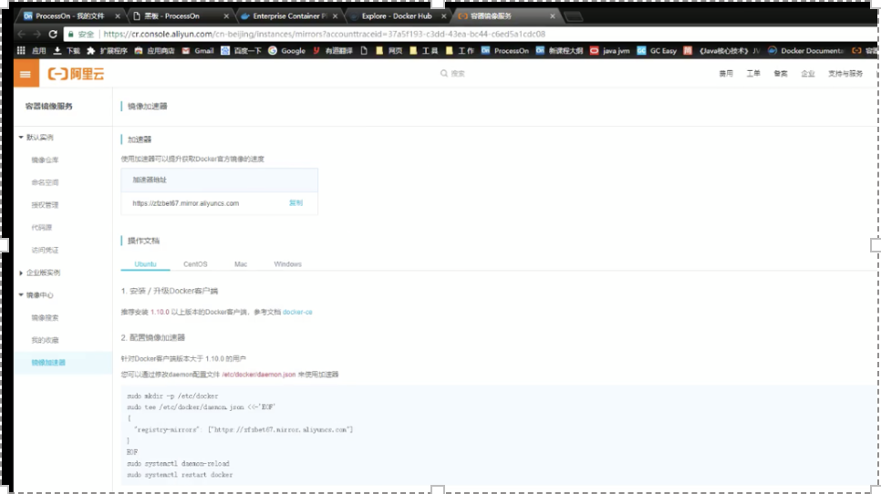
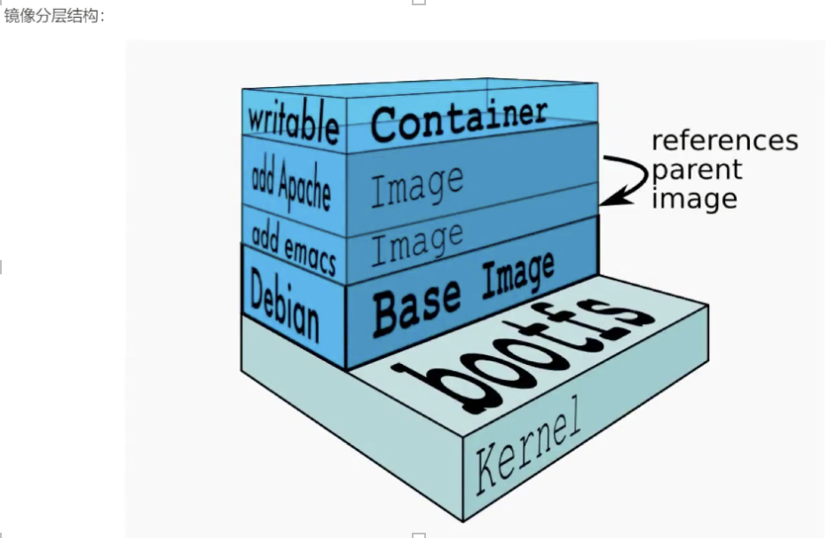

https://hub.docker.com 

docker：容器-放的是打包环境 

虚拟机：软件（docker）+硬件 

开发 测试 上线 

 

 client三条命令 

Build 

Pull :拉取镜像 

Run :镜像跑为一个容器 

 

安装：社区版和企业版 

docker安装： 

https://www.docker.com/products/docker-desktop 

sonar安装地址： 

https://marketplace.visualstudio.com/items?itemName=SonarSource.sonarlint-vscode 

 

Sonarqube 

http://testingpai.com/article/1595507287093 

 

 

# 准备 

以Centos7为例，docker要求操作系统必须为64位，且Centos内核版本位3.1及以上 

查看系统内核版本信息 

uname -r 

 

卸载旧版本 

yum list installled | grep docker 

yum -y remove … 

卸载后保留 /var/lib/docker的内容（镜像、容器、存储卷和网络等） 

rm rf /var/lib/docker 

 

 

1.安装依赖软件包 

yum install -y yum-utils device-mapper-persisten-data lvm2 

 

安装前可查看device-mapper-persisten-data 和lvm2是否已安装 

rpm -qa|grep device-mapper-persisten-data 

rpm -qa|grep lvm2 

2.设置yum源 

yum-config-manager --add-repo https://download.docker.com/linux/centos/docker-ce.repo 

3.更新yun软件包引擎 

yum makecache fast 

# 安装 

安装最新版本docker-ce -y 

yum install docker-ce -y 

安装制定版本docker-ce，可使用以下命令查看可安装版本 

yum list docker-ce.x86.64 --showduplicates | sort -r 

安装完成后查看版本 

docker version 

 

systemctl enable docker 设置docker开机自启 

systemctl  start docker   启动docker 

# 配置镜像加速 

拉取镜像速度 

阿里云/时速云/网易云 

1.注册登录开通阿里云容器镜像服务 

2.查看控制台，找到镜像加速器并复制自己的加速器地址 

3.找到/etc/docker目录下的daemon.json文件，没有则直接vi daemon.json 

4.加入以下配置 

填写自己的加速器地址 

{ 

"registry-mirror":["https://zfzbet67.mirror.aliyuncs.com"] 

} 

5.通知systemd重载此配置文件 

systemctl  daemon-reload 

6.重启docker服务 

systemctl  restart docker 

 

 

镜像：将软件环境打包好，用来创建容器，一个镜像可以创建多个容器。 

镜像：是分层结构 

Debian：基础镜像（Base Image） 

联合挂载技术：重复镜像会进行整合（Image） 

aritable:应用层 (可读写层，其下均为只读层) 

 

namespace:资源隔离 

cgroup:资源限制 

AUFS：挂载（高级多层统一文件系统） 