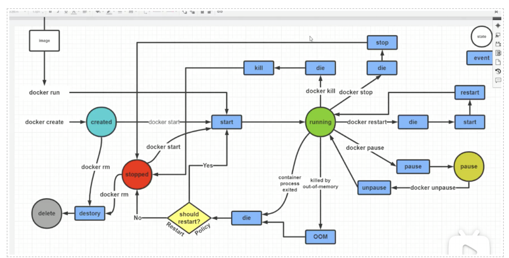

容器为经典版linux：很多命令不能用 

ll           vim 

# 镜像常用操作： 

docker images====>docker image ls:查看本地镜像 

docker search :搜索想要的镜像===与官网相同 
 
docker pull tomcat:TAG(版本)  :拉取镜像 

 
删除指定本地镜像： 

    -f : 表示强制删除   
    docker rmi -f 镜像id或者镜像名：TAG 

获取元信息(详细信息)： 

docker inspect 镜像id或者镜像名：TAG 

（也可查看容器） 

镜像不能改变只有容器才能改变 

# 容器常用操作： 

 

## 1. 运行容器： 

docker run --name liqiu[容器名] -d -p 8080【宿主机】:8080【应用端口：容器内部，官方人员写dockerfile时开放的(因容器是隔离的)】tomcat [可添加自己写的linux shell 命令] 

===》跑完生成容器id 

docker container ps ：查看容器运行的进程 

怎样查看是否跑起来？ 

1.通过外界查看 

2.docker logs liqiu :查看日志 

 

## 2. 获取容器元信息(详细信息)： 

docker container inspect liqiu【容器ID或者容器名】 

 

## 3. 进入正在运行容器 

docker exec -it  容器ID或者容器名（liqiu）/bin/bash  

进入正在运行的容器目录并且开启交互模式终端 

 

exit : 退出容器 

/bin/bash 是固有写法，作用：因为docker后台必须运行一个进程，否则容器就会退出，在这里表示启动容器后启动bash 

-i ：以交互模式运行容器 

-t  :分配一个伪终端，即命令行，通常-it组合来使用 

-d：后台运行容器 

-p：开放应用端口，使外界可访问此虚拟机 

-v :制定挂载主机目录到容器目录，默认为rw读写模式，ro表示只读 

也可以用docker exec在运行中的容器执行命令 

## 4. 拷贝文件： 

docker cp 主机文件路径 容器ID或者容器名：容器路径-------主机中文件拷贝到容器中 

docker cp 容器ID或者容器名：容器路径   主机文件路径------容器中文件拷贝到主机中 

## 5. 容器列表 

docker ps -a -q 查看正在运行的容器 

-a ：查看所有容器（运行中 未运行） 

-q  : 只查看容器的ID 

## 6. 启动容器 

docker start  容器ID或者容器名 

## 7. 停止容器 
