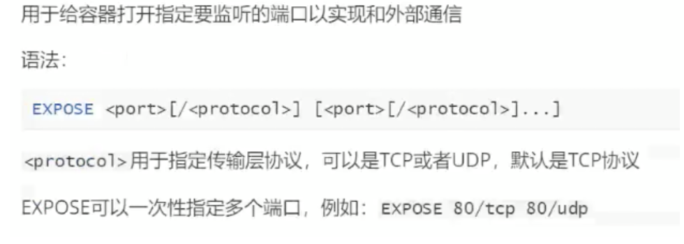
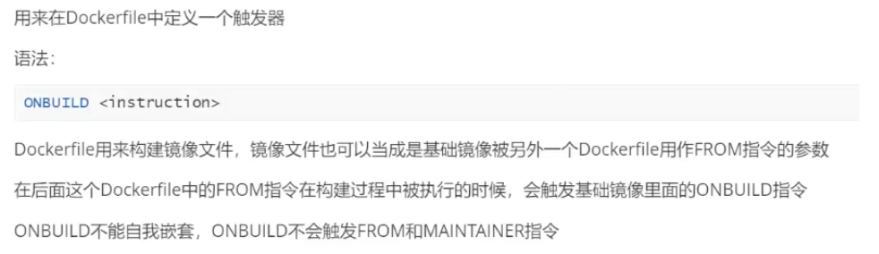

# docker的四种网络模式 

Bridge:桥模式（配置容器自定义的网络模式） 

Host：主机模式 

None:外界与内部封闭，不能相互访问 

container 

 

# 桥模式 

docker network ls 

docker run --name t1 -it --rm busybox 

docker网络： 

    ip地址直接访问===解析dns===通过host文件 

docker run --name t1 -it --rm busybox 

hostname 

    Id:sfjfoi(例)

cat /etc/hosts :通过host文件 

    IP   ID 

cat /etc/resolv.conf 

 

尝试解析百度dns 

    nslookup:解析dns的工具 
    nslookup -type=A www.baidu.com  解析百度 

 
修改dns 

改主机名 

更改DNS解析服务器：配置自己固定DNS时会需要 

docker run --name t1 -it --network bridge【模式】 -h tian【指定主机名】 --dns（直接更改服务器） 8.8.8.8 --rm busybox 

hostname -----tian 

cat /etc/resolv.conf  -----nameserver 8.8.8.8 

# 主机模式 

容器使用的网络与宿主机一样：不需要映射端口 

docker image ls 

docker run --name tom -d --network host  tomcat 

# Container 

容器开放的所有端口 

docker port tomcat 查看开放端口 
# 配置网络信息 
    :配置镜像加速时配置 

仓库中镜像不能满足时，自己基于一个基础镜像构建一个自己的镜像： 

# 生成两种方式： 
1. 更新镜像：使用docker commit 命令 

 

先使用基础镜像创建一个容器，然后对容器内容进行更改，然后使用docker commit 命令提交为-一个新的镜像(以tomcat为例) .1.根据基础镜像，创建容器 

 

docker run --name mytomcat -p 80:8080 -d tomcat 

 

2.修改容器内容 

 

docker exec -it mytomcat /bin/bashcd webapps/ROOT 

 

rm -f index.jsp 

 

echo "<h1>he11o world </h1>"> index.html 

 

exit 

 

3.提交为新镜像 

 

docker commit 一m="描述消息" -a="作者" 容器ID或容器名镜像名:TAG 

====>生成新的镜像 

 

#例: 

 

# docker commit  -m="修改了首页" -a="华安” mytomcat huaan/tomcat:v1.0 

 

4.使用新镜像运行容器 

 

docker run --name tom -p 8080:8080 -d huaan/tomcat:v1.0 

 

2. 直接构建镜像：使用docker build命令,需创建Dockerfile文件 

Dockerfile:用来构建镜像的源码（使用build指令自动化构建镜像） 

格式： 

1.注释 

2.指令+参数 

指令不区分大小写（约定：指令大写、参数小写） 

!!!除了注释，第一个有效指令必须是FROM:指定基础镜像 

# 使用Dockerfile构建SpringBoot应用镜像 

一、准备 

1.把你的springboot项目打包成可执行jar包 

2.把jar包上传到linux服务器 

 

 

二、构建 

1.在jar包路径下创建Dockerfile文件vi Dockerfile 

 

#指定基础镜像，本地没有从dockerHub pull 下来 

FROM java:8 

 

#作者 

MAINTAINER huan 

 

#把可执行jar包复制到基础镜像的根目录下 

ADD liban.jar /luban.jar 

 

#镜像要暴露的端口，如要使用端口，在执行docker run 命令时 -p生效 

EXPOSE 80 

 

#在镜像运行为容器后的执行命令 

ENTRYPOINT ["java","-jar","/luban.jar"] 

 

2.使用docker build命令构建镜像，基础语法 

Docker build -t huaan/mypro:v1 . 

# -f 指定dockerfile文件的路径 

# -t 指定镜像名字和TAG 

# .  指当前目录，这里实际需要一个上下文路径 

 

三、运行 

运行自己的Springboot镜像 

docker run --name pro -p 80:80 -d 镜像名：TAG

# Dockerfile常用指令(共18) 
1. FROM 
 
2. MAINTAINER (即将废弃，建议用LABEL) 
 
3. LABEL
 
4. COPY
 
5. ADD
 
6. WORKDIR
 
7. VOLUME
 
8. EXPOSE
 
9. ENV
 
10. ARG
 
11. RUN 

12. CMD
 
13. ENTRYPOINT  (可以写多行，但只有最后一个启动时生效) 
 
14. ONBUILD 
 

ADD 与 COPY 区别： 

ENTRYPOINT 与 CMD区别： 