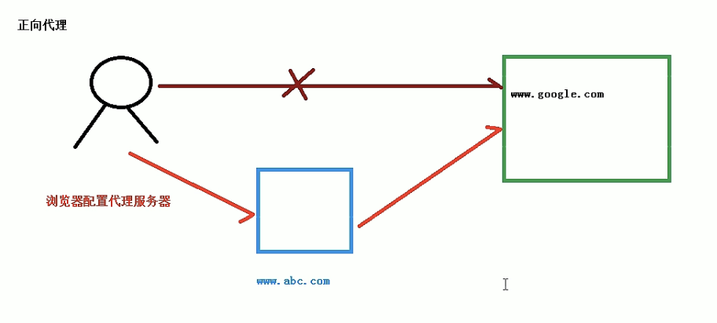
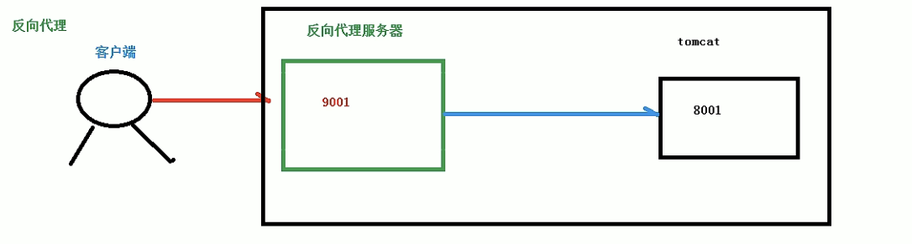
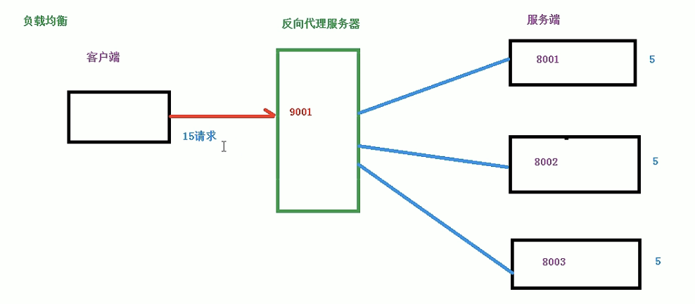
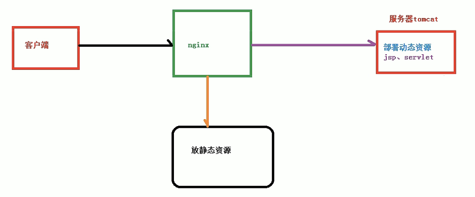

# Nginx简介 

常见web服务器: 
nginx,apache,lint, 

# 相关概念

## 反向代理

正向代理：
在浏览器配置代理服务器，通过代理服务器进行互联网访问

反向代理：
对客户端代理无感知，不需要客户端任何配置。

## 负载均衡
单个服务器解决不了，我们增加服务器的数量，然后将请求分发到各个服务器上，将原先请求集中到单个服务器上的情况改为将请求分发到多个服务器上

## 动静分离
为了加快网站的解析速度，可以把动态页面和静态页面由不同的服务器来解析，加快解析速度，降低原来单个服务器的压力。

 