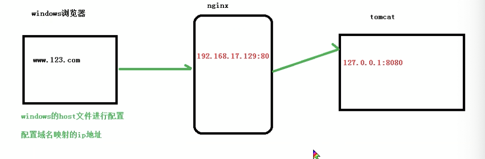

# 反向代理
## 实例1
1. 实现效果：打开浏览器，输入www.123.com ,跳转到linux系统tomcat主页面中
2. 准备工作：
* 安装nginx
* 在linux系统中安装tomcat主服务器，使用默认端口8080
压缩包拖拽进目录--cd /usr/src-- tar -xvf tomcat-7.0.70.tar.gz
* 启动tomcat:需要jdk环境
    进入tomcat的bin目录,执行文件 ./startup.sh
    可进入logs文件查看启动日志
          
* 对外开放访问的端口
设置开放的端口号  
firewall-cmd --add-port=8080/tcp ==permanent   
重启防火墙   
firewall-cmd-reload   
查看开放的端口号   
firewall-cmd --list-all 

3. 在windows系统中通过浏览器访问tomcat服务器，查看是否能访问
192.168.17.129:8080


访问过程分析


输入域名后执行：先到本地host文件中看有没有希望的配置->有（根据host执行）；没有到网络中找dns域名解析器（网络ip）
4. 具体配置
第一步：windows系统的host文件进行域名和ip对应（windows/System32/drivers/etc/HOSTS）  
```js
192.168.17.129 www.123.com
``` 
第二步：在nginx请求转发

```js

http{

    server{
        listen 80;
        server_name 192.168.17.129; 
        // 主机名称

        location / {
            root html;
            proxy_pass http://127.0.0.1:8080;
            index index.html index.html;
        }
    }
}
```
5. 最终测试
## 实例1
1. 实现效果：使用nginx反向代理，实现根据访问路径跳转到不同端口的服务中
访问 http://127.0.0.1:9001/edu/ 直接跳转到http://127.0.0.1:8081    
访问 http://127.0.0.1:9001/vod/ 直接跳转到http://127.0.0.1:8082
2. 准备工作
* 准备两个tomcat服务器，一个8080端口，一个8081端口

# 负载均衡


# 动静分离

