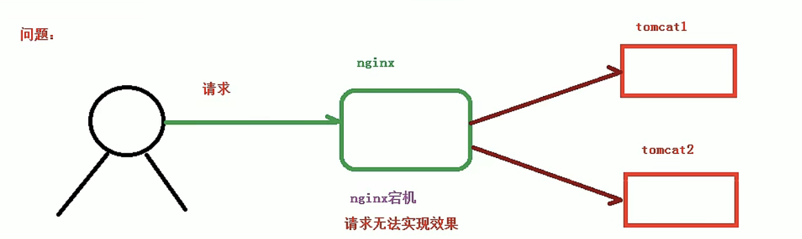

# 反向代理
## 实例1
1. 实现效果：打开浏览器，输入www.123.com ,跳转到linux系统tomcat主页面中
2. 准备工作：
* 安装nginx
* 在linux系统中安装tomcat主服务器，使用默认端口8080
压缩包拖拽进目录--cd /usr/src-- tar -xvf tomcat-7.0.70.tar.gz
* 启动tomcat:需要jdk环境
    进入tomcat的bin目录,执行文件 ./startup.sh
    可进入logs文件查看启动日志
          
* 对外开放访问的端口
设置开放的端口号  
firewall-cmd --add-port=8080/tcp ==permanent   
重启防火墙   
firewall-cmd-reload   
查看开放的端口号   
firewall-cmd --list-all 

3. 在windows系统中通过浏览器访问tomcat服务器，查看是否能访问
192.168.17.129:8080


访问过程分析


输入域名后执行：先到本地host文件中看有没有希望的配置->有（根据host执行）；没有到网络中找dns域名解析器（网络ip）
4. 具体配置
第一步：windows系统的host文件进行域名和ip对应（windows/System32/drivers/etc/HOSTS）  
```js
192.168.17.129 www.123.com
``` 
第二步：在nginx请求转发

```js

http{

    server{
        listen 80;
        server_name 192.168.17.129; 
        // 主机名称

        location / {
            root html;
            proxy_pass http://127.0.0.1:8080;
            index index.html index.html;
        }
    }
}
```
5. 最终测试
## 实例2
1. 实现效果：使用nginx反向代理，实现根据访问路径跳转到不同端口的服务中
访问 http://192.168.17.129/edu/ 直接跳转到http://127.0.0.1:8081    
访问 http://192.168.17.129/vod/ 直接跳转到http://127.0.0.1:8082
2. 准备工作
* 准备两个tomcat服务器，一个8080端口，一个8081端口
        改端口号：进入解压后的文件--cd conf--server.xml-- shutdown的port=8005改为8015--找到port=8080的位置改为8081---其他端口也都改下 【测试下】
*  创建文件夹和测试页面   
    进入tomcat/webapps/下建文件夹edu，写文件a.html   
    8081类似
3. 具体配置（nginx）

* nginx/conf/nginx.conf
* 开放端口号

```js

http{

    server{
        listen 80;
        server_name 192.168.17.129; 
        // 主机名称

        location / {
            root html;
            proxy_pass http://127.0.0.1:8080;
            index index.html index.html;
        }
    }
    //配置
    server{
        listen 9001;
        server_name 192.168.17.129; 
        // 主机名称
        // ～:表示要用正则表达式形式
        location ～ /edu/ {
            // root html;
            proxy_pass http://192.168.17.129:8080;
            // index index.html index.html;
        }
        location ～ /vod/ {
            // root html;
            proxy_pass http://192.168.17.129:8081;
            // index index.html index.html;
        }
    }
}
```
=   :用于不包含正则表达式的uri前，要求请求字符串与uri,严格匹配   
～   :用于表示uri包含**正则表达式**，并且区分大小写
～*  :用于表示uri包含**正则表达式**，并且不区分大小写  
^～  :不包含正则表达式的uri前,要求nginx服务器找到与请求字符串匹配度最高的location后，立即使用location处理请求，不再使用location块中的正则做匹配。


# 负载均衡
1. 实现效果
打开浏览器，输入http://192.168.17.129:8080/edu/a.html,把请求分担到8080和8081中去
2. 准备工作
* 准备两个tomcat服务器，一个8080端口，一个8081端口
* 在两个tomcat里面webapps目录中，创建名称是edu文件夹，在文件夹中创建页面a.html，
3. nginx的配置文件中进行负载均衡的配置
```js
http{
    //负载均衡服务器的列表
    upstream myserver {
        server 192.168.17.129:8080 weight=10; 
        server 192.168.17.129:8081 weight=10;
    }
    server{
        listen 80;
        server_name 192.168.17.129; 
        // 主机名称

        location / {
            root html;
            proxy_pass http://myserver;
            // proxy_connect_timeout 10;
            index index.html index.html;
        }
    }
}
``` 
5. nginx分配策略：
* 轮询（默认）:每个请求按时间顺序逐一分配到不同的后端服务器，如果后端服务器down掉，能自动剔除
* weight :代表权重，默认为1，权重越高被分配的客户端越多
* ip_hash :每个请求按访问ip的hash结果分配，这样每个访客固定访问一个后端服务器，可以解决session问题【指定每个用户访问的ip,解决session共享的问题】
```js
 upstream myserver {
    ip_hash；
    server 192.168.17.129:8080; 
    server 192.168.17.129:8081;
}
```
* fair(第三方) :按后端服务器的响应时间来分配请求，响应时间短的优先分配
```js
upstream myserver {
    server 192.168.17.129:8080; 
    server 192.168.17.129:8081;
    fair
}
```
# 动静分离：动态请求与静态请求分开
方式一：纯粹的把静态文件独立成单独的域名，放到独立的服务器上。【主流方案】


方式二：混合一起发布，nginx区分开

通过loaction指定不同的后缀名实现不同的请求转发。   
expires :可以设浏览器缓存过期时间，无需去服务端验证，减少与服务器之间的请求和流量。适合不经常变动的资源。  

发送请求，对比服务器该文件最后更新时间没有变化，则不会从服务器抓取，返回状态码304，有修改，直接从服务器重新下载，返回状态码200
2. 准备工作
* linux系统中准备静态资源，用于进行访问
data/www/a.html
data/image/1.png

3. 具体配置


```js
http{
    server{
        listen 80;
        server_name 192.168.17.129; 
        // 主机名称

        location /www/ {
            // 静态资源路径
            root /data/;
            index index.html index.html;
        }
        location /image/ {
            // 静态资源路径
            root /data/;
            autoindex on;//列出访问目录
            // proxy_pass http://myserver;
            // // proxy_connect_timeout 10;
            // index index.html index.html;
        }
    }
}
```
4. 最终测试 
浏览器中输入http://192.168.17.129/image/01.png
浏览器中输入http://192.168.17.129/www/a.html

# 配置高可用的集群
1. 什么是nginx的高可用



keepalived类似于一个路由，通过脚本检测当前服务器是否还活着，活着则继续访问，宕机则切换到另一台服务器。两台服务器ip不同，需对外提供一个虚拟ip。

* 需要两台nginx服务器
* 需要keepalived
* 虚拟ip

2. 准备工作
* 两台虚拟机服务器
* 两台服务器安装nginx
* 两台服务器安装keepalived（下载压缩包/使用yum命令）

    * yum install keepalived -y 

    * 查看是否安装：rpm -q -a keepalived
    * 安装后，在中生成目录keepalived： etc/keepalived/keepalived.conf

3. 主从配置
* 修改etc/keepalived/keepalived.conf 文件
* 在/usr/local/src.nginx_check.sh添加检测脚本
* 启动nginx与keepalived(systemctl start (keepalived  ed/keepalived.service))
看进程 ps -ef|grep keepalived

etc/keepalived/keepalived.conf
```js 
// 全局定义
global_defs{

    router_id LVS_DEVEL 
    //定义唯一的值（ip也可以）
    //通过（主机名字）LVS_DEVEL可以访问到主机
    //etc/hosts中加上 127.0.0.1 LVS_DEVEL

}

//检测脚本配置（nginx 是否还活着）
vrrp_script chk_http_port{
    script "/usr/local/src.nginx_check.sh"
    interval 2  //检测脚本执行间隔
    weight -20   //权重（脚本条件成立，当前主机权重减20）
}
 
//虚拟ip配置
vrrp_instance VI_1 {
    state BACKUP //备份：BACKUP；主：MASTER
    interface ens33 
    //网卡（哪个网卡绑定虚拟主机的虚拟ip）

    virtual_router_id 51 
    //主、备机的virtual_router_id必须相同(路由值)
    priority 100 //优先级，主机值大，备份机值小
    advert_int 1 //每隔一段时间（默认：1s）检测一下服务器是否活着
    //权限调用确认方式
    authentication {
        auth_type PASS
        auth_pass 1111
    }
    //vrrp H虚拟地址
    virtual_ipaddress {
        // 【可绑定多个】
        192.168.17.50 
    }
}
```
找网卡名字:ifconfig


/usr/local/src.nginx_check.sh
```js

#!/bin/bash
A=`ps -C nginx -no-header |wc -l`
if [$S -eq 0];then
    //nignx启动路径
    /usr/local/nginx/sbin/nginx
    sleep 2
    if [`ps -C nginx -no-header |wc -l` -eq 0];then 
        killall keepalived
    fi
fi
```
测试：输入虚拟IP，进入nginx页面

systemctl stop keepalived.service 停止

 ip a 查看虚拟ip的绑定

# 原理解析


1. master&worker    

启动nginx后nginx的两个进程；master将任务分给不同的worker       
查看进程： ps -ef|grep nginx    

2. worker是如何工作的  


3. 一个master和多个worker好处  
* 可以使用nginx -s reload 热部署
* 每个worker是一个独立的进程，不需要加锁（省掉了加锁带来的开销）；一个进程结束，其他进程不会中断，实现请求过程 ，服务不会中断（降低风险）

4. 最合适worker个数     
nginx同redis类似都采用了io多路复用机制。
好处：每个worker是一个独立的进程，每个进程只有一个主线程，通过**异步非阻塞**的方式处理请求，即使是成千上万个请求也不在话下。  
每个worker的线程可以把一个cpu的性能发挥到极致，所以**worker数和服务器的cpu数量相等**是最为适宜的。少：浪费，多：cpu频繁切换上下文带来损耗

5. 连接数worker_connection  
* 发送请求，占用worker的几个连接数？2或4【client tomcat】
* nginx有一个master，四个worker，每个worker支持最大连接数据1024，支持的最大并发数是多少？
worker支持最大连接数（4*1024）
最大并发：worker支持最大连接数/4～worker支持最大连接数/2

公式：
** 普通静态访问：worker_connections*worker_processes/2
** 如果是http作为反向代理：worker_connections*worker_processes/4


   


