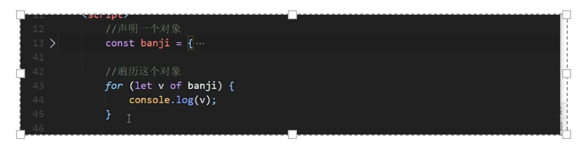

https://www.bilibili.com/video/BV1uK411H7on 
# es6
添加了重要的新语法，包括class和module，迭代器(generators)和for / of循环，生成器，箭头函数，二进制数据，类型化数组，集合（map，集合和弱地图），承诺(promises)，数字和数学增强，反射和代理(proxies)。 

1. ***相关名词介绍*** 
https://kangax.github.io/compat-table/es6/ (es6兼容性查看) 

2. ***let声明变量*** 

特性： 
- 不能重复声明，var可以 
- 块级作用域（es5作用域：全局，函数，eval【es5严格模式才会出现】），只在代码块里【{ … }、if else 、while for】 
- 不存在变量提升 
- 不影响作用域链 
```javascript
{
    let school='尚硅谷'
    function fn(){
        console.log(school)
    }
    fn()
}
```
3. ***const声明常量***   
特性： 
- 一定要赋初始值 
- 使用大些字母 
- 值不能修改 
- 块级作用域 
- 对于数组和对象的的元素修改，不算做对常量的修改，不会报错

4. 解构(数组/对象) 
5. 模版字符串 : `` 

6. 对象的简化写法 
```javascript
let school={ 
    teacher, 
    children 
} 
```
7. 箭头函数 
- this静态（生命时所在作用域） 
- 不能作为构造函数实例化对象 
- 不能使用arguments变量 
- 简写(省略小括号/花括号) 
- 不适合与this有关，事件回调，对象的方法  
    reset参数 
```javascript
    function date(…args){ 
        //args数组 
    } 
    date（'111','222','333'） 
```
8. 扩展运算符【…】 

将数组===>逗号分隔的【参数序列】 

使用: 
- 数组合并 
- 数组克隆 
- 伪数组转为真正的数组 
9. Symbol（第七种数据类型） 
特点： 
- 唯一，解决命名冲突 
- 不能进行运算 
- 不能使用 for…in循环遍历，但可以使用Reflect.ownKeys来获取对象的所有键名 

数据类型（usonb） 

```javascript
let a=Symbol() 
let a=Symbol('test') 标志用途 
let d=Symbol('test') 
let b=Symbol.for('test')  
let c=Symbol.for('test')  

a!==d  
b==c 
```


 

内置值 

```javascript
//自己控制类型检测 
class Person{ 
    static [Symbol.hasInstance](param){ 
        console.log('监测类型',param) //{} 
        return true 
    } 
} 
let o={} 
console.log(o instanceof Persom) //true 
```
10. 迭代器 
    intertor(对象里的一个属性) :主要供for…of消费 
    原生具备intertor接口: Array、Arguments、Set、Map 、string、typedArray、NodeList 
    
    
11. 生成器（特殊函数） 

异步编程（纯回调函数 node-fs ajax mongodb） 

参数：    

12. Promise 
13. 集合 
14. Class 
15. ES5构造函数继承 
16. class的类继承 
17. 子类对父类方法的重写 
18. class中的getter和setter 
19. ES6的数值扩展 
20. ES6的对象方法扩展 
21. 模块化介绍优势以及产品 
22. 浏览器使用ES6模块化引入模块 
23. ES6模块暴露数据语法汇总 
24. babel对ES6模块化代码转换 
25. ES6模块化引入NPM包 