https://lurongtao.gitee.io/felixbooks-gp19-node.js/basics/01-Node.js%E5%9F%BA%E7%A1%80.html 

视频: https://www.bilibili.com/video/BV1d4411W7Fp/ 

特点： 
- 基于V8 
- 事件驱动 
- 非阻塞i/o（输入输出流）  

阻塞操作：网络请求、数据库处理、文件读写 

优点：高并发（node/python）  
# Npm 
```javascript
export NVM_DIR="$([ -z "${XDG_CONFIG_HOME-}" ] && printf %s "${HOME}/.nvm" || printf %s "${XDG_CONFIG_HOME}/nvm")"[ -s "$NVM_DIR/nvm.sh" ] && \. "$NVM_DIR/nvm.sh" 

nvm use v14 

```

nvm alias default 版本 

\* 表示xx最新版本  
^锁定主版本  
~锁定主版本和次版本  
空：锁定主版本和次版本与patch   

脚本命令连接符： & 并行顺序，前后不一定；&&按顺序执行 

 

# nrm+npx 

exports.default= 

Es6  module.defaults / export default 

log4js 记录js日志    

Http header -----------鉴权、token 

https://liushiming.cn/article/nodejs-version-manager-nvm-tutorial.html
# http 

node 浏览器端调试（chrome://inspect/#devices） 

node --inspect --inspect-brk ser.js 

服务器端Node 进程管理工具:
- supervisor 
- nodemon 
- forever 
- pm2 

npm install nodemon   
nodemon server.js //持续监听，不用重启 
    
Postman （insomnia） 

# Event 

跨域： 
- jsonp：script标签加载js不跨域特性，从后端拉取js代码运行 
- cors：acao 
- 中间键：正向代理 

http应用实例:爬虫[cheerio 创建虚拟dom] 

readline ：从命令行读（采集）数据 

***路由(原生nodejs)：*** 

    截取request对象的url 
    读取资源---响应路径 

例子：静态资源服务搭建 
 fs.existsSync（filePathName）//判断某个文件是否存在 


***快速构建nodejs代码express、koa2*** 

# Express 
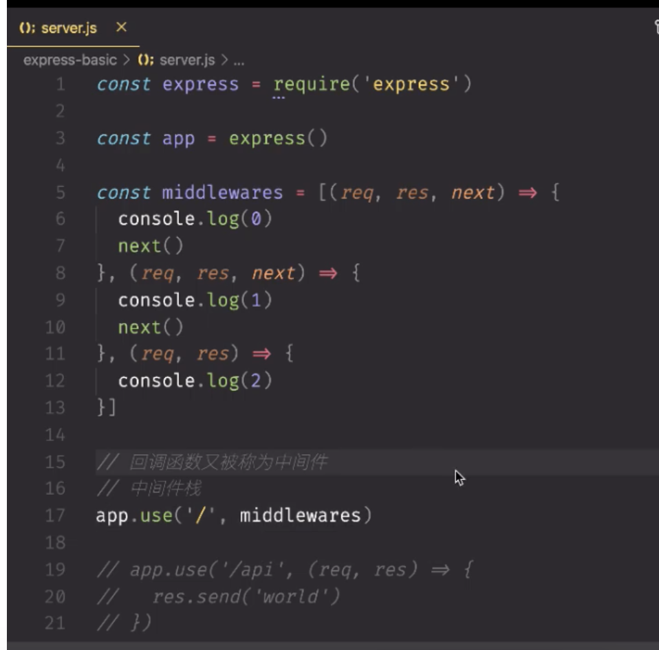

设计模式： 
Get --- query  

Post【添加】  
Put【覆盖式】/Patch【选择性】修改数据----body（第三方中间键 body-parser[解析nodejs的body]） 

中间键：自己的中间键、路由中间键、第三方中间键  
controller文件抽中间键 
rmvp 
===>vm

### 服务端与客户端渲染 

express模版  
- ejs 
- pug 
- jade 
- art-template 

使用模版用模版引擎:模版渲染更简洁 


速度/管理效率 

页面render:  
- ssr (server side render) 
- csr (client side render) 

View模版文件夹 

状态码：304 转发 
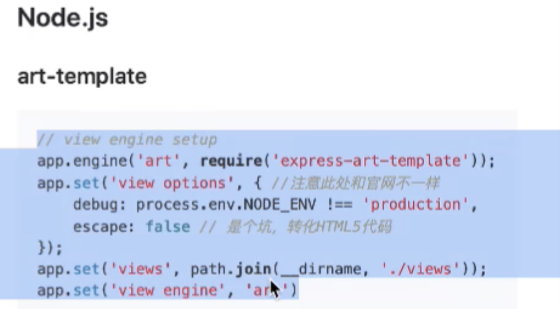

cms网站管理系统 
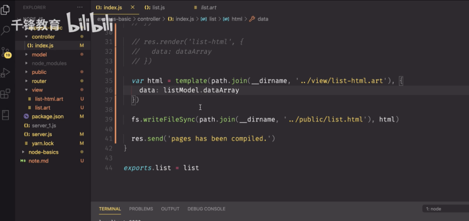
Rmvp 

# mongo
MongoDB[非关系型数据库]：json字符串  
SQL关系型数据库：二维表格 

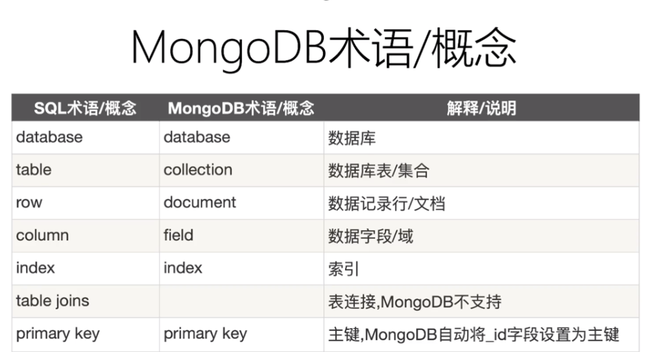

集合无固定结构 


数据类型 
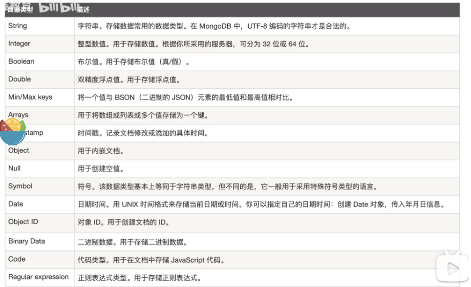

数据库常用命令: 
- db:查询当前数据库 
- show dbs：查询所有数据库 
- 创建/切换数据库：use 数据库名 
- db.stats():当前数据库状态 
- db.version :当前数据库版本 
- db.getMongo():当前db的链接机器地址 
- db.dropDatabase():删除数据库【当前数据库执行】 


集合操作 
- 创建集合：db.createCollection('users') 
- 得到当前db的所有集合名字：db.getCollectionNames()  

文档操作 
- {$inc:{ }} //在原有基础上加值 
- $gt 
- $lt 
- 模糊查询：使用正则 

集合查询：

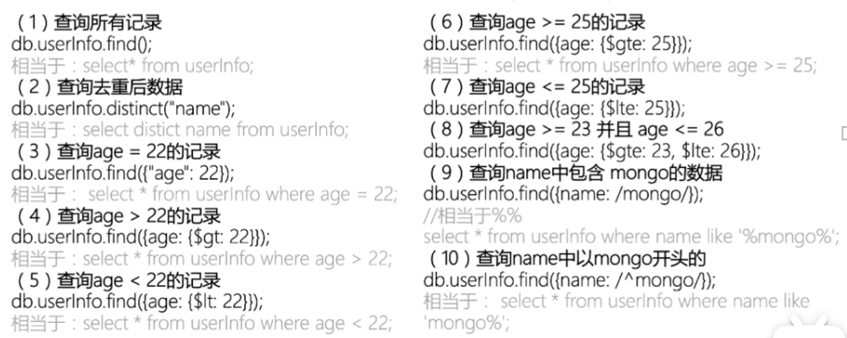
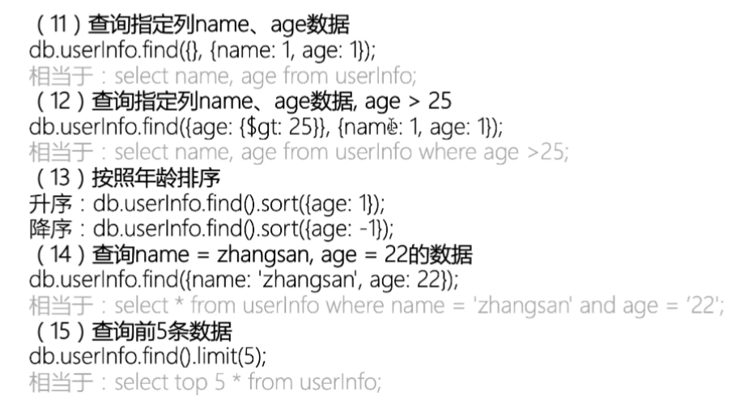
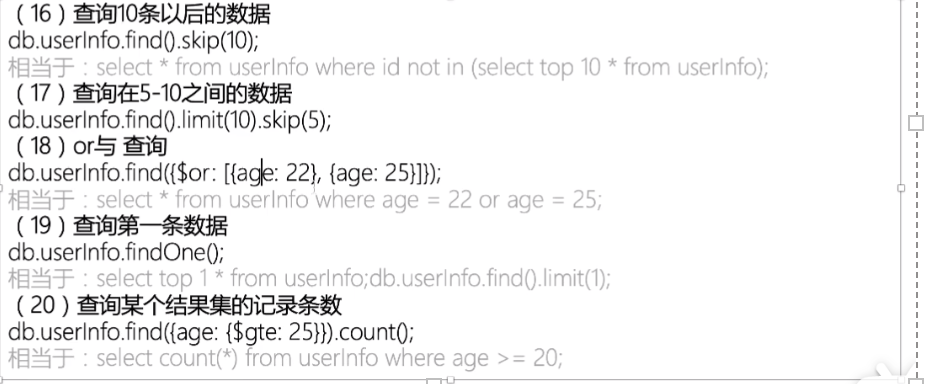
skip(3).limit(3) //跳过3条，取3条  

有sort 就先排序再查找 
mongodb工具 

# 身份认证/鉴权 
登录验证 https://jwt.io/ 

不同开发模式下的身份认证: 
- 服务端渲染 【Session认证机制】 
- 前后端分离 【JWT认证机制】 


http协议的无状态协议  
session原理：【服务器要存session】 
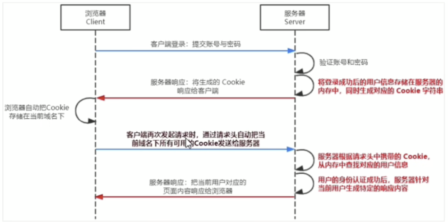

cookie： 

    【存储在用户浏览器中的一段不超过4KB的字符串（键值对和其他几个用于控制有效期、安全性、使用范围的可选属性组成）】 

    不同域名下的cookie各自独立，每当客户端发起请求时，会自动把当前域名下未过期的cookie一同发送到服务器 

特性： 
- 自动发送 
- 域名独立 
- 过期时限 
- 4kb限制 

cookie不具有安全性（身份信息、密码等不建议存储） 

提高身份认证安全性(Session认证机制) 会员卡+刷卡认证 

## session中间键使用 

1. 安装express-sesssion 
2. 配置express-sesssion中间键
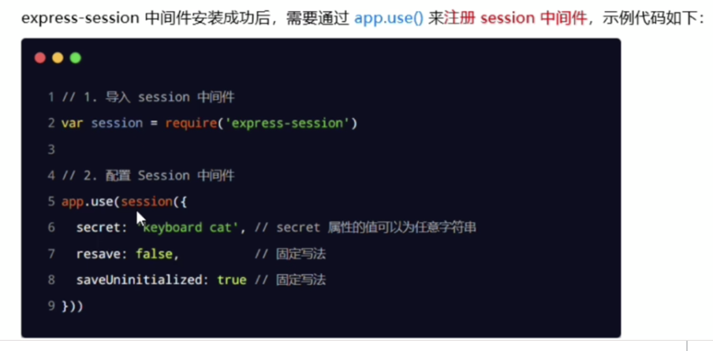
3. 向sesssion中存数据
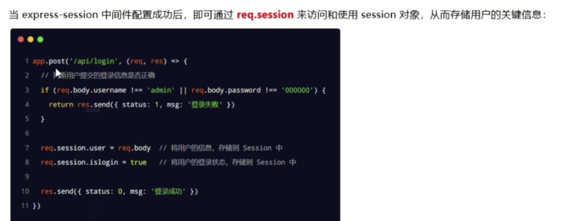
4. 从sesssion中读数据
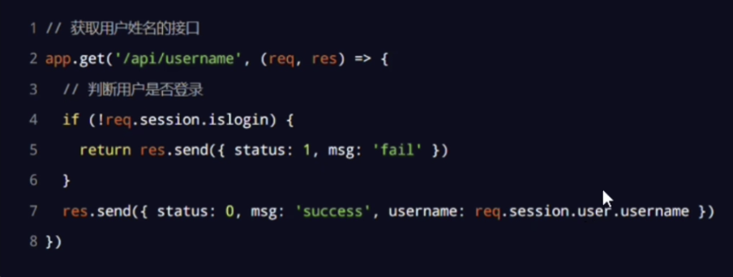
5. 清空sesssion
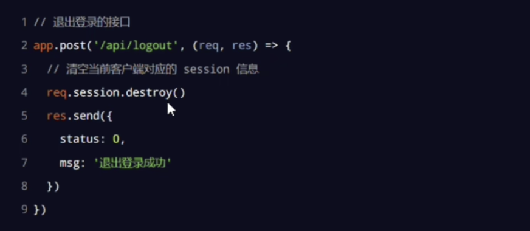
 

***了解session认证的局限性*** 

session认证机制需要配合cookie才能实现，由于cookie默认不支持跨域访问，所以，当涉及到前端跨域请求后端接口的时候，需要做很多额外的配置，才能实现session认证。 

 

***注意：*** 

当前端请求后端接口不存在跨域问题的时候，推荐使用session身份认证机制 

需要跨域，推荐使用JWT（JSON Web Token）认证机制 


# JWT基础 
## 对称加密 （hs256） 
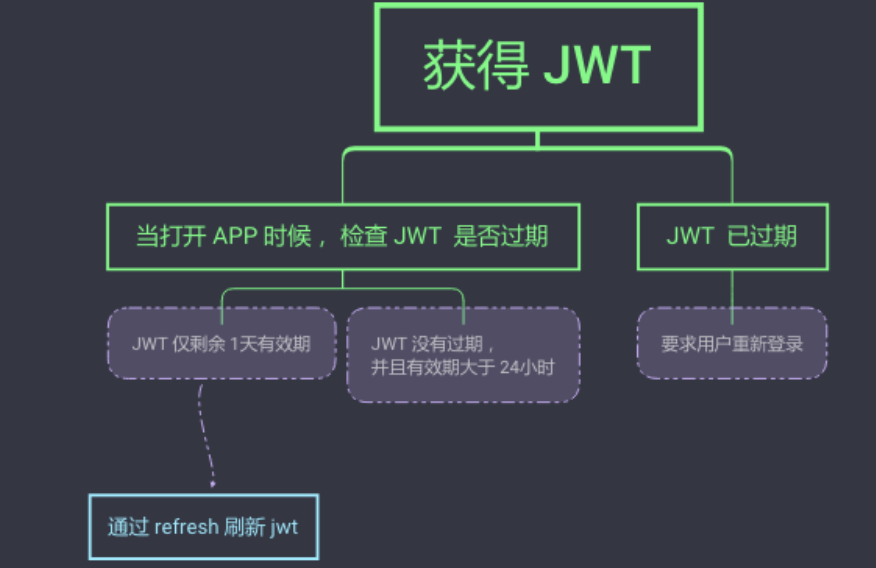

jwt工作原理 
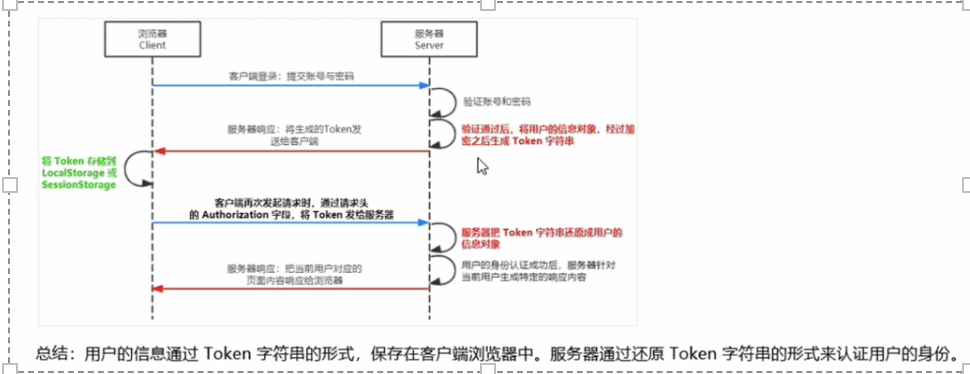

jwt的组成成分: 
Header(头部)、Payload(有效载荷)、Signature(签名)，三者使用英文的“.”分隔，格式如下：Header.Payload.Signature 
- Payload:真正用户信息，用户信息经过加密之后生成的字符串。 
- Header和Signature是安全性相关的部分，只是为了保证token的安全性。 

使用方式：Authorization:Bearer `<token>`
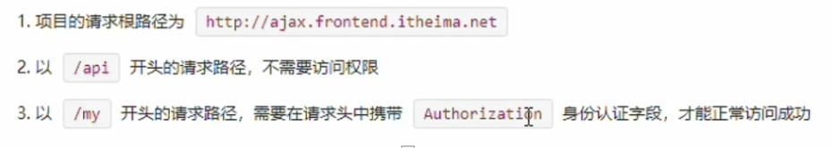

1. 安装jwt相关的包 

    npm install jsonwebtoken express-jwt 

    jsonwebtoken :用于生成jwt字符串 
    express-jwt ：将jwt字符串还原 

2. 导入jwt相关的包  
    使用require()分别导入JWT相关的两个包
    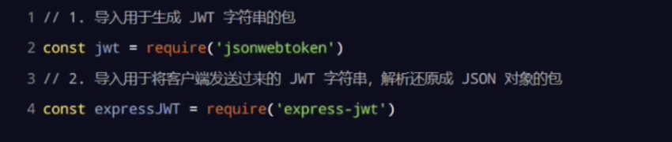
3. 定义secret
    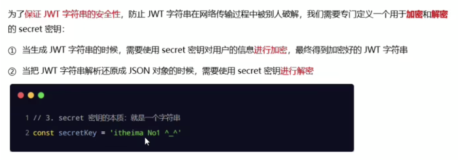
4. 登录成功后生成jwt字符串
    调用jsonwebtoken包提供的sign()方法，将用户信息，加密成jwt字符串，响应给客户端
    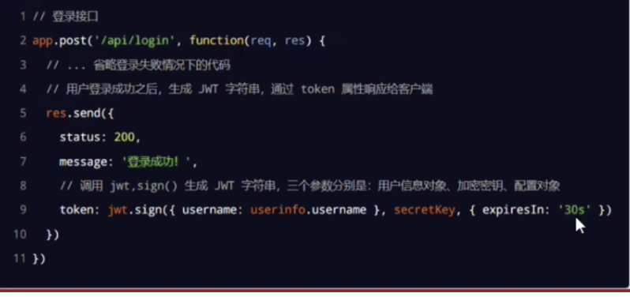
5. 将jwt字符串还原为JSON对象
    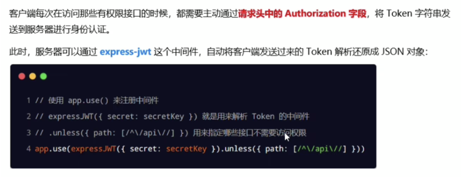
6. 使用req.user获取用户信息
    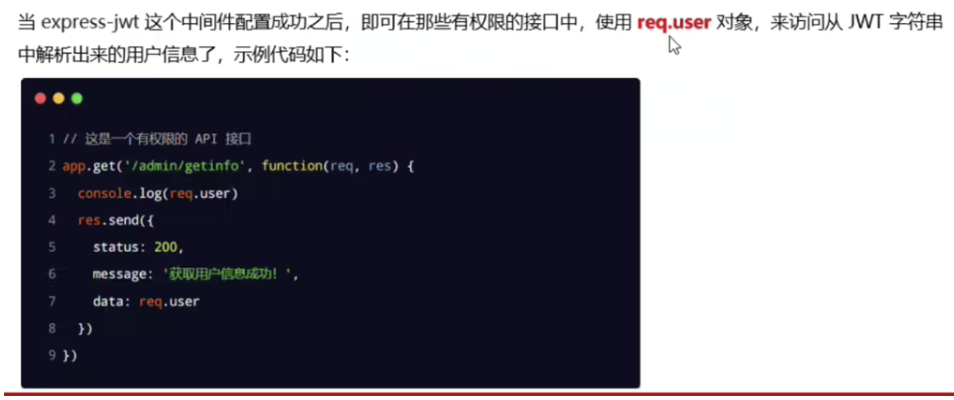
    ***注意： 不要把密码加到token字符串中** 
7. 捕获解析jwt失败后产生的错误
    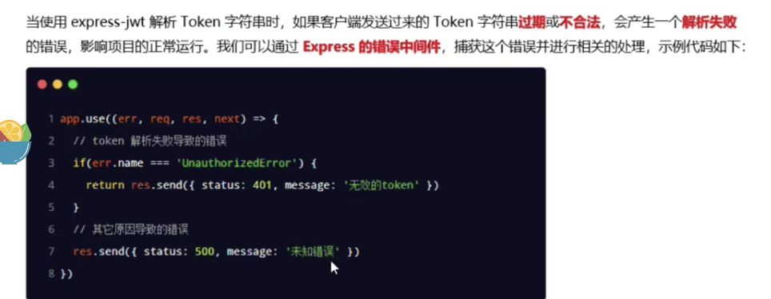

let tk= jwt.sign 
let decoded= jwt.verify(tk,'密钥') 

区块链相似：埋信息 

## 非对称加密（rs256）:公钥、私钥 

非对称密钥生成
 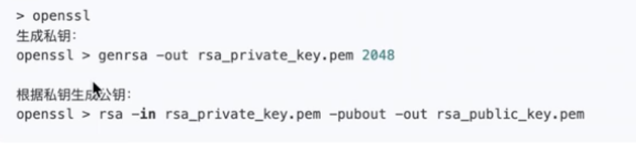

let tk= jwt.sign（，'私钥'，{}） 
 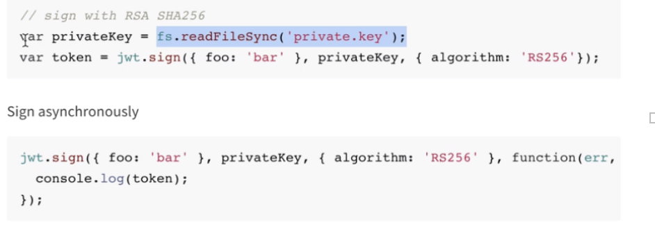
验证：  
let decoded= jwt.verify(tk,'公钥') 


 