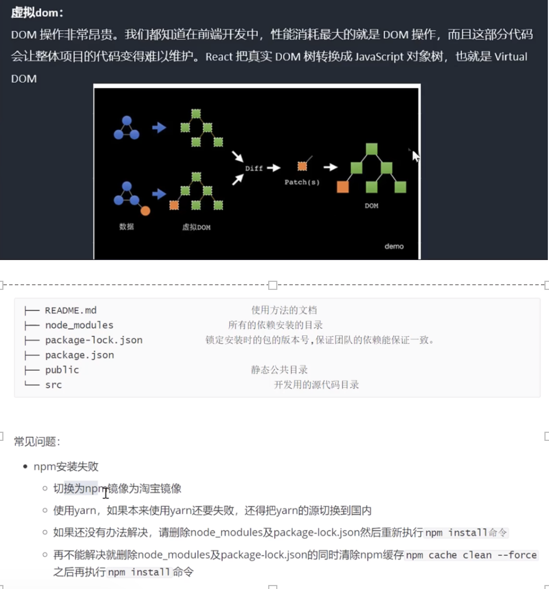
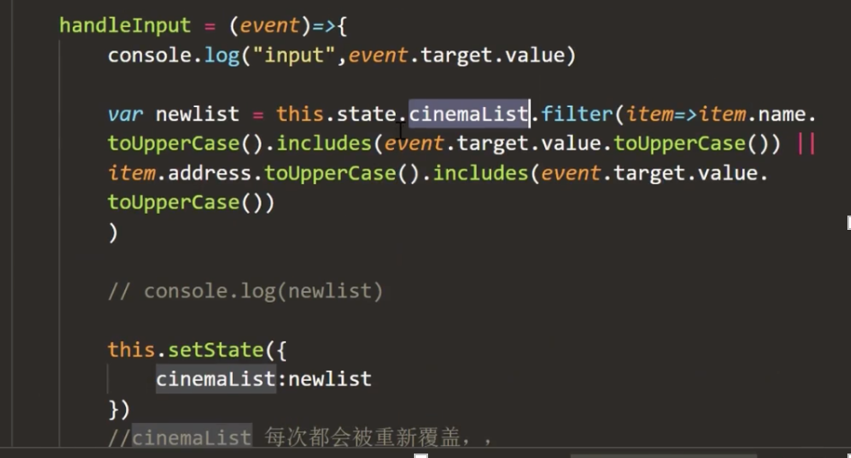

组件库（pc/移动端） 

styled-compontents 
# JSX与组件
## react特性 
声明式设计、高效、灵活、Jsx、组件、单项数据流 

**JSX**:JavaScript XML（HTML）的缩写
**作用**：在React中创建HTML结构（页面UI结构）

优势：
1. 采用类似于HTML的语法，降低学习成本，会HTML就会JSX
2. 充分利用JS自身的可编程能力创建HTML结构

注意：JSX 并不是标准的 JS 语法，是 JS 的语法扩展，浏览器默认是不识别的，脚手架中内置的@babel/plugin-transform-react-jsx 包，用来解析该语法

原则：模板中尽量精简，复杂的多分支逻辑收敛为一个函数

## 格式化配置
1. 安装prettier插件
2. 修改配置文件 setting.json
## 虚拟DOM 


npm i -g nrm (管理仓库地址) 
nrm ls   (查看镜像) 
nrm use XX 切换npm镜像 

## 事件处理 
class组件事件处理（4种） 

1. 之间在render里写行内的箭头函数（逻辑过多时不推荐）
```javascript

<button onClick={()=>{this.a}}></button>
``` 

2. 直接在组件内定义一个非箭头函数的方法，然后在render里直接私用onClick={this.handleClick.bind(this)}  (不推荐) 
```javascript
// this指向 react事件系统
<button onClick={this.handle}></button>
handle(){
    this.a
}
// this.handleClick.bind(this)() 执行
```

3. 在组件内使用箭头函数定义一个方法（推荐） 
```javascript
// this指向 react事件系统
<button onClick={this.handle}></button>
handle=()=>{
    this.a
}
```

4. 在组件内使用非箭头函数，然后在constructor里bind(this) (推荐) 

```javascript

```

* 匿名函数改变this指向:this.handle.bind(this) 
* JS 改变this指向：call(this指向后**自动执行函数**)、apply(this指向后**自动执行函数**)、bind 

```javascript
var obj1={ 
    name:"obj1", 
    getName(){ 
        console.log(this.name) 
    } 
} 
var obj2={ 
    name:"obj2", 
    getName(){ 
        console.log(this.name) 
    } 
} 
obj1.getName.call(obj2)    //obj2 
obj2.getName() //obj2 
obj1.getName.bind(obj2)()   //obj2 
```
箭头函数不用 
### 面试题： 

**react事件绑定与原生事件绑定区别：**  
react不会真正的绑定事件到具体某一个节点，而是采用事件代理模式绑定到根结点，通过 ***事件冒泡实现*** 

**优点：**  
节点绑定事件消耗内存，此方法可节省内存；不用事件解绑  
事件对象：属性方法基本一致，evt不是浏览器提供的，是react自己构建的。 

**event对象**
react模拟，也有冒泡之类


16.8之前 
16.8之后hooks 

## Ref应用 
1. 给标签设置ref===>可以获取到应用的真实dom 
```javascript
<input ref="test"/> 
<button onClick={()=>{
    // console.log('click',this.refs.test.value) 
}}>add</button> 
```
<React.StrictMode> 严格模式

新的写法 
```javascript
//myRef=React.createRef() 
<div ref={this.myRef}>hell0</div> 
```
访问this.myRef.current 

2. 给组件设置ref===>可以获取到组件对象 

# 组件的数据挂载方式
## 状态
方式一
```javascript
class App extend Component{
    state={
        a:true
    }
    render(){
        return(
            <>{this.state.a}<>
        )
    }
    change=()=>{
        this.setSate({
            a:false
        })
    }
}
```
方式二
```javascript
class App extend Component{
    constructor(){
        super()//继承
        this.state={
            a:true,
            b:1
        }
    }
    // state={
    //     a:true
    // }
    render(){
        return(
            <>{this.state.a}<>
        )
    }
    change=()=>{
        this.setSate({
            a:false,
            b:2
        })
        // this.setSate({
        //     b:2
        // })
    }
}
```
## 数据请求跨域 
Response Headers 
Access-Control-Allow-Origin:* //支持跨域请求。 
若依然失败:则后端加了请求限制   
查看请求头：Request Headers 是否让添加字段内容 
```javascript
axios({ 
    url:'', 
    method:'', 
    Headers:{} 
}) 
```
## 列表渲染
key:diff

对比key值，为了列表的复用与重排;不涉及增、删、重排 设置成索引没有问题

深复制：
const b=[1,2,3]

let a=[...b]
let c=b.slice()

dangerouslySetInnerHTML(innerhtml)
# 模糊搜索 

过滤filter 不影响原数组 


问题：过滤被覆盖 

**解决方法：** 

1.创建备份（浪费内存）
input组件value值是什么不在react组件控制范围内，独立于react(不受控) 
value值跟状态绑定在一起（value变则状态变，根据状态过滤）------后受控非受控组件 


# 状态再体验（setState同步/异步）

```javascript
console.log('state',this.state)   
//非过滤后的数据 ---- 因为setState处在同步中异步更新状态、异步更新真实dom 
setTimeout(()=>{
    this.setState 
    //处在异步中，同步更新状态、真实dom 
},0) 
```
# 面试题： 

***连续多次调用setState页面怎么去更新？*** 
react标识位，点完按钮的同步事件中设置为true，表示setState可以合并处理;异步状态，react标识位为false,不支持合并，不阻塞线程执行。 

***怎样知道状态、dom是否更新完？***
setState第二个参数回调函数，状态合dom更新完后会被触发 
```javascript    
this.setState（{},()=>{  
    console.log(this.state)  
}） 
```

**库：** better-scorll【列表平滑滚动】----操作的dom(setState处在同步中异步更新状态时会出问题)   

# 属性(props) 

# 受控与非受控 

！！！尽量写受控组件（无状态组件，对父子通信最好的应用） 

1. 表单:非受控（ref） 

2. 组件（广义范围受控与非受控）
:受控【通过props完全控制 】 
</br>
</br>
## 父子组件通信（props） 
1. 传递数据（表单域组件中比较麻烦） 
- 父传子（目的：复用）【 属性】 
- 子传父（目的：）【回调函数】 

2. ref标记（父组件拿到子组件的引用，从而调用子组件的方法）---登陆界面:在父组件中清除子组件的input输入框的value值 this.refs.form.reset() 

## 非父子组件通信 

1. 状态提升（中间人模式） 
2. 将多个组件需要共享的状态提升到它们最近的负组件上，在父组件上改变这个状态后通过props分发给子组件 
3. 发布订阅模式(redux) 
4. context状态树传参 

- 先定义全局context对象 
```javascript
import React from 'react' 

const GLobalContext=React.createContext() 

export default GLobalContext 
```

- 根组件引入GLobalContext，并使用GLobalContext.Provider（生产者）---公用父组件 

```javascript
<GLobalContext.Provider 
value={{ 
    name:'herwin', 
    age:100,
    content:this.state.content, 
    changeContent:()=>{ 
        this.setState({}) 
    },
    show:this.show.bind(this), 
    hide:this.hide.bind(this) 
}}> 

<之前的根组件><之前的根组件> 

</GLobalContext.Provider> 
```

更改value值 

- 任意组件引入GLobalContext并调用context，使用GLobalContext.Consumer(消费者) 

```javascript
<GLobalContext.Consumer> 
    {(value)=>return()} 
</GLobalContext.Consumer> 
```

# react插槽 

vue-----slot------具名插槽 
react---props.children----(数组：可加[0][1]等插槽标记) 

**用处：**   
1.为了复用（轮播【图片、文字】、选项卡）；2.一定程度减少父子通信 

 


# React生命周期 
 
### 初始化 
1. ***compontentWillMount*** :          render之前最后一次修改状态的机会 
===>UNDAFE_compontentWillMount （renamed，不建议使用）

2. Render:只能访问this.props和this.state,不允许修改状态和Dom输出

3. ***compontentDidMoun***t:成功render并渲染完成真实DOM之后触发，可以修改DOM（数据请求、订阅函数调用、setInterval、基于创建完成的dom,初始化。。。） 

### 运行中 

1. compontentWillReceiveProps：父组件修改属性触发 
2. shouldCompontentUpdate: 返回false会阻止render调用 
3. ***compontentWillUpdate*** :不能修改属性和状态 
4. render :只能访问this.props和this.state,不允许修改状态和Dom输出 
5. ***compontentDidUpdate***:成功render并渲染完成真实DOM之后触发，可以修改DOM 


### 销毁阶段 

1. ***compontentWillUnmount***:删除组件之前进行清理工作，比如：计时器和事件监听器 

版本:   
16.2（之前生命周期正常调用）---->16.8（之后react hooks-------17   
16.2之后diff算法更改：Fiber(小于线程) 


## 问题：
react创建state会创建虚拟Dom树，对比老的虚拟Dom树，是同步的；数据量过多时，造成浏览器假死.   
Fiber找出要更新的dom（优先级）可打断；更新dom不可打断;WillMount 找出要更新 低优先级、可打断 ;render 开始更新，不可打断 

## 问题： 

1. compontentWillReceiveProps，在ssr中多次被调用，所以会重复触发多遍，同时如果在这里绑定事件将无法解绑，导致内存泄漏，变得不够安全高效逐步废弃 
2. compontentWillReceiveProps外部组件多次频繁更新传入多次不同prop时，会导致不必要的异步请求 
3. compontentWillUpdate 更新前记录DOM状态，可能会做一些处理  ，与compontentDidUpdate  间隔过长，会导致状态不太信
# 新生命周期 

1. ***getDerivedStateFromProps*** 类方法static    
代替compontentWillMount 、父传子代替compontentWillReceiveProps 

2. getSnapshotBeforeUpdate（render之后didUpdate之前）取代：return 东西   
compontentWillUpdate  ：记录dom状态 

场景：  
页面更新，保留当前滚动位置（邮箱）   
WillUpdate 记录高度 
DidUpdat   访问容器的高度,scrollTop=此时容器高度-记录的高度 

 
```javascript
myref=React.createRef() 
getSnapshotBeforeUpdate(){ 
    let height=this.myref.current.scrollHeight 
    return height 
} 

compontentDidUpdate（prevProps,prevState,value）{
    //value为getSnapshotBeforeUpdate的返回值 
    this.myref.current.scrollTop=this.myref.current.scrollHeight-value 
} 
```
# react中性能优化 

1. shouldCompontentUpdate（nextP,nextS）***（SCU）***   
控制自身或者子组件是否需要更新，尤其子组件非常多时（true：render；false:不更新） 

2. PureComponent====>compontent 
帮你比较新、旧 props/state 根据return true/false 决定要不要render。   
    不适合（倒计时）：  
        如果你的state或props永远都会变，那么不会比较快因为shallowEqual也需要时间 

 
案例：轮播功能 

库：swiper（7：组件化写法） 

dom结构满足：class名字-结构 

```javascript
import Swiper from 'swiper' 
import 'swiper/css' 
//异步请求最合适位置 
compontentDidMount (){ 
    new Swiper('.swiper',{}) 
} 
//异步请求数据时  
compontentDidUpdate（）{ 
    new Swiper('.swiper',{}) 
} 
```
 
# react-hooks
使用hooks理由： 
1. 高阶组件为了复用，导致代码层级复杂 
2. 生命周期的复杂 
3. 写成function组件，无状态组件，因为需要状态，又改成class,成本高   
----------------------------------

1. useState====>['',function] 
```javascript
const [state,setState]=useState('') 
//删除方法 
const newlist=[…list] 
newlist.splice(index,1) 
```

2. useEffect(处理副作用)和useLayoutEffect(同步执行副作用) ,function组件不存在生命周期 
    -  useEffect(()=>{ 接口请求 },[])    
        传空数组：不依赖任何东西，只执行一次 
        非空：除了第一次执行，之后传依赖根据也会根据依赖更新 
    - useEffect(()=>{return ()=>{}},[])  

    useEffect  //可使用多次 

    ***与useLayoutEffect区别：***

    调用时机不同，useLayoutEffect（dom在内存中）与conponentDidMount & componentDidUpdate一致，在react完成DOM更新后马上同步调用的代码，会阻塞页面渲染。而useEffect是会在整个页面渲染完成才会调用的代码。 

    建议：优先使用useEffect 

    实际使用时：  
    避免页面抖动可能需要useLayoutEffect,在这里做dom操作，dom修改会和react做出的更改一起被一次性渲染到屏幕上，只有一次回流、重绘的代价 

3. useCallback（记忆函数） 

    防止因为组件重新渲染，导致方法被重新创建，起到缓存作用，只有第二个参数变化了，才能重新声明一次。 

```javascript
var handCallBack=useCallback(()=>{},[name]) 
<button onclick={()=>handCallBack()}>hello</button > 
//只有name改变后，这个函数才会重新声明一次 
//如果传入空数组，那么就是第一次创建后被缓存，如果后期name改变，拿到的还是老的name 
//如果第二个不传参数，每次都会重新声明。拿到的就是最新的name 
```
4. useMemo（记忆组件） 
    useCallback功能完全可以由useMemo所取代。

```javascript
useCallback(()=>{},[name])====useMemo(()=>{},[name]) 
```

    区别： 
    useCallback不会执行第一个参数函数，而是将它返回给你，   
    useMemo会执行第一个参数函数，而是将函数执行结果返回给你。   
    所以useCallback常用记忆事件函数，生成记忆后的事件函数传递给子组件使用。而useMemo更适合经过函数计算得到一个确定的值，比如记忆组件。 

5. useRef（保存引用值） 

```javascript
const myswiper=useRef(null) 
<Swiper  ref={myswiper}/> 
```

6. useContext、useReducer（减少组件层级）

```javascript
import React from 'react' 
const GLobalContext=React.createContext() 
export default GLobalContext 
```

7. 自定义hooks:必须use开头 
 
# react 补充

 ***ReactDom.createPortal(child,DOM)***

模态框、loading 

使用必要性：一旦有定位与层级属性则使用Portal很有必要 

```javascript
return( 
    createPortal(<div></div>,document.body)
) 
```


## Lazy和Suspense 

React.lazy（不支持服务端渲染） :让你像渲染常规组件一样动态处理引入（的组件） 

常用的三方包：react-loadable（路由懒加载）

```javascript
const NowPlaying=React.lazy(()=>import('./components/NowPlaying')) 
//Suspense----'react' 
<Suspense fallback={<div>ing</div>}> 
    <NowPlaying/> 
</Suspense> 
```
## forwordRef(引用传递) 
通过组件向子组件传递ref引用的技术（父组件想拿到子组件的input标签） 
```javascript
//父： 
const ref= React.createRef() 
<Child ref={this.ref}></Child> 

//子： 
const Child=forwardRef((props,ref)=>{ 
    return  (<div> 
                <input ref={ref}/> 
            </div> )
}) 
```

## 函数组件缓存：memo 

解决问题：子组件任何时候都随子组件更新 

==》 

1. shouldCompontentUpdate 

    一样：return false阻止无效更新 

2. 继承PureComponent（class组件） 

3. memo（function组件） 

```javascript
const Child=memo(()=>{ 
    return  <div><input ref={ref}/></div>
}) 
```