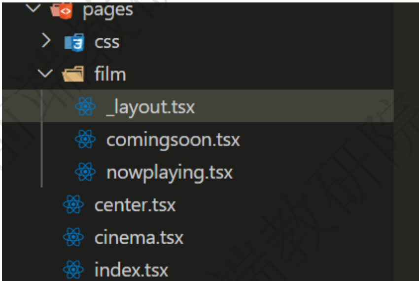

# umjs
umi，中文可发音为乌米，是一个可插拔的企业级 react 应用框架。umi 以路由为基础的，支持类 next.js 的
约定式路由，以及各种进阶的路由功能，并以此进行功能扩展，比如支持路由级的按需加载。umi 在约定式
路由的功能层面会更像 nuxt.js 一些。
开箱即用，省去了搭框架的时间

安装脚手架
$ mkdir myapp && cd myapp //空目录    
$ npx @umijs/create-umi-app
目录


路由
umi 会根据 pages 目录自动生成路由配置。需要注释.umirc.js，routes相关,否则自动配置不生效   
***(1) 基础路由***

***(2) 重定向***
```js
//新建pages/index.js 
import React from 'react'; 
import {Redirect} from 'umi' 
export default () => {  
    return ( 
        <Redirect to="/film"/> 
    ); 
}
```
***(3) 嵌套路由***  
有时候不好用，重启一下

```js
// 在film中的_layout.js 
import {Redirect,useLocation} from 'umi' 
export default function Film(props) {
    const location=useLocation() 

    if(location.pathname==='/film'||location.pathname=== '/film/'){
        return <Redirect to="/film/nowplaying"/> 
    }
    // if(props.location.pathname==='/film' || props.location.pathname=== '/film/'){
    //     return <Redirect to="/film/nowplaying"/> 
    // }

    //嵌套路由
    return ( 
        <div> {props.children} </div>
    ) 
}
```

***(4) 动态路由***

***(5) 路由拦截***
```js
// center.tsx 
import React from 'react'; 
const Center = () => { 
    return ( <div> <h1 >center</h1> </div> ); 
}
Center.wrappers = ['@/wrappers/auth'] 
export default Center 

//auth.tsx

import React from 'react' 
import { Redirect } from 'umi' 
export default (props:any) => { 
    const isLogin = localStorage.getItem("token") 
    if (isLogin) { 
        return <div>{ props.children }</div>; 
    } else { 
        return <Redirect to="/login" />; 
    } 
}
```
***(6) hash模式***
```js
// 在.umirc.js 
export default { 
    history:{ 
        type: 'hash' 
    } 
}
```
***(7) 声明式导航***

```js
import React from 'react'; 
import {NavLink} from 'umi' 
import style from './index.less'
export default function(props:any) { 
    if (props.location.pathname.includes('/detail')) {
        return <div>{ props.children }</div> 
    }
    return ( 
        <div> 
            <ul>
                <li>
                    <NavLink to="/film" activeClassName={style.active}>film</NavLink> 
                </li> 
                <li>
                    <NavLink to="/cinema" activeClassName={style.active}>cinema</NavLink> 
                </li> 
                <li>
                    <NavLink to="/center" activeClassName={style.active}>center</NavLink> 
                </li>
            </ul> 
            { props.children } 
        </div> 
    ); 
}
```
***(8) 编程式导航***
```js
import { history } from 'umi'; 
history.push(`/detail/${item}`)
```
mock模式
umi 里约定 mock 文件夹下的文件或者 page(s) 文件夹下的 _mock 文件即 mock 文件，文件导出接口定义，支持基 于 require 动态分析的实时刷新，支持 ES6 语法，以及友好的出错提示
```js
// mock/api.js 
export default { 
    // 支持值为 Object 和 Array 
    'GET /api/users': { users: [1, 2] }, 
    // GET POST 可省略 
    '/api/users/1': { id: 1 }, 
    // 支持自定义函数，API 参考 express@4 
    'POST /api/users/create': (req, res) => { 
        res.end('OK'); 
    },
}
```
反向代理
```js
// 在.umirc.js 
proxy: { 
    '/ajax': { 
        target: 'https://m.maoyan.com', 
        // pathRewrite: { '^/api': '' }, 
        changeOrigin: true 
    } 
},
```

antd
```js
//.umirc.ts
antd:{
    //自定义配置 
}
//组件页面中使用 
import {Button} from 'antd-mobile' 
<Button type="primary">add</Button>
```
dva集成

* 按目录约定注册 model，无需手动 app.model
* 文件名即 namespace，可以省去 model 导出的 namespace key
* 无需手写 router.js，交给 umi 处理，支持 model 和 component 的按需加载
* 内置 query-string 处理，无需再手动解码和编码
* 内置 dva-loading 和 dva-immer，其中 dva-immer需通过配置开启(简化 reducer 编写) 
```js
// .umirc.ts 
dva:{
    //自定义配置 
}
```


(1) 同步
```js
//models/kerwin.js
export default{
    //命名空间
    namespace:'kerwin',
    state:{
        isShow:true, 
        list:[]
    },
    //处理state－－同步 
    reducers:{ 
        //reducer简写， type类型是show的时候自动处理 
        show(state,{payload}){ 
            return {...state,...payload} 
        },
        hide(state,{payload}){ 
            return {...state,...payload} 
        } 
    },
    // yield表示后面的方法执行完以后 call表示调用一个api接口 
    // put表示一个派发 
    effects:{ 
        *showEffect(payload,{put}){ 
            yield put({ 
                type:'show', 
                payload:{ isShow:true } 
            }) 
        },
        *hideEffect(payload,{put}){ 
            yield put({ 
                type:'hide', 
                payload:{ isShow:false } 
            })
        }
    }
}
```

```js
//根组件 
import {connect} from 'dva'; 
function BasicLayout(props) { 
    return ( 
        <div > { props.isShow? ... :null }{props.children} </div> 
    ); 
}
//state.kerwin 命名空间 
export default connect(state=>state.kerwin)(BasicLayout); 
```
```js
//detail.js 
import { connect,useDispatch } from 'dva';
function Detail(props) {
    const dispatch = useDispatch() 
    useEffect(() => { 
        dispatch({ type:"kerwin/hideEffect" 
        //命名空间kerwin 
        }) 
        return () => { 
            dispatch({ 
                type:"kerwin/showEffect"
                //命名空间kerwin 
            }) 
        };
    }, []) 
    return <div> Detail </div> 
}
export default connect(state=>state.kerwin)(Detail)
```
(2) 异步
loading命名空间，是dva-loading插件创建的，每次切换路由都会自动控制内部的属性true or false
```js
// models/kerwin.js 
import {getNowplaying} from '../util/getNowplaying'; 
//封装的fetch调用接口 
export default{ 
    ... 
    reducers:{ 
        ... 
        changeList(state,{payload}){ 
            return {...state,...payload} 
        } 
    },
    // 异步 
    // yield表示后面的方法执行完以后 call表示调用一个api接口
    effects:{ 
        ... 
        *getListEffect(payload,{put,call}){ 
            let res =yield call(getNowplaying,"test-by-kerwin") 
            yield put({ 
                type:"changeList",
                payload:{ 
                    list:res
                } 
            }) 
        } 
    }
}
```
