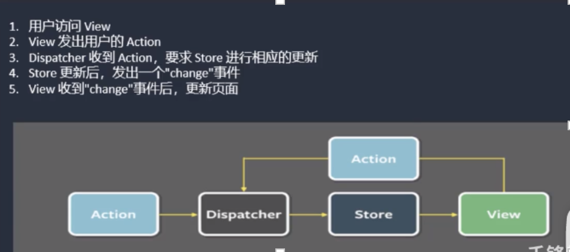
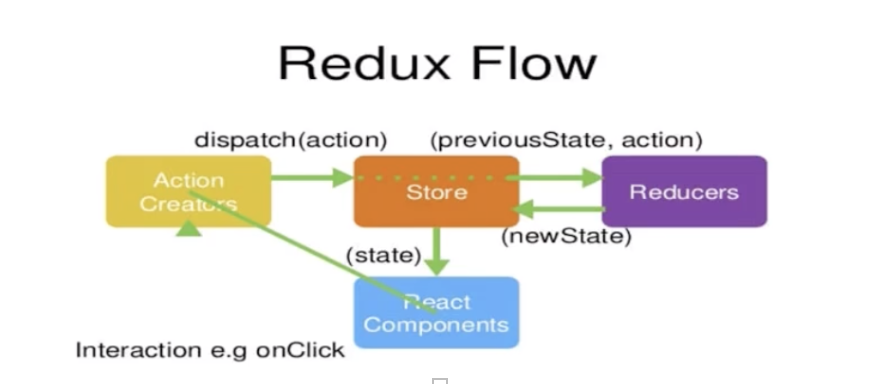
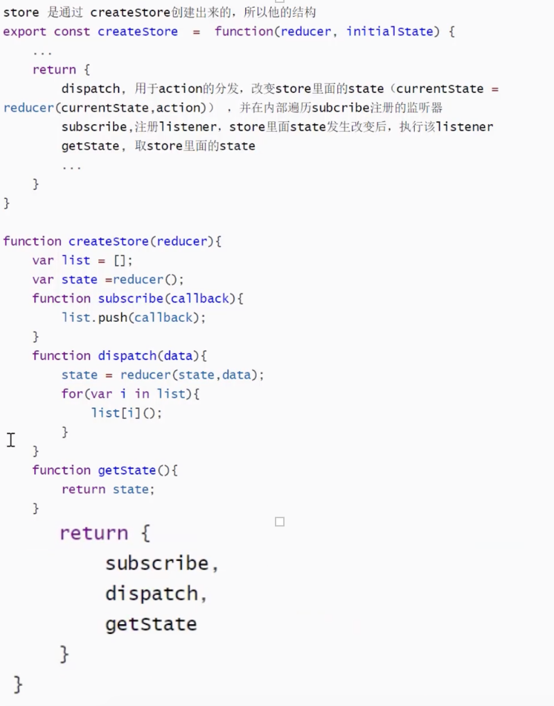
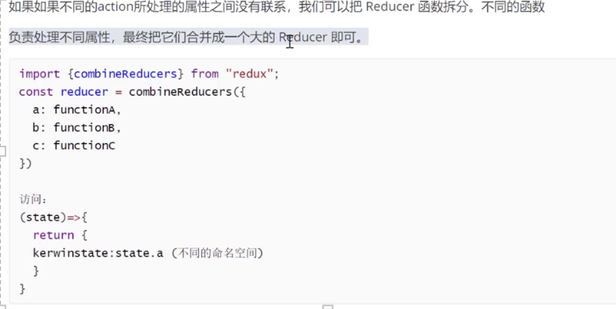
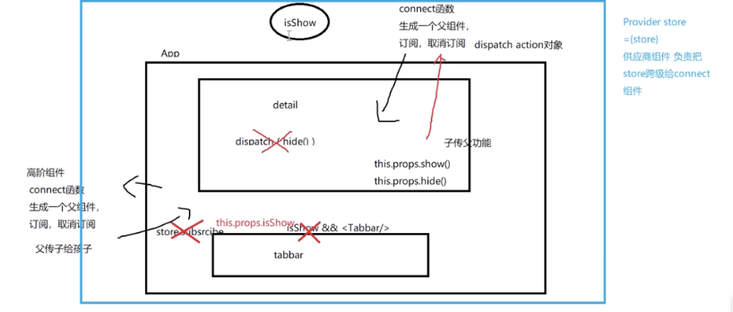
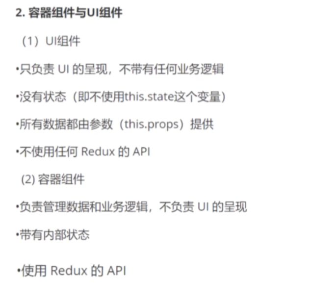
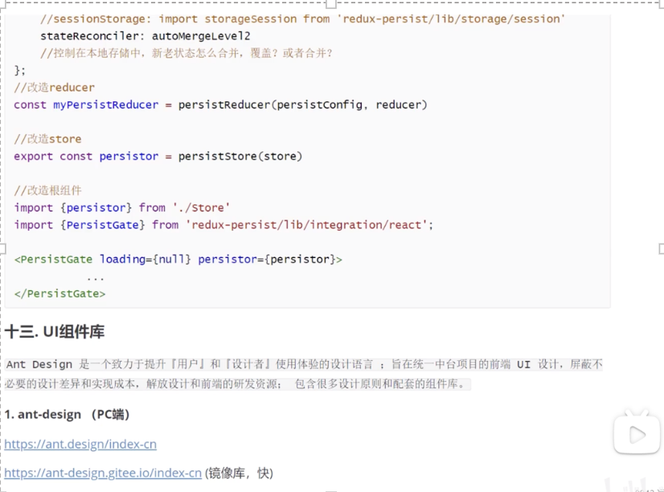

Flux是一种架构思想，专门解决软件的结构问题。跟MVC架构是同一类东西，但更加简单和清晰。Flux存在多种实现（至少15种） 

Flux 是用来构建客户端web应用的应用架构，它利用单向数据流的方式来组合React中的视图组件。更像一个模式而不是一个正式的框架。 

redux最主要：应用状态的管理。  
redux设计三大原则:  
1. state以单一对象存储在store对象中 
2. state只读（每次都返回一个新的对象） 
3. 使用纯函数reducer执行state更新

# Redux工作流 

# 与react绑定后使用redux实现案例 

1. 引入redux 

2. createStore(reducer) 
    import { createStore} from 'redux'  
    const reducer=()=>{}  
    const store =createStore(reducer) 
    export default store  

# redux原理 



# Redux-reducer合并 




# redux中间件：redux-thunk  

redux里,action仅仅是携带了数据的普通js对象。同步情况下很完美，但reducer无法处理异步情况。  
那么我们需要中间件（middleware）,在action与reducer中间架起一座桥梁来处理异步。  
1. 中间件的由来与原理、机制 

```javascript
export  default function thunkMiddleWare({dispatch,getState}){ 
    return next=>action=>typeof action==='function'?action(dispatch,getState):next(action) 
} 
```
桥梁接受到参数action,不是action执行next；是function，先执行action,action的处理结束之后，再在action的内部调用dispatch 

2. 常用异步中间件 
- ***redux-thunk*** 

```javascript
//npm 安装后引入 
import thunk from 'redux-thunk' 
import  {applyMiddleWare} from 'redux' 
//applyMiddleWare应用中间件 
const store=createStore(reducer,applyMiddleWare(thunk )) 
//dispatch中返回值是对象，交给redux默认去处理； 
//dispatch中返回值是函数，就会知道需要走chunk流程，调用时会往函数中塞参数dispatch 
//进行异步请求【把返回值弄为函数】 
const getComingSoon=()=>{ 
   return (dispatch,store)=>{
       axios().then(()=>{ 
           dispath（） 
       }).catch(()=>{ }) 
   } 
} 
useEffect(()=>{ 
    if(store.getState().XXXX.list.length){ 
        store.dispath(getComingSoon()) 
    }else{ 
        //缓存 
    } 

 //订阅 
    store.subscribe(()=>{ 
        store.getState() 
    })
},[]) 
```
问题：重复订阅 
```javascript
useEffect(()=>{ 
    if(store.getState().XXXX.list.length){ 
        store.dispath(getComingSoon()) 
    }else{ 
        //缓存 
    }
    //订阅 
    var unsubscribe= store.subscribe(()=>{ 
        store.getState() 
    })
    return()=>{ 
        unsubscribe() 
    } 
},[]) 
```
注意：函数式组件有时会执行多次 

- ***redux-promise***
```javascript
import rpromise from 'redux-promise' 
import  {applyMiddleWare} from 'redux' 
//applyMiddleWare应用中间件【可以多个】 
const store=createStore(reducer,applyMiddleWare(thunk,rpromise))   
const getComingSoon=()=>{ 
    return axios().then(()=>{ 
        dispath（） 
    }).catch(()=>{}) 
} 

//useEffect中调用getComingSoon 
```
# redux开发者工具 

https://github.com/zalmoxisus/redux-devtools-extension 

需配置一部分代码，插件才能读到redux 

没有异步的情况下 

高级配置，异步同步都能观察到 
```javascript
import {ceateStore,compose} from 'redux' 
import reducer from './reducer' 

const composeEnhancers=window._REDUX_DEVTOOLS_EXTENSION_COMPOSE_ || compose 
const store =ceateStore(reducer ,composeEnhancers(applyMiddleWare(thunk,rpromise))) 

export default store  
```

# React-redux 
基于redux多了些react特性,不用自己订阅后再取消订阅  
https://github.com/reactjs/react-redux  

只需在原有组件基础上配上 connect/Provider  
需要订阅怎样拿到值？  
connect函数生成父组件，帮我们订阅、取消订阅，然后父传子的方式给孩子 给所有组件提供store 



步骤：
1. 
```javascript
import store from './store' 
import {Provider} from 'react-redux'
ReactDOM.render( 
    <Provider store={store}> 
        <App> 
    </Provider> 
,dom) 

export default connect(App) 
```
2. 可定制想要的属性值 
```javascript
export default connect(（state）=>{ 
    //必须有返回值 
    return { 
        a :state.a, 
        b :state.b 
    } 
})(App)  
//App的props中会有该对象 

//===>改造 
const mapStateToProps=(state)=>{ 
    //必须有返回值 
    return { 
        a :state.a, 
        b :state.b 
    }
} 
export default connect(mapStateToProps)(App)  
```
3. connect(将来给孩子传的属性，(将来给孩子传的回调函数)
```javascript
export default connect(null，{ 
    a(){ 
        return {
            type:'' 
        } 
    }, 
    b(){} 
})(Detail)  
//Detail组件中props.a 

//===>改造 
const mapDispatchToProps={ 
    a(){ 
        return { 
            type:'XX' 
        } 
    }, 
    b(){} 
} 

export default connect(null,mapStateToProps)(Detail)  
``` 
connect把ui组件变成容器组件 

异步改造 

# React-redux 原理 
1. connect是HOC,高阶组件 
2. Provider组件，可以让容器组件拿到state,使用了context跨级通信 
---------------
高阶组件构建与应用 
HOC不仅仅是一个方法，确切说应该是一个组件工厂，获取低阶组件，生成高阶组件 
1. 代码复用，代码模块化 
2. 增删改props 
3. 渲染劫持 
```javascript
export default myconnect(()=>{  
    return {a:1,b:2} 
},{ 
    A:(){} 
})(NotFound) 


function myconnect(cb,obj){ 
    const a=cb() 
    //return函数 接收组件 
    return (NotFound)=>{ 
        //return 函数式组件或类组件 
        return(props)=> <div style={{color:red}}><NotFound {…a}/></div> 
    } 
} 
```
高阶组件代表 withRouter、connect 
# Redux 持久化（刷新页面不消失 localstorage ） 

基于插件：redux-persist(配合react-redux) 
```javascript
//persistReducer 持久化reducer 
//persistConfig 持久化规则 

import { createStore } from 'redux' 
import { persistStore, persistReducer}from 'redux-persist' 
//localstorage  
// defaults to localStorage for web 
import storage from 'redux-persist/lib/storage' 
import reducers from './reducers'

const persistConfig = { 
    key: 'root', 
    storage, 
    blacklist:[''] //黑名单 
    whitelist:[] //白名单 
} 
const persistedReducer = persistReducer(persistConfig, reducers ) 

 let store = createStore(persistedReducer,composeEnhancers(applyMiddleware(reduxthunk,reduxpromise))) 
let persistor = persistStore(store) 
return { store, persistor } 


import store from './store' 
import {Provider} from 'react-redux' 
import {PersisGate} from 'redux-persist/integration/react' 

ReactDOM.render( 
    <Provider store={store}> 
        <PersistGate loading={null} persistor={persistor}> 
            <App/> 
        </PersistGate> 
    </Provider>,dom
)  
export default connect(App) 
```
