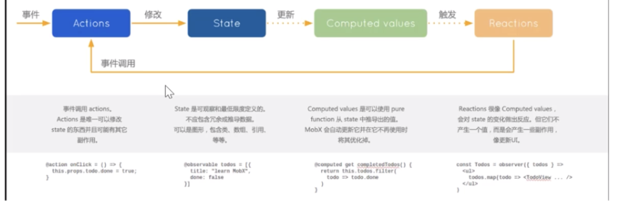
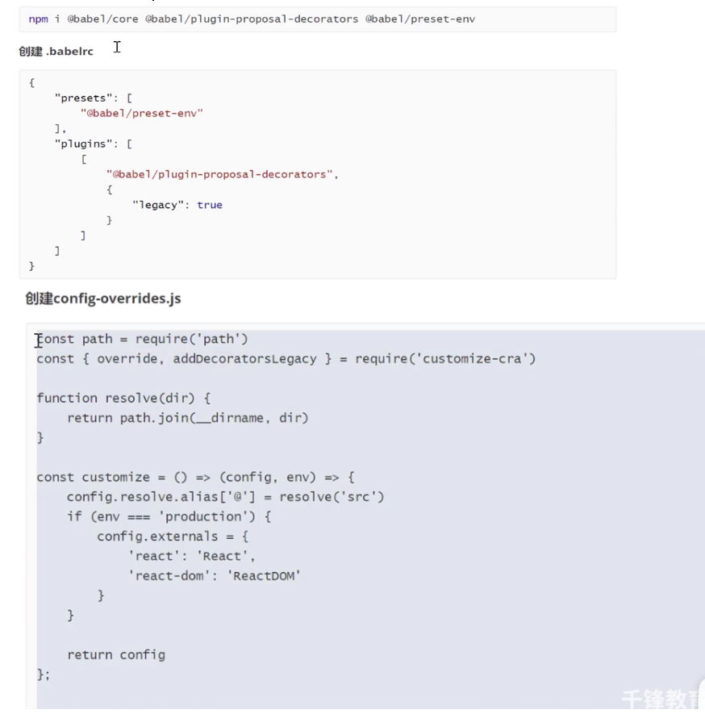
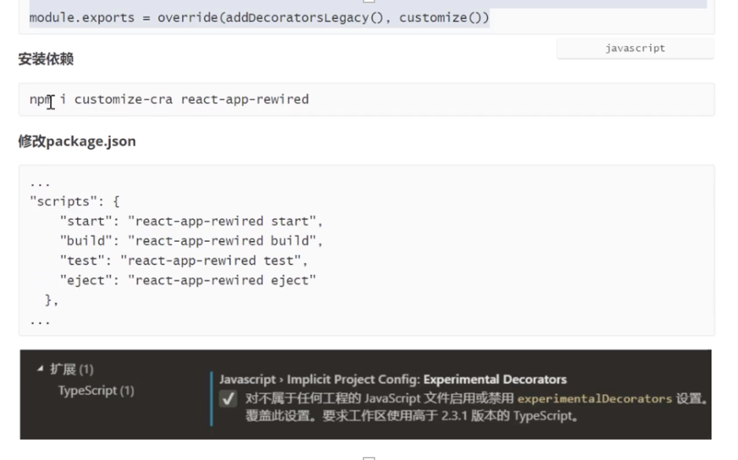

# 介绍
1. 易上手状态管理 
1. 背后哲学：任何来自应用状态的东西都应该自动获得（而非订阅）
1. 利用setter和getter来收集组件的数据依赖关系，从而在数据发生变化时精确知道哪些组件需要重绘，界面大规模变大时，会有很多细粒度更新。 

（vue类似） 


# 与redux的区别 
- Mobx更偏向OOP(面向对象编程) 
- 对一份数据直接进行修改操作，不需要始终返回一个新的数据 
- 非单一store，可以多store 
- Redux默认以js原生对象形式存储数据，而Mobx使用可观察对象。 

优点：  
- 学习成本小 
- 面向对象编程，而且对TS友好 

缺点： 
- 过于自由：mobx提供的约定及模版代码很少(编码自由)，代码编写很自由，如果不做一些约定，容易导致团队代码风格不统一 
- 相关中间件很少，逻辑业务整合是问题（基本满足现有业务）  
//异步调用（redux） 

 

# 使用 --安装（版本5使用率高） 
observable和autorun 

1. 普通数据类型 
```javascript
import {observable,autorun} from 'mobx' 

const value=observable.box(0) 
const number=observable.box(100)   
 //number改变触发函数 

//第一次会执行，之后每次改变也会执行 
autorun（（）=>{ 
    //只关心跟自己相关的改变[number], value改变不会触发改变 
    number.get(20) 
}）
setTimeout(()=>{ 
    number.set(20) 
    value.set(20) 
},100) 
```

2. 对象或数组 
```javascript
const obj=observable.map({key:'value'}) 
//obj.set('key','test') 
//obj.get('key','test') 

const obj=observable({key:'value'}) 
//obj.key='test' 
//obj.key  

const obj=observable(['2','4','5']) 
obj[2]=1 
```
***react使用 ***

```javascript
const store1=observable({ 
    isShow:true, 
    list:[], 
    city:'' 
}) 


//===>redux 
import { createStore} from 'redux' 
const reducer=()=>{} 
const store =createStore(reducer)
compontentDidMount(){ 
    autorun(()=>{ 
        let c=store1.isShow 
        setState({}) 
    }) 
} 
```
 

action（修改值） 

 
```javascript
import {observable,autorun,configure} from 'mobx' 
//严格模式控制 always[严格]。observable不能随意修改 

configure({ 
    enforceAction：'never' 
}) 

const store1=observable({ 
    isShow:true, 
    list:[], 
    city:''， 
    //不能直接修改，但可调方法 
    change(){ 
        this.isShow=false 
    } 
},{ 
    change:action 
    //标记方法时action，专门修改value 
})  
store1.change() 
```
# 支持(es7)装饰器   
===> 
```javascript
class store { 
    @observable isShow=true 
    @observable  list=[] 
    @action change(){} 
} 
export default new store  
```
装饰器语法开启 
编辑器支持:首选项--->设置---> experimentalDecorators 

工程支持：  
- 【实验阶段】 



启动方式更改 

 
eject配置文件显示（webpack比较了解，可以去修改） 

### runInAction 
异步处理 

```javascript
@action getList(){ 
    axios().then((res)=>{ 
        runInAction(()=>{ 
            this,list=res.data 
        }) 
    }).catch() 
} 
useEffect(()=>{ 
    if(store.list.length==0){ 
        store.getList() 
    } 
    //注册多次 
    let un= autorun(()=>{ 
        console.log(store.list，store.isShow) 
        //添加一次依赖 
        setList(store.list) 
    }) 
    return ()=>{ 
        //取消订阅 
        un() 
    } 
}) 
```

# Mobx-react（5版本）    
//不用取消订阅 

构建一个 父组件-高阶组件mobx-react 
```javascript
import {Provider} from 'bobx-react' 
ReactDOM.render( 
    <Provider store1={store}> 
        <App/> 
    </Provider> 
,dom) 
```
App.js 
//注入(不能给export edfault注入，能给类注入) 
```javascript
@inject （'store1'） 

@observer 

class App extends Component{ 
    state={
        isShow:fasle 
    } 
    componentDidMount(){ 
        this.props.store1 
    } 
    render(){ 
        return(<div></div> ) 
    } 
} 

export default function Cin(){ 
    useEffect(()=>{ 
        if(store.list.length==0){ 
            store.getList() 
        } 
        //注册多次 
        let un= autorun(()=>{ 
            console.log(store.list，store.isShow) 
            //添加一次依赖 
            setList(store.list) 
        })  
        return ()=>{ 
            //取消订阅 
            un() 
        } 
}) 

return (<div> 
    <Observer>{()=>{return()}}</Observer> 
    </div> 
)} 

//与写法类似 
<createContext.Consumer> 
{()=>{store1.list.map(()=>{})}} 
</createContext.Consumer> 
```