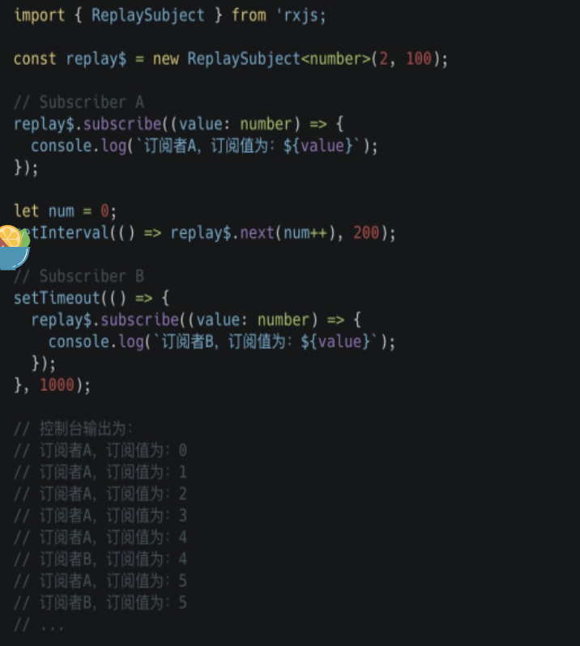
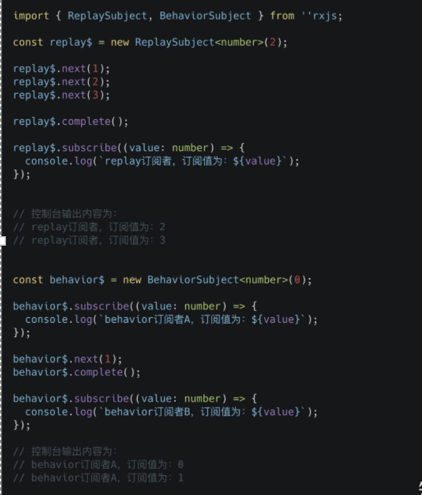

Observer都有三个方法： 
* next（v）    
* error（e）  
* complete（） 

 

1.Subject（Observable，Observer） 

2.BehaviorSubject ：有订阅时，保留最新值 （订阅者接到最新值） 

3.ReplaySubject ： 

有新订阅时，重新发送最后几个值 （新订阅者接到最后几个值 ） 

但可以指定存储时间 

4.AsyncSubject  ：执行complate完成，这时候将最后一个值发送给所有订阅者 

# Subject 

Subject其实是观察者模式的实现，所以当观察者订阅Subject对象时，它会把订阅者添加到观察者列表中，每当有接收到新值时，它就会遍历观察者列表，依次调用观察者内部的next方法，把值一一送出。 

Subject的使用方法：

理解： 
1. 我们创建了一个Subject 
2. 发出了一个值1，但由于此时并没有订阅者，所以这个值不会被订阅到 
3. 创建了订阅者 A 
4. 又发出一个值2，这时候订阅者 A 会接收到这个值 
5. 又创建一个订阅者 B 
6. 最后发出一个值3，这时候已经订阅的都会接收到这个值 

# BehaviorSubject 

很多时候我们会希望Subject能代表当下的状态，而不是单纯的事件发送（即：如果当前有一个新的订阅，我们希望Subject能立即给出最新的值，而不是没有回应）。这个时候我们就可以使用到BehaviorSubject 

BehaviorSubject继承自Subject，它具有存储当前值的特征。这表示你可以始终直接从BehaviorSubject获取到最后发出的值。 

代码示例： 

解析： 

1. 我们首先创建了一个BehaviorSubject的实例behavior$,并在实例化时传入初始值0。 
2. 然后我们订阅了这个这个实例behavior$,由于BehaviorSubject的特点是把最新的值发布给订阅者，订阅者 A 会得到初始值0，所以就会打引出订阅者A，订阅值为：0 
3. behavior$使用内置的next方法发出一个新的值1，这时候订阅者 A 将会收到新的值，打印出订阅者A，订阅值为1 
4. 我们增加一个订阅者 B，这时候它会得到最新的值1，所以打印结果为订阅者B，订阅值为1 
5. 最后我们再一次调用behavior$的next方法，由于我们之前已经订阅了两次，所以订阅者 A 和订阅者 B 都会接收到新的value 

# ReplaySubject 

有时候我们创建一个Subject，但又想在每次新的订阅时，它都会重新发送最后几个值，这个时候我们就可以用到ReplaySubject。 

ReplaySubject可以将旧数据发送给新的订阅者，这点很像是BehaviorSubject，但是它还有一个额外的特性，它可以记录一部分的observable执行，所以它可以存储多个旧值并发送给它的新订阅者。 

创建ReplaySubject时，可以指定要存储多少值以及要存储多长时间。它的第一个参数 bufferSize指定了缓存的大小，默认为 Infinity，即缓存所有发出的值，是一个「空间限制」。我们还可以向其传递第二个参数 windowTime，指定缓存的「时间限制」，默认为 Infinity，即不限制值的失效时间。 

 
指定要存储多少值： 

解析： 

1. 我们创建了一个ReplaySubject的实例replay$，并指定我们只想存储最后两个值 
2. 我们创建了一个订阅者 A 
3. 调用三次replay$的next方法，把值发布给订阅者。这时订阅者 A 将会打印三次 
4. 现在就来体验ReplaySubject的魔力。我们使用replay$创建了一个新的订阅者 B，由于我们告诉ReplaySubject，存储两个值，因此它将直接向订阅者 B 发出这些最后的值，订阅者 B 将打印出这些值。 
5. replay$发出另外一个值，这时候，订阅者 A 和订阅者 B 都接收到值的改变，打印出另外一个值 

指定值在ReplaySubject存储的时间： 

上面代码中发生了那些事情呢： 

1. 我们创建了ReplaySubject,并指定它只存储最后两个值，但是不超过 100ms 
2. 创建一个订阅者 A 
3. 我们开始每 200ms 发出一个新的值。订阅者 A 会接收到发出的所有值 
4. 我们创建一个订阅者 B，由于是在 1000ms 后进行订阅。这意味着在开始订阅之前，replay$已经发出了 5 个值。在创建ReplaySubject时，我们指定最多存储 2 个值，并且不能超过 100ms。这意味着在 1000ms 后，订阅者 B 开始订阅时，由于replay$是 200ms 发出一个值，因此订阅者 B 只会接收到 1 个值。 

有的同学看到这里，会感觉到ReplaySubject(1)是不是就等同于BehaviorSubject。但是，二者无论在概念上还是行为上，都是有所区别的。 
 
首先概念上的区别是本质的，ReplaySubject只是缓存了最近的值，它仍然反映的是不断有值产生的流（多值），而BehaviorSubject反映的则是随时间变化的值（单值）。因此，BehaviorSubject需要传入一个初始值，然后这个值将不断变化，我们只能看见当前的值。 
 
在行为上，由于ReplaySubject侧重于缓存，那么当它完成时，并不会影响我们继续观测它缓存的值。我们来看下面这个例子： 

ReplaySubject在执行完complate时，我们订阅它仍然可以拿到缓存的值，而BehaviorSubject在执行完complate时，我们继续订阅它已经没有任何作用了。 

# AsyncSubject
虽然BehaviorSubject和ReplaySubject都存储值，但AsyncSubject的工作方式却有所不同。AsyncSubject是一个Subject变体，其中仅Observable执行的最后一个值发送到其订阅者，并且仅在执行完成时发送（类似于rxjs/operators里面的last方法）。 

请参考下面的示例代码： 

执行步骤： 

1. 我们创建AsyncSubject的实例async$ 
2. 我们通过订阅者 A 进行订阅 
3. async$发出 2 个值，仍然没有发生变化 
4. 我们创建一个订阅者 B 
5. 发出新的值，但是两个订阅者都没有任何反应 
6. async$执行complate完成，这时候将最后一个值发送给所有订阅者 

 

从上面的代码示例可以看出来AsyncSubject会在执行complate后才送出最后一个值，其实这个行为跟 Promise 很像，都是等到事情结束后送出一个值。在 Promise 中，我们可以通过 resolve(value)声明任务完成，并将获得的值发送出去，然后再通过Promise.then()方法中处理得到的值。 

# 比较

ReplaySubject(1)是不是就等同于BehaviorSubject？ 

二者无论在概念上还是行为上，都是有所区别的。 

 

BehaviorSubject和ReplaySubject都存储值; 

AsyncSubject是一个Subject变体，仅Observable执行的最后一个值发送到其订阅者，并且仅在执行完成时发送。 