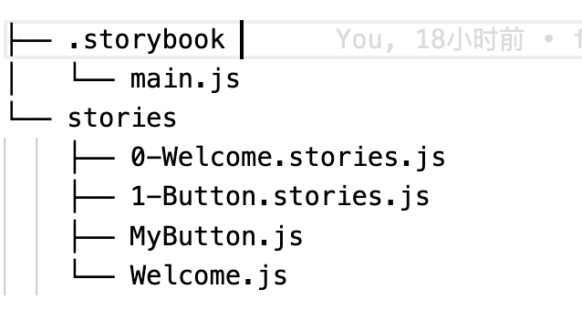

https://zhuanlan.zhihu.com/p/148296971 

 

# 简介及使用教程 

Storybook是一个辅助UI控件开发的工具。通过story创建独立的控件，让每个控件开发都有一个独立的开发调试环境。 Storybook的运行不依赖于项目，开发人员不用担心由于开发环境、依赖问题导致不能开发控件。支持React、 Vue和Angular。 

用户可以独立地开发UI组件，而不必担心应用程序特定的依赖关系和需求，使开发人员能够独立地创建组件，并在孤立的开发环境中交互地展示组件。

# vue安装

## 自动安装 

Storybook官方提供了npx的自动安装模式，你只需要在命令行中输入下面的脚本（安装时间较长）： 

    ***npx -p @storybook/cli sb init --type vue*** 

    在安装完成后，项目中多出了两个文件夹 .storybook 和 stories 
  

    在命令行执行 npm run storybook     Storybook默认会在localhost: 6006端口打开
    

## 手动安装 

1. 安装 @storybook/vue 
    npm install @storybook/vue 

2. 安装相关依赖 

    npm install vue-loader vue-template-compiler @babel/core babel-loader babel-preset-vue --save-dev 

3. 在package.json中添加启动脚本

```javascript
{ 
  "scripts": { 
    "storybook": "start-storybook" 
  } 
} 
```

4. 添加入口文件.storybook/main.js 

```javascript
module.exports = { 
  stories: ['../src/components/**/*.stories.js'], 
  addons: [], 
}; 
```  

5. 启动Storybook，默认会在localhost: 6006 

    npm run storybook 

# react安装
## 自动安装 

npx -p @storybook/cli sb init 
 
如果使用Create React APP ，你应当使用一下命令： 
npx -p @storybook/cli sb init --type react_scripts 

## 手动步骤 

1. 全局安装Storybook   
  npm i -g storybook 

2. 依次安装： 
    npm install @storybook/react --save-dev 

    npm install react react-dom --save 
    npm install babel-loader @babel/core --save-dev 

    在package.json添加npm 命令： 
```json
{ 
   "scripts": { 
         "storybook": "start-storybook" 
   } 
} 
```
 
3. 创建 .storebook/main.js: 
```javascript
module.exports = { 
    stories: ['../src/**/*.stories.[tj]s'], 
}; 
```

4. 创建第一个Store，新建文件../src/index/stories.js : 
```javascript
import React from 'react'; 
import { Button } from '@storybook/react/demo'; 
 

export default { title: 'Button' }; 
 

export const withText = () => <Button>Hello Button</Button>; 
 

export const withEmoji = () => ( 
  <Button> 
    <span role="img" aria-label="so cool"> 
      😀 😎 👍 💯 
    </span> 
  </Button> 
); 
```

这样就创建了按钮组件的两个story。 

Button   

    (/With Text)  
    (/With Emoji)

 

运行: npm run storybook 
 