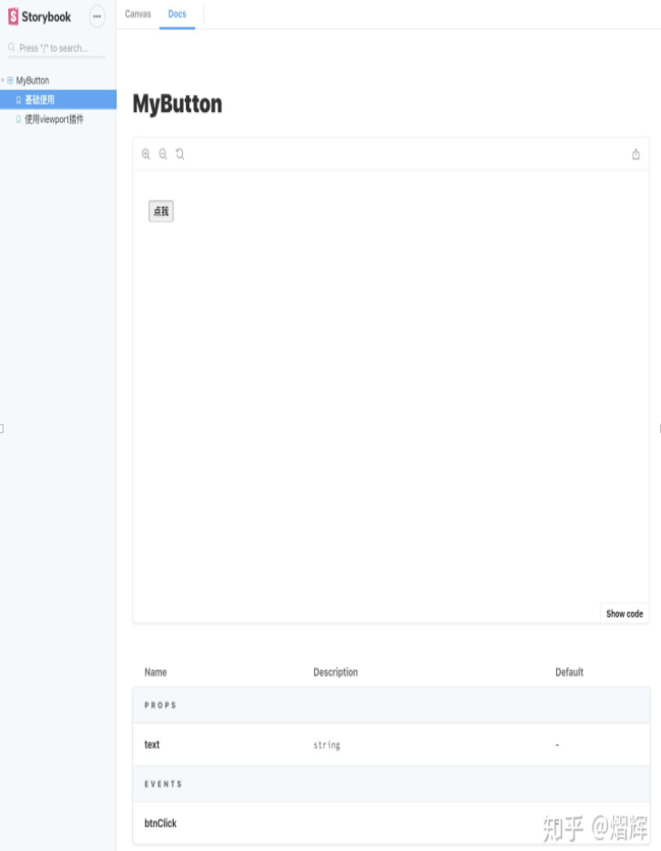

在完成安装后，我们还需要了解一下Storybook的一些基础知识，比如项目的配置文件在哪里？项目中如何添加插件？什么是CSF？如何写组件的故事？如何添加自定义的Webpack配置？ 

 

# 配置文件 - main.js 
```javascript
module.exports = { 
  stories: ['../stories/**/*.stories.js'], 
  addons: ['@storybook/addon-actions', '@storybook/addon-links'], 
}; 
```

.storybook/main.js 是Storybook的配置文件，主要的配置是stories和addons。更多的配置你可以查看文档 Configuration overview。 

* stories 用来描述你的故事相对于配置文件的位置，从默认的配置可以知道，故事的文件名称格式为：*.stories.js。 

* addons 用来描述你需要引入的插件。storybook提供了丰富的插件。 

# 插件-Addons 


https://storybook.js.org/addons

例如@storybook/addon-links 用来创建storybook中的链接关系，@storybook/addon-docs 提供了开箱即用的组件文档。在社区里面也有很多其非官方的插件。 

要使用Addons首先要进行安装，以@storybook/addon-links为例： 

npm install -D @storybook/addon-links 

在.storybook/main.js中添加插件 
```javascript
module.exports = { 
  stories: ['../stories/**/*.stories.js'], 
  addons: ['@storybook/addon-links'], 
}; 
```

在你的stories中使用插件 
```javascript
import { linkTo } from '@storybook/addon-links' 
 

export default { 
  title: 'Button', 
}; 
 

export const first = () => ( 
  <button onClick={linkTo('Button', 'second')}>Go to "Second"</button> 
); 
export const second = () => ( 
  <button onClick={linkTo('Button', 'first')}>Go to "First"</button> 
); 
``` 

 

# 组件故事格式 - CSF 

要熟练使用新版本Storybook，一定要理解一个术语：Component Story Format(CSF)，这是Storybook在5.2版本引入的一种采用ES6 modules去编写stories的方式，在官方文档中，CSF被反复的提及。为了更好的理解story和CSF的关系，我们来看一下官方提供的 1-Button.stories.js。 
```javascript
import { action } from '@storybook/addon-actions'; 
import { linkTo } from '@storybook/addon-links'; 
 

import MyButton from './MyButton'; 
 

export default { 
  title: 'Button', 
  component: MyButton, 
}; 
 

export const Text = () => ({ 
  components: { MyButton }, 
  template: '<my-button @click="action">Hello Button</my-button>', 
  methods: { action: action('clicked') }, 
}); 
 

export const Jsx = () => ({ 
  components: { MyButton }, 
  render(h) { 
    return <my-button onClick={this.action}>With JSX</my-button>; 
  }, 
  methods: { action: linkTo('clicked') }, 
}); 
 

export const Emoji = () => ({ 
  components: { MyButton }, 
  template: '<my-button @click="action">       </my-button>', 
  methods: { action: action('clicked') }, 
}); 
```

这是一个十分典型的stories.js，export default定义了这是一个名为Button，展示Mybutton 组件的故事文件。需要注意的是，该对象的*title* 是侧边栏中的标题，组件内title不能重复。 
```javascript
export default { 
  title: 'Button', 
  component: MyButton, 
}; 
```

三个export const定了三个story，分别对应的是侧边栏中的Text、Jsx、Emoji。 

看到这里你大概明白到底什么是story了：story是一个代码片段，它已特定状态呈现该组件的示例。而CSF，就是ES6的Modules语法去编写 *.stories.js*的一种格式。 

# 添加自定义webpack配置 

如果我们在组件中使用 less、sass等css语法，在启动storybook后就会出现报错，因为storybook的并不能使用项目中的webpack配置，我们需要在.storybook/main.js中添加scss-loader的配置。 

在.storybook/main.js中添加自定义webpack配置的字段是webpackFinal。例如你想添加对于sass的支持，代码如下： 
```javascript
module.exports = { 
  stories: ['../**/*.stories.js'], 
  addons: [], 
  webpackFinal: async (config, { configType }) => { 
    config.module.rules.push({ 
      test: /\.scss$/, 
      use: ['style-loader', 'css-loader', 'sass-loader'], 
    }); 
    return config; 
  }, 
}; 
``` 

Storybook的Addons 

我们可以使用addons来让storybook更加的强大，这里我介绍几个常用的插件，使用他们可以满足我CDD的开发模式，生成良好、可交互的组件文档。 

注意：每个插件都需要npm install @storybook/addon-xxxx 安装，并在 .storyboo/``main.js中配置，方法见上文，下面的示例中会略过这部分操作。 

 

1. @storybook/addon-actions 
@storybook/addon-actions 可以用来在页面上打印组件 @emit 的事件和其事件参数，上面的story中，组件触发了btnClick 事件，打印出了参数['点我']。 

 
MyButton.vue 组件： 
```html
<template> 
  <div> 
    <button @click="btnClick">{{ text }}</button> 
  </div> 
</template> 
 

<script> 
export default { 
  name: "MyButton", 
  props: { 
    text: String, 
  }, 
  methods: { 
    btnClick() { 
      this.$emit('btnClick', this.text); 
    } 
  }, 
} 
</script> 
 ```

Button.stories.js ： 
```html
import { action } from '@storybook/addon-actions'; 
import MyButton from './MyButton.vue'; 
 

export default { 
  title: 'MyButton', 
  component: MyButton, 
}; 
 

export const 使用actions插件 = () => ({ 
    components: { 
        MyButton, 
    }, 
    template: ` 
    <my-button text="点我" @btnClick="btnClick"/> 
    `, 
  methods: { 
    btnClick: action('btnClick') 
  } 
}); 
```

2. @storybook/addon-viewport 

@storybook/addon-viewport 能够实现viewport的改变，这在移动端组件文档中是十分必要的。 

Button.stories.js ： 
```javascript
import { INITIAL_VIEWPORTS } from '@storybook/addon-viewport'; 
import MyButton from './MyButton.vue'; 
 

export default { 
  title: 'MyButton', 
  component: MyButton, 
  parameters: { 
    viewport: {  
      viewports: INITIAL_VIEWPORTS, 
      defaultViewport: 'iphone6'  
    }, 
  } 
}; 
 

export const 使用viewport插件 = () => ({ 
    components: { 
        MyButton, 
    }, 
    template: ` 
    <my-button text="点我"/> 
    `, 
}) 
 

使用viewport插件.story = { 
  parameters: { 
    viewport: {  
      defaultViewport: 'iphonex'  
    }, 
  }, 
} 
```

但是使用该插件时，控制台会有一个warning信息，在笔者写这篇文章的时候，这个issue依然是open状态，暂时就忽略这个warning吧： 

Warning: Cannot update during an existing state transition (such as within `render`). Render methods should be a pure function of props and state. 
    in Unknown (created by Context.Consumer) 
    in WithTheme(Component) 

3. @storybook/addon-docs 

一旦在.storybook/main.js中安装了``@storybook/addon-docs，它可以默认列出组件的所有props和events，不需要额外的配置。该插件也提供了 .mdx的语法支持，允许你使用markdown的语法之定义文档。但是我更喜欢使用下面的一个组件去抒写文档。 

4.@storybook/addon-notes 

@storybook/addon-notes能够完全支持.md的语法，相比较于.mdx，我更加喜欢使用他去写组件的相关文档。 

Button.md 

# Storybook教程 
 

### CSF格式的优点 
 

-  很简单。编写故事就像从您的故事文件中以您知道和喜欢的干净标准格式导出ES6功能一样容易。 
-   便携式。可以轻松地在ES6模块存在的任何地方使用组件故事，包括您最喜欢的测试工具（如Jest和Cypress）。 
-  优化。组件故事除了您的组件之外不需要任何库。而且因为它们是ES6模块，所以它们甚至可以Tree Shaking！ 
- ☝️声明式的。声明性语法与更高级别的格式（如MDX）同构，从而实现了清晰可验证的转换。- 

Button.stories.js 
```javascript
import ButtonMd from './Button.md'; 

export const 基础使用 = () => ({ 
    components: { 
        MyButton, 
    }, 
    template: ` 
    <my-button text="点我" @btnClick="btnClick"/> 
    `, 
  methods: { 
    btnClick: action('btnClick') 
  } 
}); 
 

基础使用.story = { 
  parameters: { 
    notes: { ButtonMd }, 
  } 
};
``` 