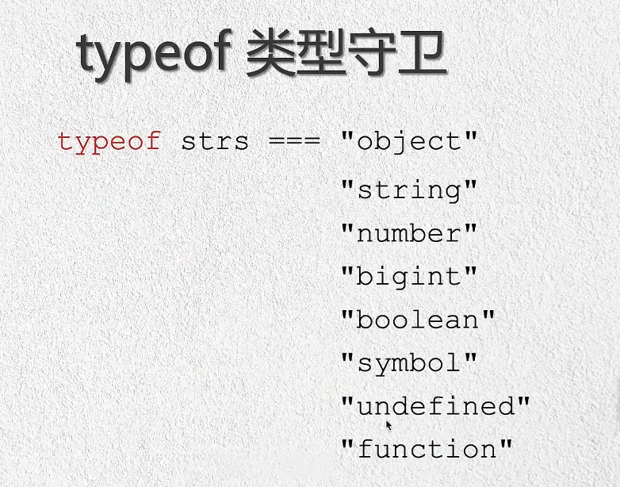
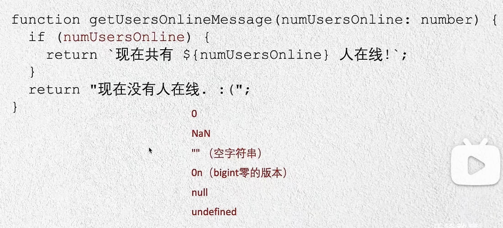
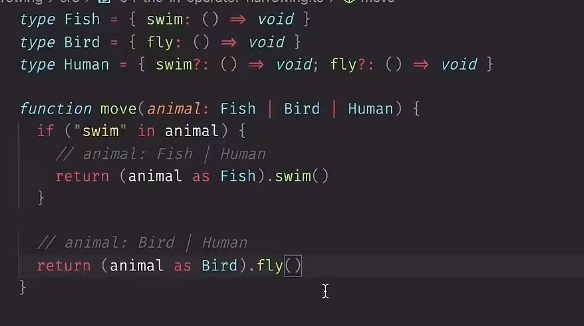
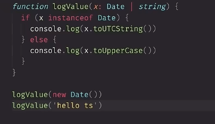
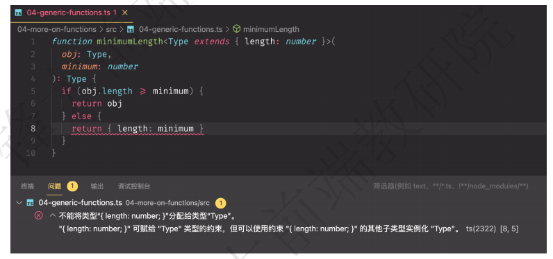

# 优化编译
1. 解决ts和js冲突问题（文件名相同报错）
tsc --init  #生成编译文件

2. 自动编译 tsc --watch
3. 出现错误时，不编译 tsc --noEmitOnError hello.ts --watch

# 显式类型
```javascript
function greet(per:string,data:Date){
    console.log(``)
}
// Date() 字符串
greet('li',new Date())


let msg='ssss'
// 无显式类型，会自动推断类型
```
# 降级编译(例如：es6模版字符串语法)&严格模式
tsconfig.json
ts7-->es2016
```json
{
    "target":"es5", //默认es3

    // ts默认宽松验证：验证程序某些部分，类型可选，推理采用最宽松类型(比如：any)，不检查潜在的null undefinded
   
   // 严格模式
    "strict":true,
    "noImplicitAny":true, //判断any类型

    "stricNullChecks":true,
    // let a:string=undefined
    // let b:string=null

    "rootDir":"./src",
    "outDir":"./dist"
}
```
# 类型
常用类型（基元类型）：string number(无int/float) boolean
对象类型:除了元类型的类型
数组：type[] Array`<type>`  type:任意合法类型

any:不希望某个特定值导致类型检查错误

函数：()=>void
```javascript
function greet(per:string,data:Date):viod{
    console.log(``)
}
```
联合类型：|
类型别名：type Id=string
接口：
```javascript
interface Point {
    x:string
}
```
## **扩展**
***类型别名与接口的不同：***

扩展接口：
```javascript
interface Point {
    x:string
}
interface PointChild extend Point{
    y:number
}
const a:PointChild={x:'111',y:2333}
```

type扩展（交叉扩展）：&
```javascript
type Point= {
    x:string
}
type PointChild = Point&{y:number}

const a:PointChild={x:'111',y:2333}
```

现有类型添加字段：
```javascript
// interface 通过同名添加（type不能，只能通过交叉点方式加&）
interface Point {
    x:string
}
interface Point {y:number}

const a:Point={
    x:'111',
    y:2333
}
```
HTMLElement、HTMLCanvasElement
**类型断言：as**

```javascript
const canvasdom=document.getElementById("mian_canvas") as HTMLCanvasElement
// 等价
const canvasdom=<HTMLCanvasElement>document.getElementById("mian_canvas")
```
只能允许转化为更具体或不太具体的类型版本（防止不可能的强制的发生）
```javascript
let a='hello' as number //错误
==>正确
let a=（'hello' as any) as number
let a=（'hello' as unkonwn) as number
//实现不知道什么类型时断言为一个差不多的类型 
```

**文字类型（字符串/数字/...）**

let s:"left"|"right"
let s:-1|0|1


```javascript
function handlereq(url:string,method:"GET"|"POST"|"GUESS"){

}

const req={
    url:"https://example.com",
    // 注意：加as因为req.method类型会推断为string
    method:"GET" as GET
}
// 或者
const req={
    url:"https://example.com",
    // 注意：加as因为req.method类型会推断为string
    method:"GET" 
} as const

handlereq(req.url,req.method)
```
**null和undefined**
```javascript
function handlereq(url?:string|null){
    // url 是undefined或null或string

    // !：断言为不是null或undefined 不会更改断言时行为
    // 仅当知道不可能时null或undefined时使用，不要过多使用，会带来意外问题
    console.log(url!.toFixed())
}
```
**枚举**
允许描述一个值（命名常量之一），与其他不同不是js类型级别里添加的内容，而是添加到ts语言和运行时的内容。【需要确定确实需要枚举来做些事情】
```javascript
enum Direction{
    up=1,
    down
}

Direction.up //1
Direction.down //2
```

**不太常用的原语**

bigint :非常大的整数（es2020开始）
symbol :全局唯一引用（symbol函数）
```javascript
const onehund:bigint=BigInt(100)

const another:bigint=100n //(target:es2020 不报错)

const fir=Symbol('name')
const two=Symbol('name')
fir===two //false
```


# 类型缩小 （宽类型-->窄类型）
常用于处理联合类型变量的场景  
将类型细化为比声明更具体的类型的过程：类型缩小
```javascript
function padleft (padding:number|string ,input:string):string {
    // return new Array(padding+1).join(" ")+input 检查会报错

    // 类型防护
    if(typeof padding==="number"){
        return new Array(padding+1).join(" ")+input
    }
    return padding+input
}

```
1. 类型守卫
注意：typeof null ==='object'


2. 真值缩小
条件、&&、||、if语句、布尔否定（!）


```javascript
Boolean('hell0') //true
!!"test"  //true !"test":文字布尔类型 -->!!"test":真正的true

function print(strs:string|string[]|null){
    //解决： typeof null ==='object'
    if(strs&&typeof strs==='object'){
        for(const s of strs){

        }else if(typeof strs==='string'){

        }else{

        }
    }
}

```

3. 等值缩小
=== !==  == !=

```javascript
function print(x:string|number,y:string|boolean){
    //解决： typeof null ==='object'
    if(x===y){
        // string
      
    }else{
        
    }
}
```

4. in操作符缩小
value(字符串文字) in x（联合类型）

==>true :x具有可选或必需属性的类型的值
==>false: x具有可选或缺失属性的类型的值


5. instanceof操作符缩小


6. 分配缩小
x是string|number
```javascript
let x=Math.random()<0.5?10:'hello'

x=1
x='bye'
// 都不会报错
```
7. 控制流分析

函数根据返回值推断类型

# 使用类型谓词
```javascript
// pet is Fish 类型谓词【参数 is 类型】
function isFish(pet:Fish|Bird):pet is Fish{
    // pet有swim（true） 是Fish
    return (pet as Fish).swim!==undefined
}
```

# unions 联合类型&never:不应存在的状态
```javascript
interface Shape{
    kind:'circle':'square',
    radius?:number
    sideLength?:number
}

interface Circle{
    kind:'circle',
    radius:number
}
interface Square{
    kind:'square',
    sideLength:number
}

type Shape=Circle|Square
 
function getArea(shape:Shape){
    // shape.radius会有问题
    // 解决：1.shape.radius!! 排除undefined
    // 2 .通过判断类型缩小
    switch(shape.kind){
        case "circle":
            return
        case "square":
            return
        default:
            // type Shape=Circle|Square |Triangle
            // 有Triangle不能返回never
            const _exhaustiveCheck:never=shape
            return _exhaustiveCheck
    }
    // return Math.PI*shape.radius**2
}
```

# 函数类型表达式

# 调用签名
函数还可以有属性，函数类型的表达式写法，不允许声明属性，想用属性描述可调用的东西，可在对象类型中写调用签名。

```javascript
type DescribableFunction = { 
    description: string; 
    // 函数：参数列表和返回类型之间使用:而不是=>
    (someArg: number): boolean; 
}
function doSomething(fn: DescribableFunction) { 
    console.log(fn.description + " returned " + fn(6)); 
}
function fn1(n:number) { 
    console.log(n)
    return true 
}

fn1.description = 'balabala...' 
doSomething(fn1)
```
# 构造签名

函数可用new调用，被称为构造函数,new-->返回一个对象或一个类。

```javascript
class Ctor { 
    s: string
    constructor(s: string) { 
        this.s = s 
    } 
}
type SomeConstructor={
    new (s:srting):Ctor
}
function fn(ctor: SomeConstructor) { 
    return new ctor("hello") 
}
console.log(f.s) //hello
// 工厂函数
```

data有new无new都可以被调用,可以在同一个类型中，任意的结合调用和构造签名。
```javascript
interface CallOrConstruct {
    // 构造签名
    new (s: string): Date; 
    // 调用签名
    (n?: number): number; 
}

function fn(date: CallOrConstruct) { 
    let d = new date('2021-11-20') 
    let n = date(100)
}
```
# 泛型函数:描述两个值之间的对应关系时
1. ## 类型推断

输出值类型--输入值类型关联
```javascript
function firstElement(arr: any[]) { 
    return arr[0]; 
    // 返回值类型：any
}

// <T> : Type的简写  定义泛型<Type>
// 输入输出类型保持一致
function firstElement<Type>(arr: Type[]):Type|undefined { 
    return arr[0]; 
    // 返回值类型：Type
}
// 推断
const s = firstElement(["a", "b", "c"]); // s 是 'string' 类型 
const n = firstElement([1, 2, 3]); // n 是 'number' 类型 
const u = firstElemen([])// u 是 undefined 类型 

// 指定
const s = firstElement<string>(["a", "b", "c"]); // s 是 'string' 类型 
const n = firstElement<number>([1, 2, 3]); // n 是 'number' 类型 
const u = firstElemen<undefined>([])// u 是 undefined 类型 

// 一般不会在调用时指令，会ts推断类型
```

```javascript
function map<Input, Output>(arr: Input[], func: (arg: Input) => Output): Output[] {         
    return arr.map(func); 
}
//参数'n'是'字符串'类型。 
// 'parsed'是'number[]'类型。 
const parsed = map(["1", "2", "3"], (n) =>parseInt(n)
```
2. ## 限制条件而非扩展:`<Type extends { length: number }>`
我们已经写了一些通用函数，可以对任何类型的值进行操作。
有时我们想把两个值联系起来，但只能对某个值的子集进行操作。在这种情况下，我们可以使用一个约束条件来限制一个类型参数可以接受的类型。

```javascript
function longest<Type extends { length: number }>(a: Type, b: Type) { 
    if (a.length >= b.length) { 
        return a; 
    } else { 
        return b; 
    } 
}

const longerArray = longest([1, 2], [1, 2, 3]);// longerArray 的类型是 'number[]' 
const longerString = longest("alice", "bob"); // longerString 是 'alice'|'bob' 的类型。 

const notOK = longest(10, 100);// 错误! 数字没有'长度'属性 
```
3. ## 使用受限值
```javascript
function minimumLength<Type extends {length: number}>(obj:Type, minimum: number):Type{ 
    if (obj.length >= minimum) { 
        return obj 
    } else { 
        return { length: minimum } 
    } 
}
// 返回值虽然与限制类型相等但要求返回的是泛型类型
```

```javascript
// 'arr' 获得值： { length: 6 } 
const arr = minimumLength([1, 2, 3], 6); 
//在此崩溃，因为数组有一个'切片'方法，但没有返回对象! 
console.log(arr.slice(0))
```

4. ## 指令类型参数
TypeScript通常可以推断出通用调用中的预期类型参数，但并非总是如此。例如，假设你写了一个函数
来合并两个数组：
```javascript
function combine<Type>(arr1: Type[], arr2: Type[]): Type[] { 
    return arr1.concat(arr2); 
}
// 通常情况下，用不匹配的数组调用这个函数是一个错误：
const arr = combine([1, 2, 3], ["hello"]);

// =>给泛型定义具体类型第一个number 第二个string
const arr = combine<number|string>([1, 2, 3], ["hello"]);
// [1,2,3,'hello']
// 不推荐，这个实际用来要求入参
```
5. ## 编写优秀通用函数的准则
编写泛型函数很有趣，而且很容易被类型参数所迷惑。
有太多的类型参数或在不需要的地方使用约束，会使推理不那么成功，使你的函数的调用者感到沮丧。
* 在可能的情况下，使用类型参数本身，而不是对其进行约束   
乍一看，这些可能是相同的，但 firstElement1 是写这个函数的一个更好的方法。它的推断返回类型是Type，但 firstElement2 的推断返回类型是 any ，
因为TypeScript必须使用约束类型来解析arr[0] 表达式，而不是在调用期间 "等待 "解析该元素。


```javascript
function firstElement1<Type>(arr: Type[]) { 
    return arr[0]; 
}
function firstElement2<Type extends any[]>(arr: Type) { 
    return arr[0]; 
}

// a: number (推荐) 
const a = firstElement1([1, 2, 3]); 

// b: any (不推荐) 
const b = firstElement2([1, 2, 3]);

```
* 总是尽可能少地使用类型参数   

我们已经创建了一个类型参数Func,它并不涉及两个值。这总是一个值得标记的坏习惯,因为它意味着想要指定类型参数的调用者必须无缘无故地手动指定一个额外的类型参数。

Func 除了使函数更难阅读和推理外，什么也没做。
```javascript
function filter1<Type>(arr:Type[],func:(arg:Type)=>boolean):Type[] { 
    return arr.filter(func);
}
function filter2<Type,Func extends (arg:Type)=>boolean>(arr:Type[],func:Func): Type[] { 
    return arr.filter(func); 
}
```
* 如果一个类型的参数只出现在一个地方，请重新考虑你是否真的需要它
```javascript
function greet<Str extends string>(s: Str) { 
    console.log("Hello, " + s); 
}
greet("world")
// ==>我们完全可以写一个更简单的版本：
function greet(s: string) { 
    console.log("Hello, " + s);
}
```

# 可选参数
1. ## 函数的可选参数
```javascript
function f(x?: number) { 
    // ... 
}
f(); // 正确 
f(10); // 正确
```
2. ## 回调中的可选参数

当为回调写一个函数类型时，永远不要写一个可选参数，除非你打算在不传递该参数的情况下调用函数。

# 函数重载
javascript函数可以在不同的参数数量和类型中被调用。
在TypeScript中，我们可以通过编写“重载签名”来指定一个可以以不同方式调用的函数。要做到这一点，要写一些数量的函数签名（通常是两个或更多），然后是函数的主体：
```javascript
function makeDate(timestamp: number): Date; 
function makeDate(m: number, d: number, y: number): Date; 
//一个接受一个参数，另一个接受三个参数。这前两个签名被称为重载签名。

// 第三个成为实现签名
function makeDate(mOrTimestamp:number,d?:number,y?:number): Date { 
    if (d !== undefined && y !== undefined) { 
        return new Date(y, mOrTimestamp, d); 
    } else { 
        return new Date(mOrTimestamp); 
    } 
}
const d1 = makeDate(12345678); 
const d2 = makeDate(5, 5, 5); 
const d3 = makeDate(1, 3); //报错:只是兼容重载签名参数，不能根据实现签名调用
```
1. ## 重载签名和实现签名
3个问题：1. 参数不正确 2.参数类型不正确 3.返回类型不正确
```javascript

// 这是一个常见的混乱来源。通常我们会写这样的代码，却不明白为什么会出现错误：
function fn(x: string): void; 
function fn() { 
    // ... 
}
// 期望能够以零参数调用 
fn(); //错误
-----------------------------
// 实现的签名从外面是看不到的。在编写重载函数时，你应该总是在函数的实现上面有两个或多个签名。
function fn(x: boolean): void; 
function fn(x: string): void; 
// 错误
// function fn(x: boolean) {}
// ==>
function fn(x: boolean|string) {}

-------------------------------------
function fn(x: string): string; 
function fn(x: number): boolean; 
// 错误
// function fn(x: string | number):string { 
//     return "oops";
// }
function fn(x: string | number):string|boolean { 
    return "oops";
}
function fn(x: string | number):string|boolean { 
    return "oops";
}
```
2. ## 编写好的重载
准则：在可能的情况下，总是**倾向于使用联合类型的参数**而不是重载参数
```javascript
function len(s: string): number; 
function len(arr: any[]): number; 
function len(x: any) { 
    return x.length; 
}

len('');//ok
len([0]);//ok

len(Math.random() > 0.5 ? "hello" : [0]); //报错


// =>改造
function len(x: any[] | string) { 
    return x.length;
}
len(Math.random() > 0.5 ? "hello" : [0]); //ok
```

3. ## 函数内this的声明


# void-object-unknown-never-function

# 参数展开运算符

1. ## 形参展开

2. ## 实参展开

# 参数解构

# 返回void类型

# 认识对象类型

1. ## 可选属性
2. ## 只读属性
3. ## 索引签名
4. ## 类型扩展
5. ## 交叉类型
6. ## 处理冲突
7. ## 泛型对象类型
# 从类型中创建类型
# 泛型
1. ## 泛型类型
2. ## 泛型类
3. ## 泛型约束
4. ## 泛型约束中使用类型参数
5. ## 泛型中使用类类型参

<!-- 目标 -->
# 类型操作符:keyof&typeof

# 索引访问类型

# 条件类型
1. ## 条件类型约束
2. ## 在条件类型内进行推理
3. ## 分布式条件类型
# 类
## 类成员 
## 类属性 
## 构造器
## 方法
## getters&setters


