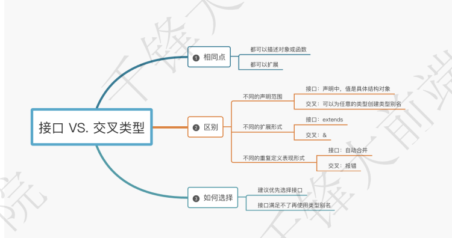
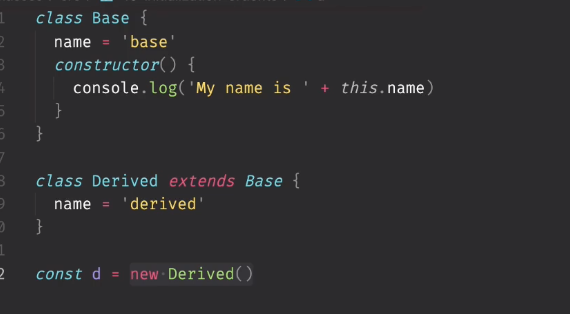

# 优化编译
1. 解决ts和js冲突问题（文件名相同报错）
tsc --init  #生成编译文件

2. 自动编译 tsc --watch
3. 出现错误时，不编译 tsc --noEmitOnError hello.ts --watch

# 显式类型
```javascript
function greet(per:string,data:Date){
    console.log(``)
}
// Date() 字符串
greet('li',new Date())


let msg='ssss'
// 无显式类型，会自动推断类型
```
# 降级编译(例如：es6模版字符串语法)&严格模式
tsconfig.json
ts7-->es2016
```json
{
    "target":"es5", //默认es3

    // ts默认宽松验证：验证程序某些部分，类型可选，推理采用最宽松类型(比如：any)，不检查潜在的null undefinded
   
   // 严格模式
    "strict":true,
    "noImplicitAny":true, //判断any类型

    "stricNullChecks":true,
    // let a:string=undefined
    // let b:string=null

    "rootDir":"./src",
    "outDir":"./dist"
}
```
# 类型
常用类型（基元类型）：string number(无int/float) boolean
对象类型:除了元类型的类型
数组：type[] Array`<type>`  type:任意合法类型

any:不希望某个特定值导致类型检查错误

函数：()=>void
```javascript
function greet(per:string,data:Date):viod{
    console.log(``)
}
```
联合类型：|
类型别名：type Id=string
接口：
```javascript
interface Point {
    x:string
}
```


HTMLElement、HTMLCanvasElement
**类型断言：as**

```javascript
const canvasdom=document.getElementById("mian_canvas") as HTMLCanvasElement
// 等价
const canvasdom=<HTMLCanvasElement>document.getElementById("mian_canvas")
```
只能允许转化为更具体或不太具体的类型版本（防止不可能的强制的发生）
```javascript
let a='hello' as number //错误
==>正确
let a=（'hello' as any) as number
let a=（'hello' as unkonwn) as number
//实现不知道什么类型时断言为一个差不多的类型 
```

**文字类型（字符串/数字/...）**

let s:"left"|"right"
let s:-1|0|1


```javascript
function handlereq(url:string,method:"GET"|"POST"|"GUESS"){

}

const req={
    url:"https://example.com",
    // 注意：加as因为req.method类型会推断为string
    method:"GET" as GET
}
// 或者
const req={
    url:"https://example.com",
    // 注意：加as因为req.method类型会推断为string
    method:"GET" 
} as const

handlereq(req.url,req.method)
```
**null和undefined**
```javascript
function handlereq(url?:string|null){
    // url 是undefined或null或string

    // !：断言为不是null或undefined 不会更改断言时行为
    // 仅当知道不可能时null或undefined时使用，不要过多使用，会带来意外问题
    console.log(url!.toFixed())
}
```
**枚举**
允许描述一个值（命名常量之一），与其他不同不是js类型级别里添加的内容，而是添加到ts语言和运行时的内容。【需要确定确实需要枚举来做些事情】
```javascript
enum Direction{
    up=1,
    down
}

Direction.up //1
Direction.down //2
```

**不太常用的原语**

bigint :非常大的整数（es2020开始）
symbol :全局唯一引用（symbol函数）
```javascript
const onehund:bigint=BigInt(100)

const another:bigint=100n //(target:es2020 不报错)

const fir=Symbol('name')
const two=Symbol('name')
fir===two //false
```


# 类型缩小 （宽类型-->窄类型）
常用于处理联合类型变量的场景  
将类型细化为比声明更具体的类型的过程：类型缩小
```javascript
function padleft (padding:number|string ,input:string):string {
    // return new Array(padding+1).join(" ")+input 检查会报错

    // 类型防护
    if(typeof padding==="number"){
        return new Array(padding+1).join(" ")+input
    }
    return padding+input
}

```
1. 类型守卫
注意：typeof null ==='object'


2. 真值缩小
条件、&&、||、if语句、布尔否定（!）


```javascript
Boolean('hell0') //true
!!"test"  //true !"test":文字布尔类型 -->!!"test":真正的true

function print(strs:string|string[]|null){
    //解决： typeof null ==='object'
    if(strs&&typeof strs==='object'){
        for(const s of strs){

        }else if(typeof strs==='string'){

        }else{

        }
    }
}

```

3. 等值缩小
=== !==  == !=

```javascript
function print(x:string|number,y:string|boolean){
    //解决： typeof null ==='object'
    if(x===y){
        // string
      
    }else{
        
    }
}
```

4. in操作符缩小
value(字符串文字) in x（联合类型）

==>true :x具有可选或必需属性的类型的值
==>false: x具有可选或缺失属性的类型的值


5. instanceof操作符缩小


6. 分配缩小
x是string|number
```javascript
let x=Math.random()<0.5?10:'hello'

x=1
x='bye'
// 都不会报错
```
7. 控制流分析

函数根据返回值推断类型

# 使用类型谓词
```javascript
// pet is Fish 类型谓词【参数 is 类型】
function isFish(pet:Fish|Bird):pet is Fish{
    // pet有swim（true） 是Fish
    return (pet as Fish).swim!==undefined
}
```

# unions 联合类型&never:不应存在的状态
```javascript
interface Shape{
    kind:'circle':'square',
    radius?:number
    sideLength?:number
}

interface Circle{
    kind:'circle',
    radius:number
}
interface Square{
    kind:'square',
    sideLength:number
}

type Shape=Circle|Square
 
function getArea(shape:Shape){
    // shape.radius会有问题
    // 解决：1.shape.radius!! 排除undefined
    // 2 .通过判断类型缩小
    switch(shape.kind){
        case "circle":
            return
        case "square":
            return
        default:
            // type Shape=Circle|Square |Triangle
            // 有Triangle不能返回never
            const _exhaustiveCheck:never=shape
            return _exhaustiveCheck
    }
    // return Math.PI*shape.radius**2
}
```

# 函数类型表达式

# 调用签名
函数还可以有属性，函数类型的表达式写法，不允许声明属性，想用属性描述可调用的东西，可在对象类型中写调用签名。

```javascript
type DescribableFunction = { 
    description: string; 
    // 函数：参数列表和返回类型之间使用:而不是=>
    (someArg: number): boolean; 
}
function doSomething(fn: DescribableFunction) { 
    console.log(fn.description + " returned " + fn(6)); 
}
function fn1(n:number) { 
    console.log(n)
    return true 
}

fn1.description = 'balabala...' 
doSomething(fn1)
```
# 构造签名

函数可用new调用，被称为构造函数,new-->返回一个对象或一个类。

```javascript
class Ctor { 
    s: string
    constructor(s: string) { 
        this.s = s 
    } 
}
type SomeConstructor={
    new (s:srting):Ctor
}
function fn(ctor: SomeConstructor) { 
    return new ctor("hello") 
}
console.log(f.s) //hello
// 工厂函数
```

data有new无new都可以被调用,可以在同一个类型中，任意的结合调用和构造签名。
```javascript
interface CallOrConstruct {
    // 构造签名
    new (s: string): Date; 
    // 调用签名
    (n?: number): number; 
}

function fn(date: CallOrConstruct) { 
    let d = new date('2021-11-20') 
    let n = date(100)
}
```
# 泛型函数:描述两个值之间的对应关系时
1. ## 类型推断

输出值类型--输入值类型关联
```javascript
function firstElement(arr: any[]) { 
    return arr[0]; 
    // 返回值类型：any
}

// <T> : Type的简写  定义泛型<Type>
// 输入输出类型保持一致
function firstElement<Type>(arr: Type[]):Type|undefined { 
    return arr[0]; 
    // 返回值类型：Type
}
// 推断
const s = firstElement(["a", "b", "c"]); // s 是 'string' 类型 
const n = firstElement([1, 2, 3]); // n 是 'number' 类型 
const u = firstElemen([])// u 是 undefined 类型 

// 指定
const s = firstElement<string>(["a", "b", "c"]); // s 是 'string' 类型 
const n = firstElement<number>([1, 2, 3]); // n 是 'number' 类型 
const u = firstElemen<undefined>([])// u 是 undefined 类型 

// 一般不会在调用时指令，会ts推断类型
```

```javascript
function map<Input, Output>(arr: Input[], func: (arg: Input) => Output): Output[] {         
    return arr.map(func); 
}
//参数'n'是'字符串'类型。 
// 'parsed'是'number[]'类型。 
const parsed = map(["1", "2", "3"], (n) =>parseInt(n)
```
2. ## 限制条件而非扩展:`<Type extends { length: number }>`
我们已经写了一些通用函数，可以对任何类型的值进行操作。
有时我们想把两个值联系起来，但只能对某个值的子集进行操作。在这种情况下，我们可以使用一个约束条件来限制一个类型参数可以接受的类型。

```javascript
function longest<Type extends { length: number }>(a: Type, b: Type) { 
    if (a.length >= b.length) { 
        return a; 
    } else { 
        return b; 
    } 
}

const longerArray = longest([1, 2], [1, 2, 3]);// longerArray 的类型是 'number[]' 
const longerString = longest("alice", "bob"); // longerString 是 'alice'|'bob' 的类型。 

const notOK = longest(10, 100);// 错误! 数字没有'长度'属性 
```
3. ## 使用受限值
```javascript
function minimumLength<Type extends {length: number}>(obj:Type, minimum: number):Type{ 
    if (obj.length >= minimum) { 
        return obj 
    } else { 
        return { length: minimum } 
    } 
}
// 返回值虽然与限制类型相等但要求返回的是泛型类型
```

```javascript
// 'arr' 获得值： { length: 6 } 
const arr = minimumLength([1, 2, 3], 6); 
//在此崩溃，因为数组有一个'切片'方法，但没有返回对象! 
console.log(arr.slice(0))
```

4. ## 指令类型参数
TypeScript通常可以推断出通用调用中的预期类型参数，但并非总是如此。例如，假设你写了一个函数
来合并两个数组：
```javascript
function combine<Type>(arr1: Type[], arr2: Type[]): Type[] { 
    return arr1.concat(arr2); 
}
// 通常情况下，用不匹配的数组调用这个函数是一个错误：
const arr = combine([1, 2, 3], ["hello"]);

// =>给泛型定义具体类型第一个number 第二个string
const arr = combine<number|string>([1, 2, 3], ["hello"]);
// [1,2,3,'hello']
// 不推荐，这个实际用来要求入参
```
5. ## 编写优秀通用函数的准则
编写泛型函数很有趣，而且很容易被类型参数所迷惑。
有太多的类型参数或在不需要的地方使用约束，会使推理不那么成功，使你的函数的调用者感到沮丧。
* 在可能的情况下，使用类型参数本身，而不是对其进行约束   
乍一看，这些可能是相同的，但 firstElement1 是写这个函数的一个更好的方法。它的推断返回类型是Type，但 firstElement2 的推断返回类型是 any ，
因为TypeScript必须使用约束类型来解析arr[0] 表达式，而不是在调用期间 "等待 "解析该元素。


```javascript
function firstElement1<Type>(arr: Type[]) { 
    return arr[0]; 
}
function firstElement2<Type extends any[]>(arr: Type) { 
    return arr[0]; 
}

// a: number (推荐) 
const a = firstElement1([1, 2, 3]); 

// b: any (不推荐) 
const b = firstElement2([1, 2, 3]);

```
* 总是尽可能少地使用类型参数   

我们已经创建了一个类型参数Func,它并不涉及两个值。这总是一个值得标记的坏习惯,因为它意味着想要指定类型参数的调用者必须无缘无故地手动指定一个额外的类型参数。

Func 除了使函数更难阅读和推理外，什么也没做。
```javascript
function filter1<Type>(arr:Type[],func:(arg:Type)=>boolean):Type[] { 
    return arr.filter(func);
}
function filter2<Type,Func extends (arg:Type)=>boolean>(arr:Type[],func:Func): Type[] { 
    return arr.filter(func); 
}
```
* 如果一个类型的参数只出现在一个地方，请重新考虑你是否真的需要它
```javascript
function greet<Str extends string>(s: Str) { 
    console.log("Hello, " + s); 
}
greet("world")
// ==>我们完全可以写一个更简单的版本：
function greet(s: string) { 
    console.log("Hello, " + s);
}
```

# 可选参数
1. ## 函数的可选参数
```javascript
function f(x?: number) { 
    // ... 
}
f(); // 正确 
f(10); // 正确
```
2. ## 回调中的可选参数

当为回调写一个函数类型时，永远不要写一个可选参数，除非你打算在不传递该参数的情况下调用函数。

# 函数重载
javascript函数可以在不同的参数数量和类型中被调用。
在TypeScript中，我们可以通过编写“重载签名”来指定一个可以以不同方式调用的函数。要做到这一点，要写一些数量的函数签名（通常是两个或更多），然后是函数的主体：
```javascript
function makeDate(timestamp: number): Date; 
function makeDate(m: number, d: number, y: number): Date; 
//一个接受一个参数，另一个接受三个参数。这前两个签名被称为重载签名。

// 第三个成为实现签名
function makeDate(mOrTimestamp:number,d?:number,y?:number): Date { 
    if (d !== undefined && y !== undefined) { 
        return new Date(y, mOrTimestamp, d); 
    } else { 
        return new Date(mOrTimestamp); 
    } 
}
const d1 = makeDate(12345678); 
const d2 = makeDate(5, 5, 5); 
const d3 = makeDate(1, 3); //报错:只是兼容重载签名参数，不能根据实现签名调用
```
1. ## 重载签名和实现签名
3个问题：1. 参数不正确 2.参数类型不正确 3.返回类型不正确
```javascript

// 这是一个常见的混乱来源。通常我们会写这样的代码，却不明白为什么会出现错误：
function fn(x: string): void; 
function fn() { 
    // ... 
}
// 期望能够以零参数调用 
fn(); //错误
-----------------------------
// 实现的签名从外面是看不到的。在编写重载函数时，你应该总是在函数的实现上面有两个或多个签名。
function fn(x: boolean): void; 
function fn(x: string): void; 
// 错误
// function fn(x: boolean) {}
// ==>
function fn(x: boolean|string) {}

-------------------------------------
function fn(x: string): string; 
function fn(x: number): boolean; 
// 错误
// function fn(x: string | number):string { 
//     return "oops";
// }
function fn(x: string | number):string|boolean { 
    return "oops";
}
function fn(x: string | number):string|boolean { 
    return "oops";
}
```
2. ## 编写好的重载
准则：在可能的情况下，总是**倾向于使用联合类型的参数**而不是重载参数
```javascript
function len(s: string): number; 
function len(arr: any[]): number; 
function len(x: any) { 
    return x.length; 
}

len('');//ok
len([0]);//ok

len(Math.random() > 0.5 ? "hello" : [0]); //报错


// =>改造
function len(x: any[] | string) { 
    return x.length;
}
len(Math.random() > 0.5 ? "hello" : [0]); //ok
```

3. ## 函数内this的声明


# void-object-unknown-never-function

# 参数展开运算符

1. ## 形参展开

2. ## 实参展开
```javascript
const arr1 = [1, 2, 3];
const arr2 = [4, 5, 6]; 
arr1.push(...arr2);

// 一般来说，TypeScript并不假定数组是不可变的
// 推断的类型是number[] -- "一个有零或多个数字的数组"。不专指两个数字
const args = [8, 5]; 
const angle = Math.atan2(8, 5); //正确
const angle = Math.atan2(...args); //错误

// 推断为2个长度的元组 
const args = [8, 5] as const; 
// 正确
const angle = Math.atan2(...args);
```
# 参数解构
以使用参数重构来方便地将作为参数提供的对象，解压到函数主体的一个或多个局部变量中
```javascript
function sum({ a, b, c }) { 
    console.log(a + b + c); 
}
sum({ a: 10, b: 3, c: 9 });

// 对象的类型注解在解构的语法之后：
function sum({ a, b, c }: { a: number; b: number; c: number }) {
    console.log(a + b + c); 
}
// 这看起来有点啰嗦，但你也可以在这里使用一个命名的类型：

// 与之前的例子相同 
type ABC = { a: number; b: number; c: number }; 
function sum({ a, b, c }: ABC) { 
    console.log(a + b + c); 
}
```
# 返回void类型
一个具有 void 返回类型的**上下文函数类型**（ type vf = () => void ），在实现时，可以返回任何其他的值，但它会被忽略。    
当一个**字面的函数定义**有一个 void 的返回类型时，该函数必须不返回 任何东西。
```javascript
type voidFunc = () => void 
const f1: voidFunc = () => { 
    return true 
}
const f2: voidFunc = () => true 
const f3: voidFunc = function () { 
    return true 
}

const v1:boolean= f1(); //加显式定义boolean，不让推断，会检查出错
const v2 = f2(); 
const v3 = f3();


// error：不能将类型"boolean"分配给void【上面可以】
function f2(): void { 
    return true; 
}
const f3 = function (): void { 
    return true;
}
```
# 认识对象类型

匿名对象  接口命名  类型别名
```javascript
//匿名
function greet(person: { name: string; age: number }) { 
    return "Hello " + person.name; 
}

// 接口命名
interface Person { 
    name: string; age: number; 
}
function greet(person: Person) { 
    return "Hello " + person.name; 
}

// 类型别名
type Person = { name: string; age: number; };
function greet(person: Person) { 
    return "Hello " + person.name; 
}
```
# 属性修改器
1. ## 可选属性：加？
```javascript
type Shape = {} 
interface PaintOptions { 
    shape: Shape; 
    xPos?: number; 
    yPos?: number; 
}

function paintShape({ shape:Shape【别名】, xPos:number【别名】 = 0, yPos = 0 }: PaintOptions) { 
    console.log("x coordinate at", xPos);
    console.log("y coordinate at", yPos); 
    // ... 
}
```
2. ## 只读属性
一个标记为只读的属性不能被写入。
```javascript

interface SomeType { 
    readonly prop: string; 
}
function doSomething(obj: SomeType) { 
    // 可以读取 'obj.prop'. 
    console.log(`prop has the value '${obj.prop}'.`); 
    // 但不能重新设置值 obj.prop = "hello";
}


interface Home{
     readonly resident: { 
         name: string; 
         age: number };
}
function visitForBirthday(home: Home) {
    // 我们可以从'home.resident'读取和更新属性。 
    console.log(`Happy birthday ${home.resident.name}!`); 
    home.resident.age++; 
}
function evict(home: Home) {
    // 但是我们不能写到'home'上的'resident'属性本身。 
    home.resident = { 
        name: "Victor the Evictor", age: 42, 
    }; 
}

// *可选属性可给只读属性赋值
interface Person { 
    name: string; age: number; 
}
interface ReadonlyPerson { 
    readonly name: string; 
    readonly age: number; 
}
let writablePerson: Person = { name: "Person McPersonface", age: 42, };
// 正常工作 
let readonlyPerson: ReadonlyPerson = writablePerson;

 console.log(readonlyPerson.age);  // 打印 '42' 

 writablePerson.age++; 

 console.log(readonlyPerson.age);  // 打印 '43'


```
3. ## 索引签名
有时不知道一个类型的所有属性名称，但你知道值的形状。
索引签名的属性类型必须是string或number
```javascript
interface StringArray{
    [index:number]:string
}
const myArray: StringArray = ['a', 'b']; 
const secondItem = myArray[1]; //"b"


interface NumberOrStringDictionary { 
    [index: string]: number ; 
    length: number; // 正确
    name: string; // 有问题（索引签名没有兼容string）
}
interface NumberOrStringDictionary { 
    [index: string]: number | string; 
    length: number; // 正确, length 是 number 类型 
    name: string; // 正确, name 是 string 类型 
}
```
# 扩展类型
1. ## 类型扩展&交叉类型
扩展接口：
```javascript
// 类型扩展
interface Point {
    x:string
}
interface PointChild extend Point{
    y:number
}
const a:PointChild={x:'111',y:2333}

interface Point2 {
    s:string
}

interface PointChild extend Point,Point2{
    z:string
}

// 交叉类型
type Points = Point&Point2

function drw(col:Point&Point2){}

```
区别：如何处理冲突
```javascript
// interface 通过同名添加（type不能会报标识符重复）
interface Point {
    x:string
}
interface Point {y:number}

const a:Point={
    x:'111',
    y:2333
}
```


# 泛型
一个可以包含任何数值的盒子类型：字符串、数字、长颈鹿，等等。
```javascript
interface Box { 
    contents: any; 
}
// 没有意义

// unknown非常严苛，用户不能随意的给contents做赋值，每个给contents的赋值都需要做判断，才能做自己的业务处理（都不可取）
interface Box { 
    contents: unknown; 
}
// --------------
// 推荐：泛型
interface Box<Type> { 
    contents: Type; 
}
let box:Box<string>={
  contents:'sfsdf'  
};
// -----------------------------------
interface Box<Type> { 
    contents: Type; 
}
interface Apple { 
    // .... 
}
type AppleBox = Box<Apple>;

let a:Apple={}
let ab:AppleBox={
    contents:a
}
// -----------------------
// 也可用类型别名
type Box<Type> { 
    contents: Type; 
}
// 由于类型别名与接口不同，它不仅可以描述对象类型，我们还可以用它来编写其他类型的通用辅助类型。
type OrNull<Type> = Type | null; 
type OneOrMany<Type> = Type | Type[]; 
type OneOrManyOrNull<Type> = OrNull<OneOrMany<Type>>; //基于OrNull<>进行扩展
type OneOrManyOrNullStrings = OneOrManyOrNull<string>;
```
# 类型操纵--从类型中创建类型
方法（7）：
* 泛型类型
* keyof类型操作符
* typeof类型操作符
* 索引访问类型：type[a]访问子集
* 条件类型：像使用if语句一样创建类型
* 映射类型：映射现有类型中的每个属性来创建类型
* 模版字面量类型：通过**模版字面量**的字符串来改变属性的映射类型

```javascript
function identity(arg: number): number { 
    return arg; 
}
function identity(arg: any): any { 
    return arg; 
}

// 使用类型变量
// 可以将类型信息从函数的一侧输入，然后从另一侧输出。相比any它不会丢失任何信息.
function identity<Type>(arg: Type): Type { 
    return arg; 
}
// 使用
let output = identity<string>("myString");
let output = identity("myString");
// 第二种方式可能也是最常见的。这里我们使用类型参数推理——也就是说，希望编译器根据我们传入的参数的类型，自动为我们设置Type的值。更复杂的例子中可能不能推断，需使用第一种。
```
**使用通用类型变量**
```javascript
function loggingIdentity<Type>(arg: Type): Type { 
    console.log(arg.length); //有ts报错---传入一个number而这个数字没有.length 成员。
    return arg; 
}

// ==>Type规定为数组类型
function loggingIdentity<Type>(arg: Array<Type>): Array<Type> { 
    console.log(arg.length);
    // 数组有一个.length，所以不会再出错了 
    return arg; 
}
```
## **泛型类型**
### 泛型类型--泛型接口
上面通过**函数**来定义了一个泛型，以及在**函数体**里使用这个**泛型类型的变量**  
如何去通过给一个**变量**来去设置这个**函数的泛型的类型**

```javascript
function identity<Type>(arg: Type): Type { 
    return arg; 
}
// 定义泛型函数的格式
let myIdentity: <Type>(arg: Type) => Type = identity;

//对象字面量 
let myIdentity: { <Type>(arg: Type): Type } = identity;

//对象字面量 =>抽离成泛型接口
interface GenericIdentityFn { 
    <Type>(arg: Type): Type; 
}
let myIdentity: GenericIdentityFn = identity;

// 
interface GenericIdentityFn<Type> { (arg: Type): Type; }
// let myIdentity: GenericIdentityFn = identity;//报错，因为GenericIdentityFn要求输入具体的类型
let myIdentity: GenericIdentityFn<string> = identity //更严谨
```
### 泛型类---与泛型接口类似
在类的名称后加尖号，去写一些泛型参数的列表
tsconfig.json
```json
{
    "stricPropertyInitialization":true //check class
}
```

```javascript
class GenericNumber<NumType> { 
    zeroValue: NumType; 
    add: (x: NumType, y: NumType) => NumType; 
}

let myGenericNumber = new GenericNumber<number>(); 
myGenericNumber.zeroValue = 0; 
myGenericNumber.add = function (x, y) { 
    return x + y;
}

let myGenericNumber = new GenericNumber<string>(); 
myGenericNumber.zeroValue = ''; 
myGenericNumber.add = function (x, y) { 
    return x + y;
}
```
### 泛型约束
通用类型变量--loggingIdentity type==>type类型的array

在用户调用这个函数，传参数时告诉他传入的参数值，必须要有length属性-----泛型约束可以解决   
定义方法：
```javascript
// 约束Type
function loggingIdentity<Type extends Lengthwise> {}

// ------------------------------
interface Lengthwise{
    length:number
}
function loggingIdentity<Type extends Lengthwise>(arg: Type): Type { 
    console.log(arg.length); // 现在我们知道它有一个 .length 属性，所以不再有错误了 
    return arg; 
}
loggingIdentity(3) //报错
```

### 泛型约束中使用类型参数
受另一个类型参数约束的类型参数： `<Key extends keyof Type>`:key属于Type类型的对象类型的某个key才可以
```javascript
function getProperty<Type, Key extends keyof Type>(obj: Type, key: Key) { 
    return obj[key]; 
}
let x = { a: 1, b: 2, c: 3, d: 4 }; 
getProperty(x, "a"); 
getProperty(x,'m') //类型m的参数不能赋值给类型"a"|"b"|"c"|"d"的参数
```

### 泛型中使用类类型
使用泛型创建工厂函数时，有必要通过它的构造函数来引用类的类型
```javascript
// c应该是个类类型-给c定义类型。定义方法keys是小括号，value是Type类型
// 作用：用来创建类实例
function create<Type>(c: { new (): Type }): Type {
    return new c(); 
}

class BeeKeeper { 
    hasMask: boolean = true; 
}
class ZooKeeper { 
    nametag: string = "Mikle"; 
}
class Animal { 
    numLegs: number = 4; 
}

class Bee extends Animal { 
    keeper: BeeKeeper = new BeeKeeper(); 
}
class Lion extends Animal { 
    keeper: ZooKeeper = new ZooKeeper();
}
// 泛型A必须是Animal的实例或者Animal类型
function createInstance<A extends Animal>(c: new () => A): A { 
    return new c(); 
}
createInstance(Lion).keeper.nametag; 
createInstance(Bee).keeper.hasMask;
createInstance(BeeKeeper) //报错
```

## keyof类型操作符
映射类型组合是很有用   
接受对象类型，产生key的字符串，或者数字字面量的集合，或者一个联合类型
```javascript
type point = { x: number; y: number }; 
type P = keyof Point; //"x"|"y"

const p1:P = 'x' 
const p2:P = 'y'
//----------------------------
type Mapish = { 
    [k: number]: boolean 
}; 
type M = keyof Mapish;  //M是number
const m:M = 0 //OK

//------------------------------------
type Mapish = { 
    [k: string]: boolean 
}; 
type M = keyof Mapish;  //string
const m:M = 'a' //ok
const m2:M = 10 //错误

//keyof衍生出新的类型
```
## typeof类型操作符

typeof让我们在类型上下文中，使用它来引用一个变量，或者数组的类型。
```javascript
let s= "hello"; 
let n: typeof s; 
n = 'world' 
// n= 100 //错误
```
如果只使用基本类型来说，typeof没什么大用。但是组合其他类型操作，可以方便的表达很多模式，

```javascript
type Predicate = (x: unknown) => boolean; 
type K = ReturnType<Predicate>;
// -------------------------------------------------
function f() { 
    return { x: 10, y: 3 }; 
}
// type P = ReturnType<f>//f表示值，需要加typeof
type P = ReturnType<typeof f>; //{x:number,y:number}
```
预定义类型`ReturnType`:获取函数返回值类型,`ReturnType<T>`:T必须传入一个函数的类型 
typeof可以去标识一些标识符，比如变量及某个变量上的属性，但不能用标识函数调用的结果，只能标识未调用的函数。
```javascript
function msgbox(str:string){
    return str
}
let shouldContinue: typeof msgbox("Are you sure you want to continue?");
```

## 索引访问类型

可以使用***索引访问类型***来查询另一个类型上的特定属性(索引使用变量,不能用const)
```javascript
type Person = { 
    age: number; 
    name: string; 
    alive: boolean 
}; 
type Age = Person["age"]; //number


type I1 = Person["age" | "name"]; // type I1 = string | number
const i11:I1 = 100
const i12:I1 = '' 

type I2 = Person[keyof Person]; // type I2 = string | number | boolean 
const i21:I2 = '' 
const i22:I2 = 100 
const i23:I2 = false 
 

type AliveOrName = "alive" | "name"; 
type I3 = Person[AliveOrName]; // boolean|string

const aon1:AliveOrName = 'alive' 
const aon2:AliveOrName = 'name'


//---------------------------------------------------
// 另一个使用任意类型进行索引的例子是使用 number 来获取一个数组元素的类型。我们可以把它和 typeof 结合起来，方便地获取一个数组字面的元素类型。
const MyArray = [ 
    { name: "Alice", age: 15 }, 
    { name: "Bob", age: 23 }, 
    { name: "Eve", age: 38 }
];

type Person = typeof MyArray[number]; //type Person={name:string;age:number;}
const p:Person = { name: 'xiaoqian', age: 11 }


type Age = typeof MyArray[number]["age"]; //type Age = number 
const age:Age = 11 

// 或者 
type Age2 = Person["age"]; //type Age2 = number
const age2:Age2 = 11

// 索引使用变量,不能用const
// const key = "age"; 
type key = "age";
type Age = Person[key]; 
```

## 条件类型
条件类型结合泛型能发挥最大优势。函数重载优化，

条件类型的形式看起来有点像JavaScript中的条件表达式（ condition ? trueExpression : falseExpression ）。   
SomeType extends OtherType ? TrueType : FalseType
```javascript
interface Animal { 
    live(): void; 
}
interface Dog extends Animal { 
    woof(): void; 
}

type Example1 = Dog extends Animal ? number : string; // type Example1 = number 
type Example2 = RegExp extends Animal ? number : string;//type Example2=string 
```

函数重载优化
```javascript
interface IdLabel { 
    id: number 
    /* 一些字段 */; 
}
interface NameLabel { 
    name: string 
    /* 另一些字段 */; 
}
function createLabel(id: number): IdLabel; 
function createLabel(name: string): NameLabel; 
function createLabel(nameOrId: string | number): IdLabel | NameLabel; 
function createLabel(nameOrId: string | number): IdLabel | NameLabel { 
    throw "unimplemented";
}
//--------------------------------------------
type NameOrId<Type extends string|number>=Type extends number?IdLabel:NameLabel
function createLabel<Type extends string|number>(idorname:T):NameOrId<T>{
    throw ''
}

let a = createLabel("typescript"); // let a: NameLabel 
let b = createLabel(2.8); // let b: IdLabel 
let c = createLabel(Math.random() ? "hello" : 42);// let c: NameLabel | IdLabel 
```
### 条件类型约束
条件类型中的检查会给我们提供一些新的信息。就像用类型守卫缩小范围可以给我们一个更具体
的类型一样，条件类型的真正分支将通过我们检查的类型进一步约束泛型。
```javascript
type MessageOf<T> = T["message"];//TypeScript出错是因为无法保证T有叫做message的属性。我们可以对 T 进行约束，TypeScript就不会再抱怨。

type MessageOf<T extends { message: unknown }> = T["message"]

type MessageOf<T>=T extends { message: unknown }?T["message"]:never

// 如果我们想让 MessageOf 接受任何类型，并在消息属性不可用的情况下，默认为 never 类型，我们可以通过将约束条件移出，并引入一个条件类型来做到这一点。
type MessageOf<T> = T extends { message: unknown } ? T["message"] : never; interface Email { 
    message: string; 
}
interface Dog { 
    bark(): void; 
}

type EmailMessageContents = MessageOf<Email>; //type EmailMessageContents=string 
const emc:EmailMessageContents = 'balabala...' 

type DogMessageContents = MessageOf<Dog>; // type DogMessageContents = never 
const dmc:DogMessageContents = 'error' as never


type Flatten<T> = T extends any[] ? T[number] : T;
// 提取出元素类型。 
type Str = Flatten<string[]>;// type Str = string 

type Str = Flatten<number>//number
```
### 在条件类型内进行推理
在条件类型内推理，条件类型为我们提供了一种方法来推断我们在真实分支中使用***infer***关键字进行对比的类型。
```javascript
//  infer 关键字显式的声明性了一个名为 Item 的新的同类型的变量
// 而不是指定如何在真实的分支中检索T的元素类型。这使我们不必考虑关于数字类型的问题了。
type Flatten<Type> = Type extends Array<infer Item> ? Item : Type

// Type是否受函数约束
type GetReturnType<Type> =Type extends (...args: never[])=>infer R?R:never; 

// infer R的意义：传入函数函数类型，定义好函数的返回值的类型，就返回具体的类型

type Num = GetReturnType<() => number>; // type Num = number 
type Str = GetReturnType<(x: string) => string>; //type Str = string 
type Bools=GetReturnType<(a:boolean,b:boolean)=>boolean[]>;//type Bools=boolea[] 


// 给泛型传入 string 类型，没有类似于函数的返回值，infer return不成立【type不约束于函数的类型】，会返回 never 
type Never = GetReturnType<string> 
const nev:Never = 'error' as never
// ----------------------------------------
//一个具有多个调用签名的类型（如重载函数的类型）进行推断时，从最后一个签名进行推断（据推测，这是最容许的万能情况）。不会根据参数类型的列表来执行重载解析。
declare function stringOrNum(x: string): number; //不会解析
declare function stringOrNum(x: number): string; //不会解析
declare function stringOrNum(x: string | number): string | number;  //解析最后一个签名

type T1 = ReturnType<typeof stringOrNum>;// type T1 = string | number 

```
### 分布式条件类型
当条件类型作用于一个通用类型的时候，给定一个联合类型，它就变成了一个分布式的
```javascript
type ToArray<Type>= Type extends any ? Type[] :never
// 相当于做了一个分布式分发
type StrArrOrNumArr=ToArray<string|number>;//type StrArrOrNumArr=string[]|number[] 

//非分布式
type ToArrayNonDist<Type> = [Type] extends [any] ? Type[] : never;
type StrArrOrNumArr = ToArrayNonDist<string | number>;
// 'StrArrOrNumArr'不再是一个联合类型 
// type StrArrOrNumArr = (string | number)[]

```
# 类
## 类成员&类属性  
```javascript
//初始化1
class Point { 
    x: number= 0; 
    y: number = 0; 
}
const pt = new Point(); 
// Prints 0, 0 
console.log(`${pt.x},${pt.y}`);//就像const、let和var一样一个类属性的初始化器将被用来推断其类型。

//2初始化(构造函数方法)
class Point { 
    // 不定义类型number，初始化时会自动推断
    x: number; 
    y: number; 
    // new 时此函数自动运行
    constructor() { 
        this.x = 0 
        this.y = 0 
    }
}
const pt = new Point(); 
pt.x = 0; 
pt.y = 0
// 与其他位置一样，类型注解是可选的，但如果不指定，将是一个隐含的any类型。
//字段也可以有初始化器；这些初始化器将在类被实例化时自动运行。


//-----------------------------------------------------------------
//如果你打算通过构造函数以外的方式来确定初始化一个字段可以使用确定的赋值断言操作符 ！ 。
class GoodGreeter { 
    name!: string; // 没有初始化，但没报错。
    // constructor() { 
    //     this.name = "hello"; 
    // } 
}
```

字段的前缀可以是 readonly 修饰符。这可以防止在构造函数***constructor***之外对该字段进行赋值。

## 构造器（constructor）
类的构造函数签名和函数签名之间只有一些区别：
* 构造函数不能有**类型参数**--这属于外层类的声明，我们将在后面学习。
* 不构造函数不能有**返回类型**注释-——类的实例类型总是被返回的。
```javascript
class Point { 
    x: number; 
    y: number; 
    // 带默认值的正常签名 
    constructor(x:number = 0, y:number = 0) { 
    // constructor(x = 0, y = 0) { 
        this.x = x; this.y = y; 
    } 
}
//-----------------------------

class Base {
    k=4
}
class Derived extends Base { 
    constructor() { 
        // 在ES5中打印一个错误的值；在ES6中抛出异常。 
        console.log(this.k); 
        //需要在构造器主体中调用super(); 。
        super(); 
    } 
}
```
## 类里方法(类中的函数属性)
可以使用与**函数**和**构造函数**相同的所有类型注释
```javascript
class Point { 
    x:number = 10; 
    y:number = 10; 
    scale(n: number): void { 
        //一个方法体中，仍然必须通过 this 访问字段和其他方法,否则读取的可能是类外部的变量
        this.x *= n; this.y *= n; 
    } 
}

```
## getters&setters访问器
定义两个相同的方法，分别用get,set修饰
```javascript
class C { 
    _length = 0; 
    get length() { 
        return this._length; 
    }
    set length(value) { 
        this._length = value;
    }
}
let c:C=new C()

```
TypeScript对访问器有一些特殊的推理规则：
* 如果有get ，但没有 set ，则该属性自动是只读的   
* 如果没有指定**setter**参数的类型，它将从**getter的返回类型**中推断出来   
* 访问器和设置器必须有相同的成员可见性   
从TypeScript 4.3开始，不同类型的访问器set的value的类型，不一定与get返回值的类型保持一致
Number.isFinite(num)  是可数的
```javascript
class Thing { 
    _size = 0; 
    get size(): number { 
        return this._size; 
    }
    set size(value: string | number | boolean) { 
        let num = Number(value); 
        // 不允许NaN、Infinity等 
        if (!Number.isFinite(num)) { 
            this._size = 0; return; 
        }
        this._size = num; 
    } 
}
```
## 索引签名
类可以声明索引签名，这些签名与对象类型的索引签名相同。
```javascript
class MyClass { 
    [s: string]: boolean | ((s: string) => boolean); 
    // 约束了类里属性和函数定义规则，比如：check
    check(s: string) { 
        return this[s] as boolean; 
    } 
}
```
## 类继承---implements子句
```javascript
interface Pingable { 
    // 定义形状
    ping(): void; 
}
class Sonar implements Pingable { 
    // 实现
    ping() { 
        console.log("ping!"); 
    } 
}
// error：缺少ping
class Ball implements Pingable { 
    pong() { 
        console.log("pong!"); 
    } 
}
// ------------------------------------
// implements 子句只是检查类是否可以被当作接口类型来对待。它根本不会改变类的类型或其方法
interface Checkable { 
    check(name: string): boolean; 
}
class NameChecker implements Checkable { 
    // 与Checkable的check兼容就可以
    check(s:number|string) { 
        // any：注意这里没有错误 
        // return s.toLowercse() === "ok"; 
    } 
}
//-------------------------------
// 实现一个带有可选属性的接口并不能创建该属性。
interface A { 
    x: number; 
    y?: number; 
}
class C implements A { 
    x = 0; 
}
const c = new C(); 
c.y = 10; //C中不实现，会报在类中不存在
```

## extends 子句

implements可以实现一个类，去继承或实现一个接口

extends 实现一个类继承另外一个类，被继承的类成为**基类/父类**，继承的类称为**子类**，会具备父类的所有的属性或者方法，还可以定义自己的一些成员

## 重写类的方法

派生类也可以覆盖基类的一个字段或属性。可以使用**super.**语法来访问基类方法。
注意，因为JavaScript类是一个简单的查找对象，没有 "超级字段 "的概念。
TypeScript强制要求派生类总是其基类的一个子类型。

```javascript
class Base { 
    greet() { 
        console.log("Hello, world!"); 
    } 
}
class Derived extends Base { 
    greet(name?: string) { 
        // 派生类要对基类做兼容
        if (name === undefined) { 
            super.greet(); 
        } else { 
            console.log(`Hello, ${name.toUpperCase()}`); 
        } 
    } 
}
const d = new Derived(); 
d.greet(); //ok
d.greet("reader");//ok


//----------------------------
//类型赋值
const d: Base = new Derived(); 
d.greet()
d.greet("reader");//ok

const b: Base = d; // 没问题 （派生类做到了是子类的子对象【或子类型】）
b.greet();
```
## 基类和派生类初始化顺序
按照JavaScript的定义，类初始化的顺序是：
* 基类的字段被初始化
* 基类构造函数运行
* 派生类的字段被初始化
* 派生类构造函数运行


## 类--继承内置类型（array error map等等）
es5及以下需要注意
```javascript
class MsgError extends Error { 
    
    constructor(m: string) { 
        super(m); 
        // 1. es5[没有类？]报错，可以设置原型解决
        Object.setPrototypeOf(this, MsgError.prototype);
    }
    sayHello() { 
        return "hello " + this.message; 
    } 
}
const msgError=new MsgError('hello')
// msgError.sayHello()

msgError instanceof MsgError //设置了原型为true，否则为false

```

## 类--成员的可见性
可以使用TypeScript来控制某些方法或属性对类外的代码是否可见。

三个重要关键字：
* public（公开的，默认值--任何对象在任何地方都可以访问）
* protected（受保护的--能在当前类或者子类中进行访问）
* private（私有的--只能在当前类中进行访问）ts允许跨实例的私有访问
```javascript
class Greeter { 
    public greet() { 
        console.log("hi!"); 
    } 
}
const g = new Greeter(); 
g.greet();

// ----------------------------
class Greeter { 
    public greet() { 
        console.log("Hello, " + this.getName()); 
    }
    protected getName() { 
        return "hi"; 
    }
}
class SpecialGreeter extends Greeter {
    public howdy() { 
        // 在此可以访问受保护的成员 
        console.log("Howdy, " + this.getName()); 
    } 
}

const g = new SpecialGreeter(); 
g.greet(); // 没有问题 
g.getName(); // 无权访问

//-------------------------------------------------
 
//派生类需要遵循它们的基类契约，但可以选择公开具有更多能力的基类的子类型。这包括将受保护的成员变成公开。
class Base { 
    protected m = 10; 
}
class Derived extends Base { 
    // 没有修饰符，所以默认为'公共'('public') 
    m = 15; 
}
const d = new Derived(); 
console.log(d.m); // OK


//-----------------------------------
class Base { 
    private x = 0; 
}
const b = new Base(); 
console.log(b.x); // 不能从类外访问 


class Base { 
    private x = 0; 
}
const b = new Base(); 
class Derived extends Base { 
    showX() { 
        // 不能在子类中访问
        console.log(this.x);
    }
}
// ==>（TypeScript确实允许跨实例的私有访问）
// 一个类里面访问另外一个实例的属性
class A { 
    private x = 10; 
    // other类的实例
    public sameAs(other: A) { 
        // 可以访问 
        return other.x === this.x; 
    } 
}

```
## 类的静态成员static
静态成员:访问时不需要实力化，直接通过类的名字。

* 特殊的静态名称不安全，避免使用：name,length,call等
* typescript没有静态类的概念，因为我们还有函数和普通对象

类可以有静态成员。这些成员并不与类的特定实例相关联。它们可以通过类的构造函数对象本身来访
问。
```javascript
class MyClass { 
    static x = 0; 
    static printX() { 
        console.log(MyClass.x); 
    } 
}
console.log(MyClass.x); 
MyClass.printX();

//---------------------------
// 静态成员也可以使用相同的 public 、 protected 和 private 可见性修饰符。
class MyClass { 
    private static x = 0; 
     static printX() { 
        console.log(MyClass.x); //可以访问
    } 
}
console.log(MyClass.x); //访问不到
//---------------------------
//静态成员也会被继承。
class Base { 
    static getGreeting() { 
        return "Hello world"; 
    } 
}
class Derived extends Base { 
    myGreeting = Derived.getGreeting(); 
}


// TypeScript（和JavaScript）没有像C#和Java那样有一个叫做静态类的结构。
// 这些结构体的存在，只是因为这些语言强制所有的数据和函数都在一个类里面；因为这个限制在TypeScript中不存在，所以不需要它们。一个只有一个实例的类，在JavaScript/TypeScript中通常只是表示为一个普通的对象。
// 例如，我们不需要TypeScript中的 "静态类 "语法，因为一个普通的对象（甚至是顶级函数）也可以完成这个工作。

// 不需要 "static" class 
class MyStaticClass { 
    static doSomething() {}
}
// 首选 (备选 1) 
function doSomething() {} 
// 首选 (备选 2) 
const MyHelperObject = { dosomething() {}, };
```

## 类里的static区块
只在内部成员使用，内部成员通过类名直接调用
静态块允许你写一串有自己作用域的语句，可以访问包含类中的私有字段。这意味着我们可以用写语句
的所有能力来写初始化代码，不泄露变量，并能完全访问我们类的内部结构
```javascript
class Foo { 
    // 跟普通静态成员区别：它成了一个私有的属性
    static #count = 0; 
    get count() { 
        return Foo.#count; //可以访问
    }
    static { 
        try { 
            const lastInstances = { 
                length: 100 
            };
            Foo.#count += lastInstances.length; //可以写
        }catch {} 
    } 
}
Foo.#count; //不可以访问
```

## 泛型类
类，和接口一样，可以是泛型的。当一个泛型类用new实例化时，其类型参数的**推断方式**与**函数调用**的方式相同。
```javascript
class Box<Type> { 
    contents: Type; 
    constructor(value: Type) { 
        this.contents = value; 
    } 
    // 静态成员不能引用类的类型参数。 
    static defaultValue: Type;//有问题
}
// const b: Box<string> = new Box("hello!")
const b = new Box("hello!"); //推断
const b = new Box<string>("hello!"); //推断
```
## 类运行时中的this
TypeScript并没有改变JavaScript的运行时行为，而JavaScript的运行时行为偶尔很奇特

```javascript
class MyClass { 
    name = "MyClass"; 
    getName() { 
        return this.name; 
    } 
}
const c = new MyClass(); 
const obj = { 
    name: "obj", 
    getName: c.getName, 
};
// 输出 "obj", 而不是 "MyClass" 
// 在这个例子中，因为函数是通过obj引用调用的，所以它的this值是obj而不是类实例。
console.log(obj.getName());
```
解决方案：
1. 箭头函数(浪费更多内存)
2. this 参数

```javascript
class MyClass { 
    name = "MyClass"; 
    getName=()=> { 
        return this.name; 
    } 
}
const c = new MyClass(); 
const obj = { 
    name: "obj", 
    getName: c.getName, 
};

console.log(obj.getName());//MyClass
//-------------------------
class MyClass { 
    name = "MyClass"; 
    getName(this:MyClass) { 
        return this.name; 
    } 
}
const c = new MyClass(); 
const obj = { 
    name: "obj", 
    getName: c.getName, 
};
console.log(obj.getName()); //obj

```
* this 值保证在运行时是正确的，即使是没有经过TypeScript检查的代码也是如此。
* 箭头函数 这将使用更多的内存，因为每个类实例将有它自己的副本，每个函数都是这样定义的。
* 箭头函数 你不能在派生类中使用 super.getName,因为在原型链中没有入口可以获取基类方法。


* JavaScript调用者仍然可能在不知不觉中错误地使用类方法
* 每个类定义只有一个函数被分配，而不是每个类实例一个函数
* 基类方法定义仍然可以通过 super 调用。
## this 类型
this 的特殊类型动态地指向当前类的类型。
```javascript
class Box { content: string = "";
    // (method) Box.set(value: string): this 
    set(value: string) { 
        this.contents = value; 
        return this; 
    } 
}
class ClearableBox extends Box { 
    clear() { 
        this.contents = ""; 
    } 
}
const a = new ClearableBox(); 
const b = a.set("hello"); //b: ClearableBox 
//返回的this给了b
console.log(b)
//--------------------------------------

//在参数类型注释中使用 this 
class Box { 
    content: string = ""; 
    sameAs(other: this) { 
        return other.content === this.content; 
    } 
}

class DerivedBox extends Box { 
    otherContent: string = "?"; 
}
const base = new Box(); 
const derived = new DerivedBox(); 
derived.sameAs(base)//报错
```

## 基于守卫的this
以在类和接口的方法的返回位置使用 this is Type 。this is固定写法
当类型缩小，目标对象的类型将被缩小到指定的Type。
```javascript
class FileSystemObject { 
    isFile(): this is FileRep { 
        return this instanceof FileRep; 
    }
    isDirectory(): this is Directory { 
        return this instanceof Directory; 
    }
    isNetworked(): this is Networked & this { 
        return this.networked; 
    }
    constructor(public path:string,private networked:boolean) { } 
}
class FileRep extends FileSystemObject { 
    constructor(path: string, public content: string) { 
        super(path, false);
    } 
}
class Directory extends FileSystemObject { 
    children: FileSystemObject[]; 
}
interface Networked { 
    host: string; 
}
const fso:FileSystemObject=new FileRep("foo/bar.txt","foo"); 
if (fso.isFile()) { 
    // const fso: FileRep 
    fso.content; 
} else if (fso.isDirectory()) { 
    // const fso: Directory 
    fso.children; 
} else if (fso.isNetworked()) { 
    // const fso: Networked & FileSystemObject 
    fso.host; 
}
```
## 参数属性（在构造函数上定义）

ts提供了特殊的语法：将构造函数的参数变成具有相同名称和值的属性【即类属性-参数属性】   
定义方法：在构造函数的前面加上一些可见性的修饰符：public 、 private 、 protected 或 readonly     
protected、private：在实例上不能访问    
当前类就会有几个成员，这些成员不用在类的里头单独定义，只需在构造函数里定义即可，不单具备成员，还具备成员修饰符里面所具备的特性
```javascript
class Params { 
    constructor(public readonly x: number, protected y: number, private z: number) { 
        // No body necessary 
    } 
}
const a = new Params(1, 2, 3); 

// (property) Params.x: number 
console.log(a.x); 
console.log(a.z);
```
## 类表达式
类表达式---类声明 相似。唯一真正的区别：类表达式不需要一个名字，尽管我们可以通过它们最终绑定的任何标识符来引用它们。

```javascript
const someClass = class<Type> { 
    content: Type; 
    constructor(value: Type) { 
        this.content = value; 
    } 
};
// const m: someClass<string> 
const m = new someClass("Hello, world");
m.content //"Hello, world"
```
## 抽象类和成员(abstract)
TypeScript中的类、方法和字段可以是抽象的。   
一个**抽象的方法或抽象的字段**是一个**没有提供实现的方法或字段**。这些成员必须存在于一个抽象类中，不能直接实例化。  
抽象类的作用是作为子类的基类，实现所有的抽象成员。当一个类没有任何抽象成员时，我们就说它是具体的。

```javascript
abstract class Base{
    abstract getName():string,
    // 具体的函数
    printName() { 
        console.log("Hello, " + this.getName());
    } 
}
const b = new Base(); //报错：无法创建抽象类实例


//我们不能用 new 来实例化 Base ，因为它是抽象的。相反，我们需要创建一个派生类并实现抽象成员。
class Derived extends Base { 
    getName() { 
        return "world"; 
    } 
}
const d = new Derived(); 
d.printName();
//------------------------------------
// 抽象构造签名
// 有时你想接受一些类的构造函数，产生一个从某些抽象类派生出来的类的实例。
function greet(ctor: typeof Base) { 
    // Base抽象类不能实例化
    const instance = new ctor(); 
    instance.printName(); 
}
//==>结构化签名 :声明了一个Base类型的结构化签名【new()=>Base】
function greet(ctor: new()=>Base) { 
    const instance = new ctor(); 
    instance.printName(); 
}
greet(Derived) //OK

//我们虽然可以使用结构化的签名，定义ctor类型，但对于是否真正的去实例化，还是生效的
```

## 类之间的关系

，TypeScript中的类在结构上与其他**类型相同**，是可以比较的。
例如，这两个类可以互相替代使用，因为它们是相同的：
```javascript
class Point1{
    x=0
    y = 0; 
}
class Point2 { 
    x = 0; 
    y = 0; 
}

const p: Point1 = new Point2();// 正确 


//-------------------
class Person { 
    name: string; 
    age: number; 
}
class Employee { 
    name: string; 
    age: number; 
    salary: number; 
}

const p: Person = new Employee();// 正确 

//如果你写了一个空类（不要！），任何东西都可以用来代替它。
class Empty { }
function fn(x: Empty) { 
    // 不能用'x'做任何事 
}
// 以下调用均可 
!fn(window); 
fn({}); 
fn(fn);
```

# 认识模块--es modules和CommonJS
JavaScript有不同的方式来处理模块化的代码。TypeScript从2012年开始出现，已经实现了对许多这些格式的支持，但随着时间的推移，社区和JavaScript规范已经趋向于一种名为ES模块（或ES6模块）的格式。你可能知道它是 import/export 语法。
ES Modules在2015年被加入到JavaScript规范中，到2020年，在大多数网络浏览器和JavaScript运行时中都有广泛的支持


在TypeScript中，任何包含顶级 import 或 export 的文件都被认为是
一个模块。
相反，一个没有任何顶级导入或导出声明的文件被视为一个脚本，其内容可在全局范围内使用（因此也可用于模块）。

模块在自己的范围内执行，而不是在全局范围内。这意味着在模块中声明的变量、函数、类等在模块外是不可见的，除非它们被明确地用某种导出形式导出。相反，要使用从不同模块导出的变量、函数、类、接口等，必须使用导入的形式将其导入。  


在TypeScript中编写基于模块的代码时，有三个主要方面需要考虑：
* 语法：我想用什么语法来导入和导出东西？
* 模块解析：模块名称（或路径）和磁盘上的文件之间是什么关系？
* 模块输出目标：我编译出来的JavaScript模块应该是什么样子的？
## es模块语法
一个文件可以通过 export default 声明一个主要出口：
```javascript
// @filename: hello.ts 
export default function helloWorld() { 
    console.log("Hello, world!"); 
}

import hello from "./hello"; 
hello();


//--------------------------------------------

// 通过省略 default 的 export ，实现有一个以上的变量和函数的导出。
export var pi=3.14
export let squareTwo = 1.41; 
export const phi = 1.61; 
export class RandomNumberGenerator {} 
export function absolute(num: number) { 
    if (num < 0) return num * -1; return num; 
}
// 这些可以通过 import 语法在另一个文件中使用：
import { pi, phi, absolute } from "./maths"; 
console.log(pi); 
const absPhi = absolute(phi)// const absPhi: number 


```
## 额外导入语法
import {old as new}
```javascript
//你可以将上述语法混合并匹配到一个单一的 import 中
// @filename: maths.ts 
export const pi = 3.14; 
export default class RandomNumberGenerator {} 

// 一、
// @filename: app.ts 
import RNGen,{pi as π} from "./maths";//带default的起别名RNGen 
console.log(π);
const rnGen=new RNGen()

// 二、
// 你可以把所有导出的对象，用 * as name ，把它们放到一个命名空间：
// @filename: app.ts 
import * as math from "./maths"; 
console.log(math.pi); 
const rnGen=new math.default()
```

## TS特定的ES模块语法
```javascript
export type
import {}
import type {}
// create 方法
import  {type Cat,create}
//演示
```
TypeScript有ES Module语法，它直接与CommonJS和AMD的 require 相关联。使用ES Module的 import 在大多数情况下与这些环境的 require 相同，但这种语法确保你在TypeScript文件中与
CommonJS的输出有1对1的匹配：

```javascript
import fs = require("fs"); 
const code = fs.readFileSync("hello.ts", "utf8");
```
## CommonJS语法(nodejs使用ts时普遍使用此语法)
module   
module.exports   

require 导入
```javascript
// 标识符是通过在一个全局调用的 module 上设置 exports 属性来导出的。
function absolute(num: number) { 
    if (num < 0) 
    return num * -1; return num; 
}
module.exports = { 
    pi: 3.14, 
    squareTwo: 1.41, 
    phi: 1.61, 
    absolute, 
};
//还可以用
// exports.absolute=absolute


const maths = require("maths"); 
maths.pi;
```


