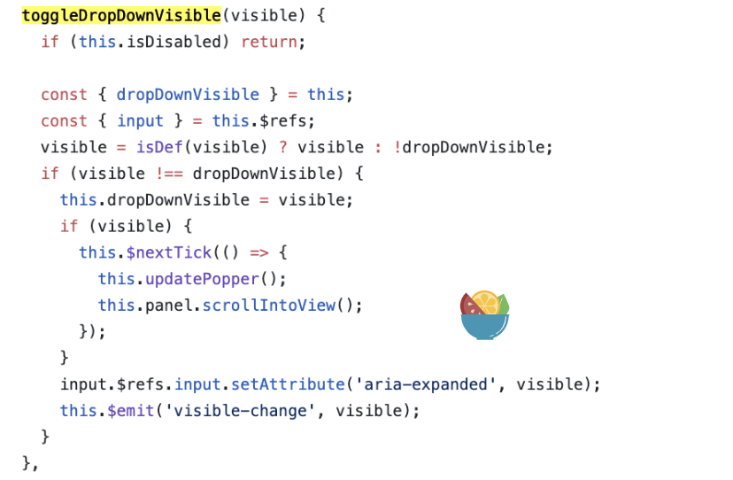
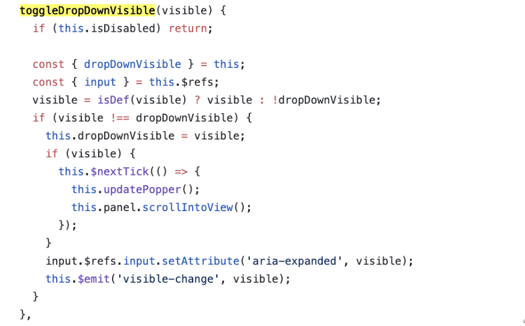
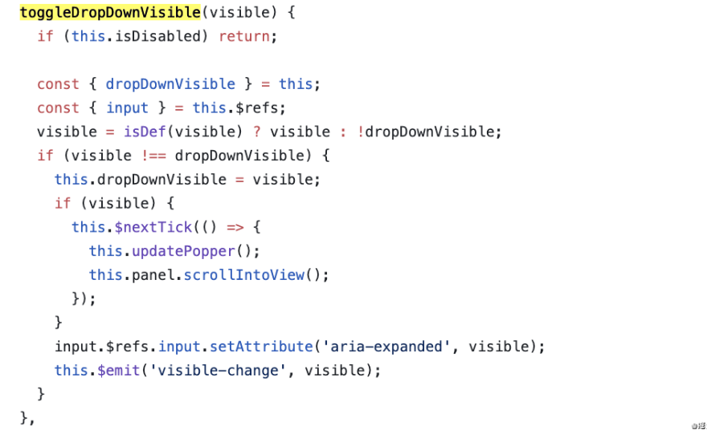

https://mp.weixin.qq.com/s/4T3pRKpWW4bEc59C7F6WGw

# 修改组件库源码封装符合自己需求的组件？ 
前端开发的同学们或许会遇到这样的问题：产品中需要实现某项功能，常用的 elementui、antd 等组件库中确实有差不多功能的组件。但实际上这些组件可能并不能满足你的功能，或多或少都需要你去看看如何修改它才能满足你的需求。 

比如我曾遇到过 element-ui 中的「树形控件」暴露出的参数没有我需要的（获取参数）；或者是「对话框」组件我需要给它的 body 加上上下两条 border 等（样式修改）；还有「级联选择器」的多选可搜索功能：需要修改级联看板使它保持展开，且当子节点全部选中时，不展示全部子节点 tag 而只展示它的父节点 tag（源码无此功能）。 

例如，我需要的功能是左二（因为我不想选项过多时 tag 占得位置太大），而原组件如左一。我截了两张图对比：  



关于组件库可能要修改的地方，我将它们分为以下五类可供参考： 
* 样式问题 
* 组件暴露的参数和方法不充分（源码中存在） 
* 可利用部分功能，其余功能要自己开发封装 
* 2+ 个组件之间的联动，多合一 
* 完全没有符合的组件 

下面详细说说这些问题，以及如何解决这些问题。如果有不满足或更好的建议，欢迎指出。 

1、组件样式问题 

当修改单个文件的样式时，以 less 为例，如果你想要修改组件的样式，可以使用 /deep/或 >>> 来深度选择到你要修改的样式（这能够帮你省去一大串的类名）。 
```css
.dialog-wrapper { 
    /deep/.el-dialog__body{ 
     border: solid 1px #999; 
    } 
} 
```

如果你要修改全局的样式，第一种方法，你可以在全局样式文件中写样式覆盖，引入到 main.js 中即可全局生效。如下： import "./assets/css/index.css"; 

第二，跟着组件库提供的『自定义主题』教程修改，一般组件库都会给出相关的教程。 

2、组件暴露的参数和方法不充分 

首先提出一个问题，你如何知道组件暴露的参数和方法不充分？其实答案很简单：因为我看了组件库的源码。 

当我们想要获取组件的一个参数，首先是看文档中提供了哪些 Attributes、Events、Methods。如果符合需求，直接拿来用就好。如果没有你要的属性和方法，请你先去看看源码中提供了哪些东西没有向外暴露出来的，但是我们能拿来用的。 

举个🌰，上述的「Cascader 级联选择器」，我想要在选中一个搜索的选项后不关闭看板。我在组件的 Events、Methods中没有找到相关的方法控制看板展开，如下： 


但当我去 github 上看该组件的源码时，我发现 toggleDropDownVisible() 方法是控制看板展开的。于是我在外部用 $refs 直接调用组件里的这个方法就好了。  


具体调用方法如下，这样即使方法没有暴露出来，也可以调用它内部的方法： 

```html
<!-- ref获取组件  -->
<el-cascader ref="cascader" placeholder="试试搜索：指南" :options="options" :props="{ multiple: true }" filterable></el-cascader 

    @visible-change="$refs.cascader.toggleDropDownVisible(true)"> 
<!-- 调用组件及其方法  -->
```
 

3、可利用部分功能，其余功能要自己开发封装 

第三类其实我们用到的已经比较少了，毕竟现在的组件库已经非常丰富了。但是这一步引起的思考确是很重要的，多看别人的源码有助于提高自己封装组件的水平。 

当要用到一个组件，但从头开发这个组件既复杂又耗时，而组件库中这个组件需要再往上加一些功能就能为你所用时，你可以考虑把组件库的代码拿到自己本地，修改它。 

第一步你需要将组件代码浏览一遍，了解它的逻辑。看看你需要加什么代码，如果在 vue中，使用 computed、watch，或是修改 created、mounted、methods 就能完成你的功能，那么就大胆地尝试。 

举个🌰 

在 element-ui 中，它提供的多选可搜索级联组件有一个问题：当用户选中全部子节点时不会合并为显示父节点。要想完成这个功能，在经历过上述步骤一番探索后发现还是要修改源码才能完成。于是我基于原本多选可搜索的级联选择器，进行以下优化： 

默认看到级联看板展开，不会收起 

@visible-change="blurCascader(true)" 
// 可触发展开 

 

```javascript
mounted() { 
    this.blurCascader(true) 
}  
// 失焦后触发展开级联看板（默认失焦后关闭看板） 
blurCascader() { 
    this.$nextTick(() => { 
        this.$refs.cascader.toggleDropDownVisible(true) // 调用组件内部未暴露的方法 
    }) 
}, 
```
* 搜索选中后展示级联看板，并勾选搜索选中的节点 
```javascript
// 响应选中的节点，选中节点后关闭选择看板，展示级联看板 

changecascader(e) { 

this.$refs.cascader.handleDropdownLeave() 

}, 
```
* 当子级节点全部选中后，tag只展示一个父级节点，而不是全部子节点 
```javascript
 // 获取所有勾选的节点 

    getPresetTags() { 

      const tree = this.panel.menus[0] 

      const result = [] 

      loop(tree) 

      // 递归查找选中的节点 

      function loop(tree = []) { 

        for (let i = 0; i < tree.length; i++) { 

          const child = tree[i] 

          if (child.checked) {                // checked 状态表示选中 

            result.push({ ...child, closable: true }) 

          } else if (child.indeterminate) {   // indeterminate 状态表示待定，是半选 

            child.children && loop(child.children) 

          } 

        } 

      } 

      this.presentFormatTags = result // 得到可显示的 tag 

    }, 
```
删除节点 

由于我修改了 tag 的展示，所以它的 deleteTag 事件也要重写。 
```javascript
deleteTag(index, tag) { 

      let _ = this 

      if (tag && tag.hasChildren) { 

       // 当删除的节点是父节点时 

        loop(tag.children) 

        function loop(list) { 

          for (let i = 0; i < list.length; i++) { 

            if (list[i].hasChildren) { 

              loop(list[i].children) 

            } else { 

              _.checkedValue = _.checkedValue.filter(n => n !== list[i].path) 

              _.$emit('remove-tag', tag) 

            } 

          } 

        } 

      } else if (tag) { 

      // 当删除的是子节点时 

        this.checkedValue = this.checkedValue.filter((n, i) => n !== tag.path) 

        this.$emit('remove-tag', tag) 

      } else { 

      // 当以回车键删除时 

        const temp = this.presentFormatTags[this.presentFormatTags.length - 1] 

        temp && this.deleteTag(null, temp) 

      } 

      // 原本这个方法的代码如下 

      // const { checkedValue } = this 

      // const val = checkedValue[index] 

      // this.checkedValue = checkedValue.filter((n, i) => i !== index) 

      // this.$emit('remove-tag', val) 

    } 

 ```

其实修改组件库代码的过程并不难，主要是看懂它的逻辑，以及其中哪些东西是你可以用的。 

上述组件的源码可以在 GitHub 查看。 

4、2+ 个组件之间的联动，多合一 

到这一步，其实你已经翻越最难的大山了！而这里要说的多个组件之间的联动其实已经处于优化用户体验的道路上了。思考一下，什么时候会用到多个组件之间的联动呢？ 

其实场景有很多，例如将「Form 表单」、「Table 表格」和「Pagination 分页」结合起来，封装成一个组件，这样在多表格的项目中直接使用就好了； 

将 table 和 pagination 放到一个组件中： 
```html
<template lang="pug"> 

div 

  .el-table 

    template(v-for="(item, index) in columns") 

      el-table-column( 

        :prop="item.prop" 

        :key="index" 

        :label="item.label") 

 

  el-pagination.pg-wrapper( 

    layout="total, sizes, prev, pager, next, jumper" 

    @size-change="handleSizeChange" 

    @current-change="handleCurrentChange" 

    :current-page="currentPage" 

    :page-sizes="[10, 20, 50, 100]" 

    :page-size="pagesize" 

    :total="total") 

</template> 

 ```

需要传入的参数如下：列信息 columns、单页数据量 pagesize、当前页码 currentPage、表格数据 tableData、数据总数 total、表单查询的参数 query 等。 
```javascript
props: { 

  // 列信息 

  columns: { 

    type: Array, 

    default: [], 

  } 

  // 单页数据量 

  pagesize: { 

    type: Number, 

    default: 10, 

  }, 

  // 当前页码 

  currentPage: { 

    type: Number, 

    default: 1, 

  }, 

  // 表格数据 

  tableData: { 

    type: Array, 

    default: [], 

  }, 

  // 数据总数 

  total: { 

    type: Number, 

    default: 1000, 

  }, 

  // 获取数据的接口 

  fetch:{ 

     type: function, 

     default:() => {} 

  }, 

  // 表单查询的参数 

  query:{ 

    type: Object, 

    default: () => {} 

  } 

}, 

methods: { 

  // 改变当前页码 currentPage 时触发 

  handleCurrentChange: function (currentPage) { 

    this.$emit('handleChange', this.pagesize, currentPage) 

    this.fetch(this.query) 

  }, 

  // 改变当前页 pageSize 时触发 

  handleSizeChange: function (pageSize) { 

    this.$emit('handleChange', pageSize, this.currentPage) 

    this.fetch(this.query) 

  } 

} 
```
 

使用时我们只需要传以上的参数就可以直接调用这两个组件了。 

还有「表格中行选中状态数据」，与「展示数据」之间的联动等等，可发挥之处有很多。将他们封装后可以大大减轻重复的工作量，特别是像后台管理类的项目，页面间相似度很高的，尤其适合这种方法。 

5、完全没有符合的组件 

如果你要的组件，外部的组件库中都没有提供，那就自己动手封装一个。尽可能将你的组件变得通用，兼容。尝试想一想你的组件是否在其他情况下也能用。另外也可以多看看别人是如何封装组件的，这有助于你自己开发。 

如果你可以将你在前端开发道路上自己封装的组件一个个收集起来，大概率可以方便你以后相同场景下直接复用，也有助于你的代码解耦。 

总结 

如果你遇到了组件库中的组件不合适的，先考虑看看是否能利用它的方法或属性达到效果，再看看能否修改它的代码达成目的。如果最后实在不行，那么就自己动手造轮子吧！自己造的轮子记得记下来，没准以后就能用上！ 

最后，Vue Demo Collection 这个项目，是我在开发过程中遇到的通用 Vue 组件的 demo 收集，包含了 Vue/CSS/Echarts 等一些可以复用的组件 ❤️，基本上我认为可以复用的组件和代码片段我都会记录在这，方便自己的回顾和使用，也算是个人成长的记录。 