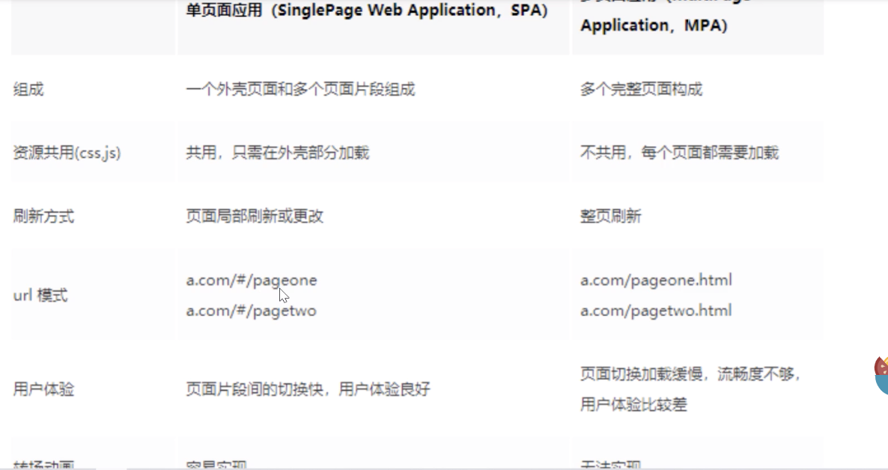
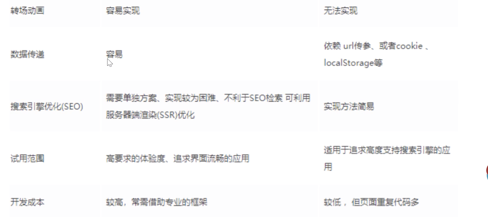
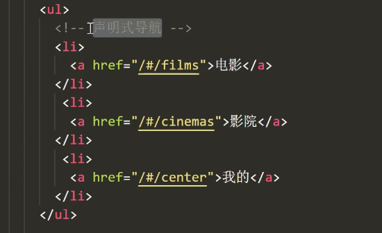
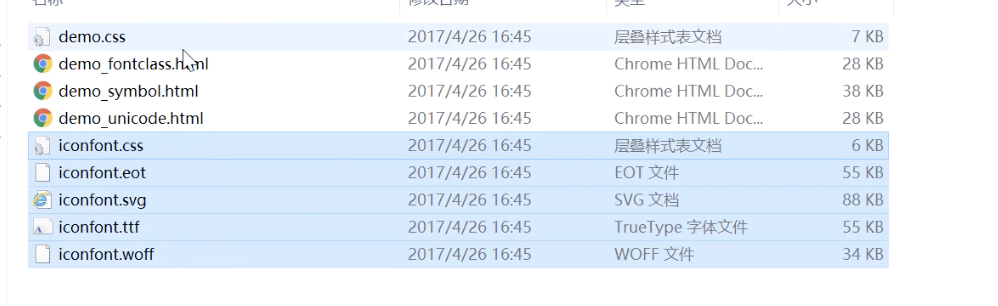
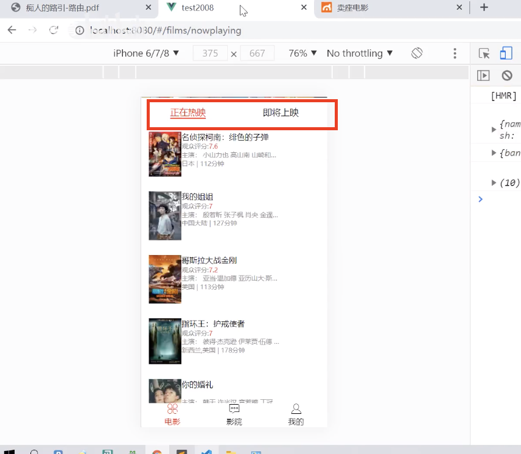
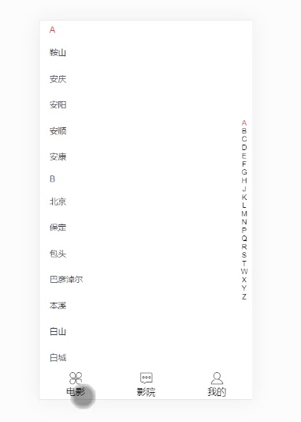
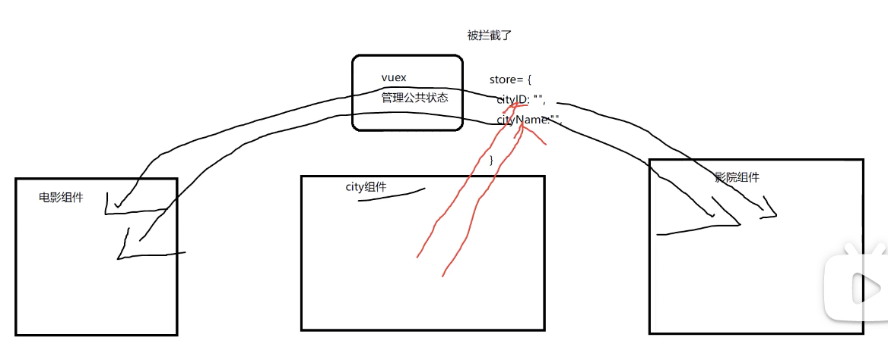
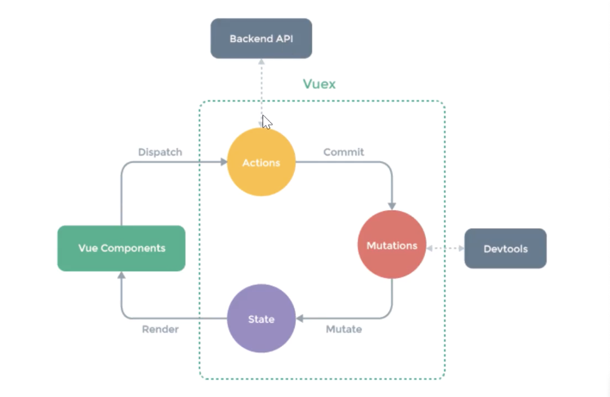

全家桶 vue vuex vue-router
# Vue CLI3使用

test.vue

```html
<template>
</template>
<script>
    module.export={
        data:function(){
            return{
                
            }
        }
    }
</script>
<style scoped>
</style>
```
npm install -g @vue/cli (一次安装) vue --version 查看版本
vue create myapp
* npm run serve 开发环境构建
* npm run build 生产环境构建
* npm run lint 代码检测工具

```javascript
new Vue({
    render:h=>h(App)
}).$mount('#app')
```

完整语法高亮
CommonJS 模块
组件作用域的 CSS

## eslint(风格统一)
（双引号）--单引号
（多个空行）--一个
（=空格）
定义未使用
最后一个有空行

调整eslint方案：
1. vscode 自动修复***与eslint/vscode版本息息相关（会偶尔不好用）***
    安装eslint插件并启用
    【文件】=》【首选项】=》【设置】=》用户，找到setting.json,加上一下配置

```json
"editor.codeActionsOnSave":{
    "source.fixAll":true
}
```
2. 关闭eslint(最后打开，一次性修复) 
    vue.config.js【vue 项目配置文件覆盖】--lintOnSave:false  
```javascript
module.exports={
    lintOnSave:false 
    //暂时关闭代码格式检测
}
```
    老版本还需加：   
    .eslintrc 删除'@vue/standard' (对于某个规则关闭，no-new:"off")

## 单文件组件（高亮显示：vetur）
建议：组件大写，文件夹小写
```html
<!-- App.vue -->
<template>
<div>
    parent
    <NavBar></NavBar>
</div>
</template>
<script>
import navbar from './NavBar.vue' 

// 1.!!!需要注册【全局】
import Vue from 'vue'
Vue.comontent('navbar',navbar)

//自动定义指令使用
Vue.directive('hello',{
    inserted(el,bingding){
        el.style.border="1px solid black"
    }
})
//过滤器
Vue.filter('img',(path)=>{
    return path
})
//可认为模版会自动导出，js不会（需导出，我们也可导入东西）
// es6导出规范
export default {
    data(){
        return{
        }
    },
    //2. 局部注册
    components:{
      navbar  
    }
    methods:{
    }
}
</script>
<!-- lang 语言-->
<style lang="scss">

</style>
```
----------------------------------------
```html
<!-- NavBar.vue -->
<template>
<div>
    child
</div>
</template>
<script>
export default {
    props:[]
    data(){
        return{}
    },
    methods:{}
}
</script>
<!-- lang=语言 -->
<!-- scoped:加scoped 样式节点会有个唯一的属性，样式会做属性选择器的对应 -->
<style lang="scss" scoped>
</style>
```
样式会被覆盖（先插入子组件样式节点）

组件通信(同非单文件组件)

...public/test.json (public不用敲--因为时默认的静态目录)
loaclhost:8080/test.json

## 反向代理&别名

跨域问题:
    后端部署到（服务器/局域网），能访问到  
    1. jsonp (不能发post,只能get)
    2. 反向代理
        删掉域名：端口号=>朝自己发请求=》配置自己的本地服务器=》让服务器给服务器发请求

       
```javascript
vue.config.js
module.exports={
    lintOnSave:false,

    //别名配置
    configureWebpack:{
        // epub无configureWebpack:{}
        resolve:{
            alias:{
                "@":'src'
            }   
        }
    }

    // 配置反向代理
    devServer:{
        port:8080,
        proxy:{
            '/ajax':{
                target:"https://m.maoyan.com",
                changeOrigin:true
            },
            '/ajax':{
                target:"https://m.maizuo.com",
                changeOrigin:true
            }

            //当都有ajax,代理到不同地方:pathRewrite
            '/test1/ajax':{
                target:"https://m.maoyan.com",
                changeOrigin:true,
                // 路径重写
                pathRewrite:{
                    '^/test1/ajax':'/ajax'
                }
            },
            '/test2/ajax':{
                target:"https://m.maizuo.com",
                changeOrigin:true,
                pathRewrite:{
                    '^/test2/ajax':'ajax'
                }
            }
        }
    }
} 
//@ 【是webpack配置别名】===》指向src的绝对路径
```
# 路由 
切换-无浏览器重载（单页面应用SPA）



公司官网需：seo  
电商、求职网站：一般不seo

***路由原理***：监听路由改变（dom），改变组件(更新视图但不重新请求页)  
1. hash路由==>location.hash或者路由
    **window.onhashchange**监听路径切换 
2. history路由==> history.pushState切换 
    **window.onpopstate**监听路径切换  

## vue-router
安装：
    npm install --save vue-router

路径与组件映射关系 的映射表（路由框架）

## 一级路由

```javascript
//main.js
import router from './router'
new Vue({
    //路由配置
    router,// ==>this.$router===router
    render:h=>h(App)
}).$mount('#app')
```
---------------
```javascript
//router/index.js

import Vue from 'vue'
import VueRouter from 'vue-router'

import Films from './Films.vue'
import Cinemas from './Cinemas.vue'

Vue.use(VueRouter) 
//注册路由插件【两个全局组件router-view、router-link】
const router =new VueRouter({
    mode:'history',
    //默认 hash   
    //history:如果浏览器不支持 history 新特性，则采用 hash
    //如果不在浏览器环境下，就采用 abstract（Node环境下）
    base:process.env.BASE_URL,
    routes
})

// 配置表
const routes = [
    {
      path: '/films',
      component: Films, //路由组件不用注册
      // 嵌套路由  
      children:[{
          path:'/films/nowplaying',
          component: NowPlaying
      },{
          path:'/films',
          //url输入films就会到==》/films/nowplaying
          redirect:'/films/nowplaying'
      }]
    },
    // 会整个替换
    {
         path: '/films/search',
        component: Search
    },
    {
        path: '/center',
        component: Center
    },
    {
      path: '/cinemas',
      component: Cinemas
    },
    {
      path: '*',
      //通配符（都不匹配，就自动匹配到films,与放前面与后面无关）
      //path: '/',
      //重定向 
      name:'testfilm',//重定向也可以是命名路由
      redirect: '/films'
    }
]
```
---------------
```html
<!-- App.vue -->
<template>
<div>
    <!-- 路由容器 -->
    <router-view></router-view>
    <router-view></router-view>
    <!-- 插槽的二次封装 -->
</div>
</template>
<script>
</script>
```
原理同：location.href=''

***路由切换高亮***监听路径改变
## 声明式导航

`<router-link to="/cinemas">`   

tag="div" vue3之前可以用 vue4不能用,但可以嵌套标签
```html
<!-- isActive标记是否激活中，action-class也不需要了 -->
<!--  navigate：触发导航的函数 -->
 <router-link custom v-slot="{navigate,isActive}" to="/films">
    <li @click="navigate">电影</li>
 </router-link>
```

```html
<!-- App.vue -->
<template>
<div>
    <router-link action-class="testautum" to="/films">电影</router-link>
    <!-- testautum会替换router-link-active -->
    <router-link to="/cinemas">影院</router-link>
    <!-- 路由容器 -->
    <router-view></router-view>
</div>
</template>
<script>
</script>
<style>
/* 可替换 */
.router-link-active{
    color:red
}
</style>
```

## 嵌套路由
```html
<!-- Films.vue -->
<template>
<div>
    <div>我是轮播</div>

    <div>
        <!-- 替换当前组件：看起来父子，实际兄弟 -->
        <router-link action-class="testautum" to="/films/search">到搜索界面(见面全部刷新)</router-link>
        <!-- 二级的声明式导航 -->
      
        <router-link action-class="testautum" to="/films/nowplaying">热映</router-link>
        <router-link to="/cinemas/soon">即将上线</router-link> 
    </div>

    <!-- 路由容器 -->
    <router-view></router-view>
</div>
</template>
<script>
</script>
<style>
/* 可替换 */
.router-link-active{
    color:red
}
</style>
```

<router-view> 是用来渲染通过路由映射过来的组件，当路径更改时，<router-view> 中的内容也会发生更改
children
children 配置就是像 routes 配置一样的路由配置数组，所以呢，你可以嵌套多层路由

## 编程式导航:location.href=''&&动态路由
<!-- films/id -->
配置路由：
```json
{
    // 动态二级路由
    path:'/detail/:id',
    component:Detail
}
```
<!-- 点击电影列表：跳转到详细信息 -->
1. 声明式导航
2. 编程式导航
```javascript
@click="change"

//** 通过路径跳转
change(){
    //1. location.href=''
    // 2.会自动判断加不加#
    this.$router.push('/detail')
    this.$router.push('/detail/1111[/suiyi]')
    // this.$route.params.id ==>拿到值
}
```

```html
<!-- Detail.vue -->
<template>
<div>
    <div>详情</div>
</div>
</template>
<script>
    export default{
        created(){
            //this.$router整个路由对象
            // 当前匹配的路由
            console.log(this.$route)
        }
    }
</script>
<style>
/* 可替换 */
.router-link-active{
    color:red
}
</style>
```


## 命名路由
***通过命名路由跳转***
配置路由：
```json
{
    path:'/detail/:id',
    name:'liqiu',//命名路由
    component:Detail，
    alias:'/d' //别名：通过d也能找到
}
```
```javascript
@click="change"
change(){
    this.$router.push({
        name:'liqiu',
        params:{
            id:1111
        }
    })
    // this.$route.params.id ==>拿到值
}
```
this.$router.back() //返回上一级
## 路由模式
    
* history（好看但会分不清是不是后端请求/微信分享有时#会删掉【替换】）
    因为是单页客户端应用，如果后台没有配置，当用户直接在浏览器访问http://tst.com/detail/33445 就会返回404。所以需要我们在服务端增加一个覆盖所有情况的候选资源。url匹配不到静态资源，则返回同一个index.html页面，让前端路由接管【本地开发时已自动做了处理】。
        
* hash  二者区别在于url中是否又#,一般用history,无#
## 路由拦截

登陆访问功能
```javascript
login(){
    localStorage.setItem('token','')

    let to= this.$route.query.where
    this.$router.push(to)
    // this.$router.push("/center")

}
```

***全局路由拦截***
```javascript
{
    path: '/center',
    component: Center,
    meta:{
        // 内容随意写
        isliqiu:true
    }
}
```
```javascript
//router.js文件
// 进来[路由]之前
router.beforeEach((to,from,next)=>{
   
    // 需要授权的路由
    // if( to.fullPath==='/center'){
    if( to.meta.isliqiu){
        //判断本地存储是否有token
        // 授权通过
        if(localStorage.getItem('token')){
            next()
        }else{
            next('/login')
            next({
                path:'/login',
                query:{
                    // 随意(登陆时可以带上从哪被强制带到login来的)
                    where:to.fullPath
                }
                // ==>/ligin?where=XXX
            })
        }
    }else{
        next()
    }
})
afterEach//进来之后
```

***局部路由拦截***

1. 路由独享拦截beforeEnter
```json
{
    path: '/center',
    component: Center,
    meta:{
        // 内容随意写
        isliqiu:true
    },
    beforeEnter:(to,from,next)=>{

    }
}
```
2. 组件内部
```javascript
<script>
    export default{
        // 路由生命周期
        beforeRouteEnter(to,from,next){
            //this.$router整个路由对象
            // 当前匹配的路由
            console.log(this.$route)
        }
    }
</script>
```
vue-router 导航解析流程
1.导航被触发；
2.在失活的组件里调用beforeRouteLeave守卫；
3.调用全局beforeEach守卫；
4.在复用组件里调用beforeRouteUpdate守卫；
5.调用路由配置里的beforeEnter守卫；
6.解析异步路由组件；
7.在被激活的组件里调用beforeRouteEnter守卫；
8.调用全局beforeResolve守卫；
9.导航被确认；
10..调用全局的afterEach钩子；
11.DOM更新；
12.用创建好的实例调用beforeRouteEnter守卫中传给next的回调函数。

vue-router的几种实例方法以及参数传递
name传递
to来传递
采用url传参
## 路由懒加载

app.8hjjkjj.js 自己的文件
XX.map 文件是源码映射文件【上线不会带上,要删掉】
chunk.vendors.fsfj.js vendors是vue源码【压缩第三方库放的地方】

===》问题：所有页面一起下载了【首屏加载过慢(存在于单页面)】
多页面：只根据当前页面开发的，不存在这个问题

基于底层webpack分割功能
解决：组件直接导入改成函数式
const foo=()=>import('./Foo.vue')

路由：
```javascript
    {
      path: '/cinemas',
      component: ()=>import('./Cinema.vue')
    }
```
## rem：网易、vw方案
确定项目主流布局方案（rem【等比例缩放布局】推荐/百分比【不好衡量】）
只有一张设计稿

缩放比例原理
预览375  真机750
window.devicePixelTaito=2.000000596046448

含义：1px像素=2px物理像素（分辨率）

规则：不看缩放比例，看document.documentElement.clientWidth

量设计稿750px
```css
/* 根节点放font-size基准值 */

.html的head中
```javascript
<head>
...
<script>

/* fontSize计算，原理：更大的设备，占的会更多，值不能固定 */
/* document.documentElement.style.fontSize='100px' */
document.documentElement.style.fontSize=document.documentElement.clientWidth/750*100
/* 计算：设备宽度/设计稿宽*基准值 */
</script>
</head>
/* body设回来,怕影响页面 */
body{
    font-size:16px
}
.box{
    /* width:750/2px[不好] */
    width:7.5rem
}
```
vscode
px==>rem 插件：px to rem
适配：rem,弹性盒，百分比


***eslint***
no-new 不合理
==》改eslint规则

.eslintrc.js
```javascript
 rules:{
    'no-new': 'off'
 }
```

## swiper
6版本：分页需按需引入
css需导入

```html
<style>
    *{
        margin:0;
        padding:0
    }
    html,body{
        height:100%
    }
    ul{
        list-style:none
    }
</style>
```

阿里iconfont下载
核心文件


放public下（只有public文件夹是对外暴漏的）

<!-- 模版 -->
<link rel="icon" href="<%= BASE_URL %>iconfont.ico">

<!-- index.html当静态资源引入 -->
<link rel="stylesheet" href="/iconfont/iconfont.css">


assets文件夹下
引入：import './'
会style内部样式导入

## 滚动时顶部吸附功能
1. 导航滚动到顶部，fix在顶部,其他仍可以滚动

position：6个值【sticky粘性的、fixed、relative、absolute、static静态的、inherit继承】

解决：一个属性搞定

```html
<tempalte>
    <div>
        <film-header class="sticky">
        </film-header>
    </div>
</template>
<script>
export default{

}
</script>
<style lang="scss" scoped>
.sticky{
    position:sticky,
    top:0px;
    backgroung:red
}
</style>
```

2.详情页面吸附到顶部的功能

解决：指令解决

```html
<!-- 拼随机数k最大的目的是：防止缓存 -->
<script src='/app.js?k=98978'></script>
```

```html
<tempalte>
    <div>
        <film-header class="sticky">
        </film-header>
    </div>
</template>
<script>
// 指令封装（传参数）
Vue.directive('scroll',{
    inserted(el,binding){
        el.style.display='none'
        window.onscroll=()=>{
            //  兼容性 ||document.body.scrollTop
           if(document.documentElement.scrollTop>50){
               显示顶部
           }else{
               隐藏顶部
           }
       } 
    }
    unbind(){
        window.onscroll=null
    }
})
export default{

    mounted(){
       window.onscroll=()=>{
           if(document.documentElement.scrollTop>50){
               显示顶部
           }else{
               隐藏顶部
           }
            // 注意：destory时清空事件window.onscroll=null
       } 
        //=>但推荐指令
        
    }
}
</script>
<style lang="scss" scoped>
.sticky{
    position:sticky,
    top:0px;
    backgroung:red
}
</style>
```
详细信息展开--收缩
加高度-->添加超出隐藏属性与高度-->删除超出属性隐藏与高度
overflow:hidden   
静态class 与动态class同时存在=》会合并


***vue支持class透传***

***axios封装***（1.axios本身的封装 2.每个页面的数据请求进行封装）

封装形式：
util :写工具的（算法）
新建单独文件 util/http.js
方法一、单独封装为一个函数   
分散的请求，集中在一个文件中

```javascript
import axios from 'axios'
function httpForList(){
    return axios({
      url:"",
      headers:{

      }  
    })
}
function httpForDetail(param){
    return axios({
      url:"",
      headers:{

      }  
    })
}
export default {httpForList,httpForDetail} 
httpForList().then((res)=>{})
```
方法二、 axios自带方案

```javascript
import axios from 'axios'

// 初步封装
export const instance=axios.create({
    baseURL:'http://m.maizuo.com',
    timeout:1000,
    headers:{

    }
})
// 拦截器（发请求之前拦截showloading/在成功后拦截hideloading）

// 传不一样的部分
function httpForList(){
    instance({
      url:"/getway?cityid=8u9&",
      headers:{
          "x-host"
      }  
    }).then(()=>{}).catch(()=>{})
}

```

data的test为对象，赋值null时会报错   
解决：v-if="test" 

***日期格式化函数***：moment   
moment().locale("zh-cn") 转为中文   
moment().format()

***swiper初始化过早/多次初始化==》swiper都会有问题***
一个页面用两次swiper存在bug:会相互影响（应该上面小，下面大）
解决：
new Swiper(id设为变量,{})


***超长列表滚动行为的性能优化***
betterScroll:实现页面中拖拉滚动、拉动属性等功能
https://ustbhuangyi.github.io/better-scroll/doc/zh-hans
用处：不让浏览器撑开滚动条（不可控，没有办法优化）

轮播：swiper、auto、组件库自带
```html
<tempalte>
    <div>
        <div class="box">
            <!-- 由li撑开 -->
            <ul>
                <li></li>
                <li></li>
                <li></li>
                <li></li>
                <li></li>
            </ul>
        </div>
    </div>
</template>
<script>
import BetterScroll from 'better-scroll'
// css3合理使用显卡
export default{
    data(){
        return {
            height:0
        }
    }
    mounted(){
        // 动态计算高度
        // 通过ref拿到 this.$refs.mytabbar.$el.offsetHeight
        // document.querySelector('.footer').offsetHeight
        this.height=document.documentElement.clientHeight-选项卡高度
        setTimeout(()=>{
            this.list=[类列表]
        },200)

        // 不能获取 li[因：初始化过早]
        // new BetterScroll('.box')

        this.$nextTick(()=>{
            new BetterScroll('.box',{
                // 滚动条
                scrollbar:{
                    fade:true
                }
            })
        })
    }
}

</script>
<style lang="scss" scoped>
.box{
    height:300;
    overflow:hidden;
    position:relative
    /* 滚动条错位解决【加定位】：BetterScroll历史遗留问题 */
}
</style>
```
rem高度存在问题：  
动态计算高度

# 组件库 

组件库：elementui(pc端后台系统)、mini ui(移动端好久没维护)、vant(移动端：有赞)

* ***elementui***

```javascript
import elementui from 'element-ui'  
import Vue from 'vue'

Vue.use(elementui)
```

* ***vant（3.X、2.X、微信小程序版本都支持）***
```javascript
import vant from 'element-ui'  
import Vue from 'vue'

Vue.use(vant) //全局注册了vant的组件
```

***图片预览功能***
vant组件库：  ImagePreview

***列表懒加载***
vant组件库：list
传page=1 pag2=2 ....实现   
⚠️ 请求频繁：onload
请求前加判断   
```javascript
if(请求的数据累加的总和===数据总数【后端给】){   
    不发请求
    return   
}
```

bug: 出现滚动条页面，切换回能滚动列表。滚动条一下到底部（onload触发）
懒加载副作用
```javascript
if(请求的数据累加的总和===数据总数【后端给】&&数据总数!=0){   
    不发请求
    return   
}
```
### 很多页面都需要loading
axios拦截器
```javascript
import axios from 'axios'

// 初步封装
export const instance=axios.create({
    baseURL:'http://m.maizuo.com',
    timeout:1000,
    headers:{

    }
})
// 拦截器（发请求之前拦截showloading/在成功后拦截hideloading）
// 发请求之前拦截，对instance
instance.interceptors.request.use(function(config){

    return {config,test:9999}
},function(error){
    return Promise.reject(error)
})

// 响应之前拦截，对instance
instance.interceptors.response.use(function(response){
    
    return response
},function(error){
    return Promise.reject(error)
})

// ===》
// 传不一样的部分
function httpForList(){
    instance({
      url:"/getway?cityid=8u9&",
      headers:{
          "x-host"
      }  
    }).then(()=>{}).catch(()=>{})
}

```

城市列表索引
***26个字母**
```javascript
for(let i=65;i<91;i++){
    letterList.push(String.fromCharCode(i))
}
```
name.substring(0,1).toUpperCase() 截取首字母

⚠️：   
某些组件临时创建，不属于某个组件 更改样式 加scoped 不起作用   
解决：只能全局

传统的多页面传值方案：
1. location.href="#/cinemas?cityname="+"name"
2. cookie  localStorage

单页面方案(也可使用多页面方案)：
1. 中间人模式
2. bus事件总线 $on , $emit
3. vuex 


# Vuex - 状态管理模式(多处使用)




npm i --save vuex 
## Vuex同步工作流

store/index.js
```javascript
import Vue from 'vue'
import Vuex from 'vuex'

Vue.use(Vuex)

export default new Vuex.Store({
    // state公共状态
    state:{
        cityId:'310100',
        cityName:'上海',
        Cinemalist:[]
    }
    // 访问--使用【但不能直接修改---错误不好追溯】
    //this.$store.state.cityName

    // 所以通过mutations修改--devtools调试追溯
    // 统一管理（只支持同步，不支持异步，所以不能在此调用接口）
    mutations:{
        changeCityName(state,cityname){
            state.cityName=cityname
        }
        changeCinemaData(){

        }
        clearCimena(state){
            state.Cinemalist=[]
        }
    }

    // 支持异步和同步
    actions:{
        getCinemaData(store,也可以传参数){
            // store.state.cityId
            // 异步获取数据
            store.commit('changeCinemaData',res.data.data.cinamas)
        }
    }
    // 分发（组件中）
    // this.$store.dispath('getCinemaData')
    // 组件中使用数据，$store.state.Cinemalist
    // 1. 列表滚动失效 2. 使用缓存了接口的数据

    // 解决2:
    // if(this.$store.state.Cinemalist.length==0){
    //     this.$store.dispath('getCinemaData').then(res=>{使用BetterScroll})
    // }else{
    //  new BetterScroll('',{

    // })
    // }
    getters:{
        // 从store中的state中派生出一些状态，getters的返回值会根据它的依赖被缓存起来，只有以来发生改变才会被重新计算（store的计算属性） this.$store.getters.属性名
        // mapGetters([''])
    }
})

// vuex同步
this.$store.commit('changeCityName','北京')


```

main.js
```javascript
import store from './store'
new Vue({
    router, //this.$router访问
    store, //this.$store访问
    render:h=>h(app)
}).$mounted('#app')
```

vue devtools 不能翻墙：在github下载源码--重新编译一版--编译完成再安装---安装：chrome包放到浏览器扩展程序

## Vuex异步引入/应用

应用：   
1. 非父子的通信
2. （两个页面数据一样）后端数据的缓存快照，减少重复数据请求，减轻服务器压力，提高用户体验

工作流



总结注意事项：
1. 应用层级的状态应该集中到单个store对象中【项目中只能用一个store】    
2. 提交mitation是更改状态的唯一方法，并且这个过程是同步的   
3. 异步逻辑都应该封装到action里面
# vuex新写法
```javascript
import {mapState,mapActions,mapMutations} from 'vuex'

this.$store.state.Cinemalist
// 新写法==>mapState（[""]）--函数调用，返回的对象
computed:{
    ...mapState(["Cinemalist"])
}
// this.Cinemalist


methods:{
    // ==>mutations新写法
    ...mapMutations['changeCityName']
    // this.changeCityName()


    // this.$store.dispath('getCinemaData')
    // ==>actions新写法
    ...mapActions(['getCinemaData'])

    // this.$store.commit('changeCityName','北京')
}

this.getCinemaData()
```

公共栏显示/隐藏（mixin混入）

```html
<tempalte>
    <div>
        <div class="box">
            <!-- 由li撑开 -->
            <ul>
                <li></li>
                <li></li>
                <li></li>
                <li></li>
                <li></li>
            </ul>
        </div>
    </div>
</template>
<script>
// 作用：深入混入公共东西（比...智能,methods的a不会覆盖组件的methods）
var obj={
    created(){
        //创建完成
        this.$store.commit('hide')
    }
    destroyed(){
        this.$store.commit('show')
    }
    methods:{
        a(){

        }
    }
}

export default{
    // 谁混入obj，就会执行
    mixin:[obj],
    data(){
        return {
            height:0
        }
    }
    mounted(){

    }
}

</script>
<style lang="scss" scoped>
.box{
    height:300;
    overflow:hidden;
    position:relative
    /* 滚动条错位解决【加定位】：BetterScroll历史遗留问题 */
}
</style>
```

## vuex持久化（因：vuex默认管理在内存，刷新页面---恢复默认值）

1. localStorage   
2. vuex persistedstate


npm i vuex-persistedstate

```javascript
import vuexPersistedState from 'vuex-persistedstate'
export default new Vuex.Store({
    // plugins:[vuexPersistedState()],//全部持久化
    plugins:[vuexPersistedState({
        storage:window.sessionStorage,//默认localStorage  
        reducer(state){
            return {
                cityId:state.cityIdd
            }
        }
    })],
    state:{

    }
})

```
