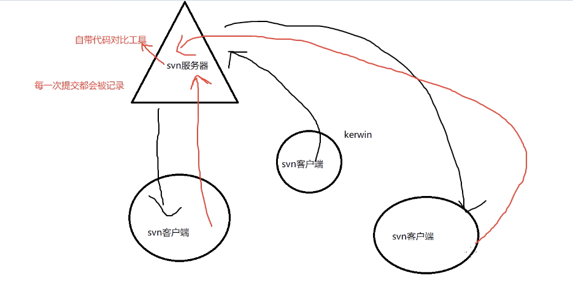
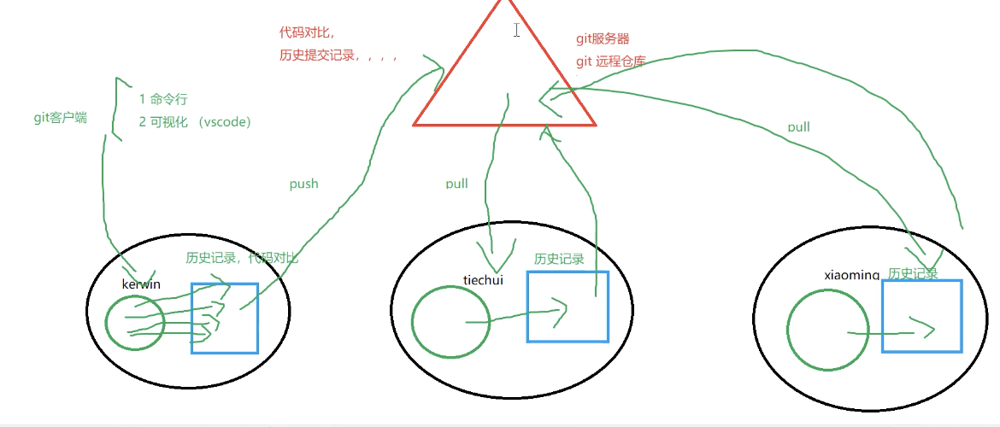
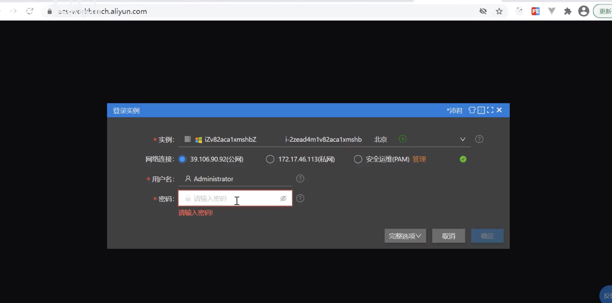
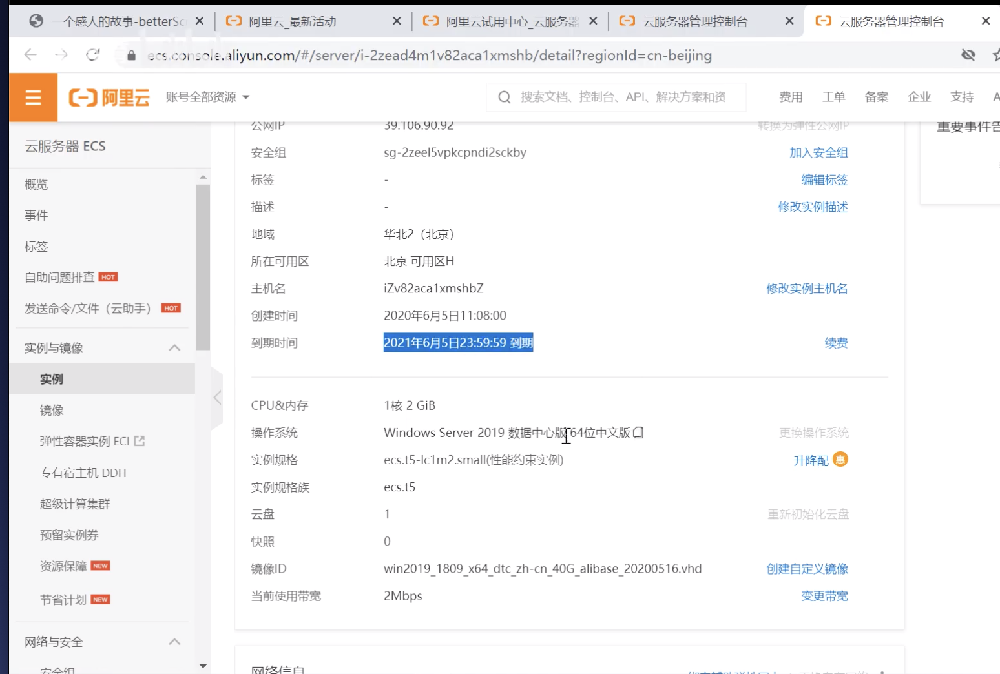
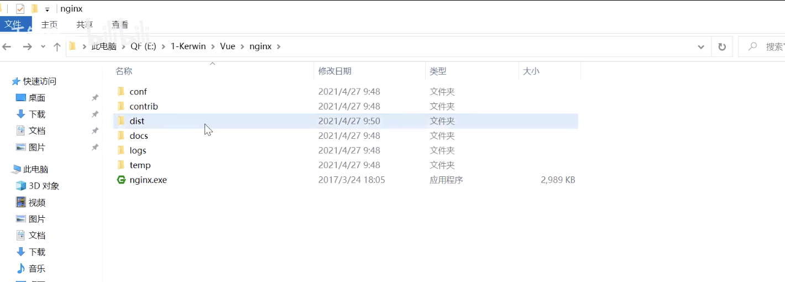

项目实战 

betterScroll 

300ms以及手势问题 

# Git 
软件：Git（与node相同 默认下一步下一步...）、github desktop

svn:集中式代码管理工具

缺点：不能离线工作（连不上内网）

git:分布式代码管理工具

优点：每个人都有本地仓库：先到本地仓库-->push远程仓库

git init 初始化本地仓库（所有代码在这个仓库里管理）  

git diff

git config --gobal user.name XX

git push -f【强制】

git add->暂存区-->git commit->本地仓库-->git push远程仓库  

gitee、gitlib:中国服务器的远程仓库(私有、公有、企业)

<!-- 密码输错 -->
搜索：wind 10 删除凭证

git代码冲突：拉取远程，先把本地代码放到本地库

任何人从从公司仓库中下载的vue、react项目不能直接运行


# 开发流程&云服务器

敏捷开发：以人为本、循序渐进迭代

第一次迭代结束--提测--展示给客户（需上线）

正常分为三个迭代

开发中：daily scrum（每天会） / 看板

每天会【小组内】：1.今天做什么，遇到什么问题，怎么解决的 2.明天做什么

上线：   
服务器   

1. 电子城买服务器（硬件机器：工作站）---服务器搭建环境、做（windows、linux）系统--申请固定ip电信网线---系统中启动服务器（nginx或者http服务器）---通过申请的固定ip访问到   
【行业：系统集成解决方案的人：做软硬件搭配、机房排版、备份等】
2. 云服务器工作站   
* 申请阿里云工作站（虚拟化的：虚拟主机）【有免费试用】
https://passport.aliyun.com

左上角->云服务器ecs（公网ip谁都能访问到）->远程链接（用户名不变）[登陆]—>通过网页打开云电脑界面



查看服务器配置


windows-远程桌面链接（链接）

# nginx上线使用
把nginx服务器放到远程主机

<!-- http apache服务器：代码可能有跨域问题，不能反向代理 -->
1. 远程电脑安装nginx服务器（高性能反向代理服务器）---将编译好的dist文件夹（粘贴到远程nginx服务器）  



正式启动项目前 找到文件 nginx/conf/liqiuli.conf

访问localhost的80端口，会把dist文件夹当成根目录
```nginx
server {
    <!-- 监听80端口 -->
    listen 80;
    server_name localhost;

    location / {
        root dist[文件名];
        index index.html index.htm;
    }

    <!-- 代理 -->
    location /ajax/ {
        proxy_pass https://m.maoyan.com
    }
}
```

启动：.\nginx.exec -c .\conf\liqiuli.conf
【nginx -c 加载conf文件夹下的liqiuli.conf】

关闭：.\nginx.exec -s stop
重启要先关闭

不重启的情况下刷新服务器
.\nginx.exec -s reload

本地不运行，当问localhost:8080能访问到

阿里云 安全组：添加80
==》申请域名 需要充钱【可直接搜教程】
而apache必须放www等

⚠️：此处跨域非开发模式下的跨域


本地开发：解决跨域（因：dev-server开着）