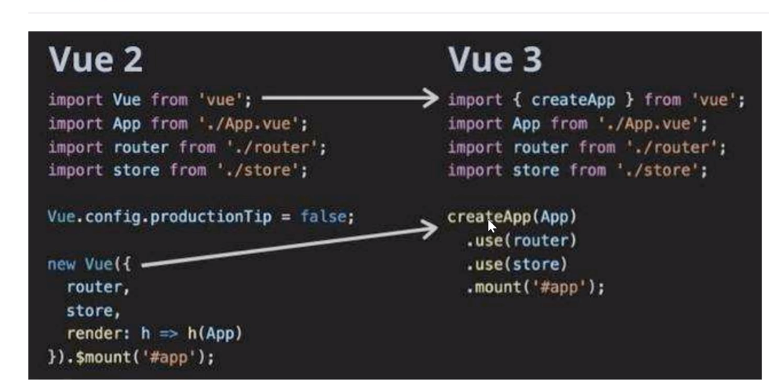
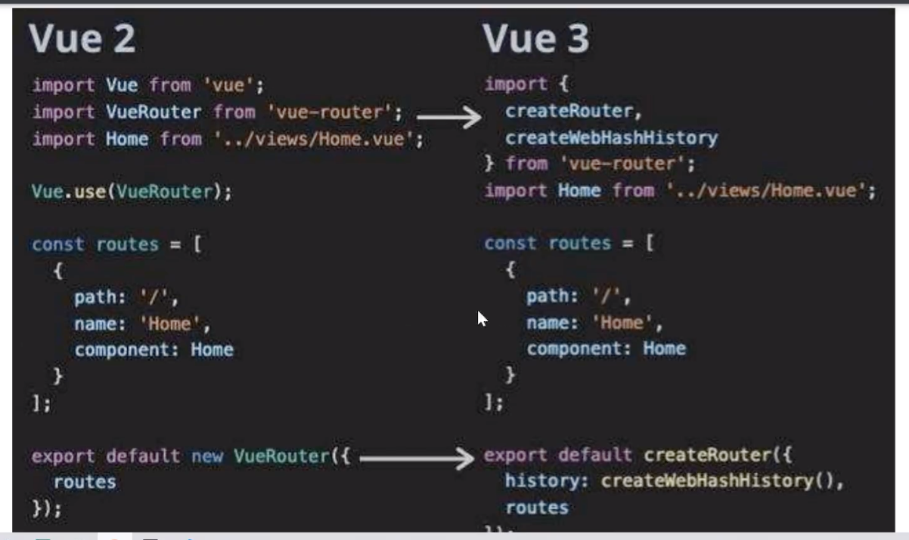
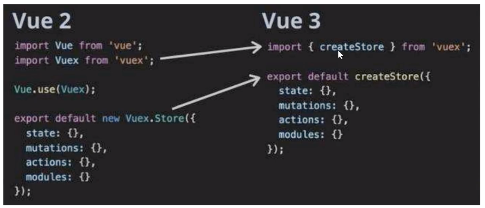

# Vue3升级战略 


route
history:createWebHistory()
history:createWebHashHistory()
createWebHistory()




vue2没必要升级为vue3
1. 动态属性的拦截
classobj:{   
        a:true,   
        c:false   
    }

:class="classobj"
vue2:class 临时给对象加属性，检测不到改变
解决方案：Vue.set(对象,属性,true)

vue3 支持动态增加属性的拦截

2. 条件渲染没有区别
3. 列表渲染   
    vm.datalist[0]='test'  
    vue2直接改索引值拦截不到,vue3可以

4. 计算属性&fetch&axios没有区别

5. 组件定义
```javascript
vue2:vue.conpontent('',{})
vue3: 
let app= Vue.createApp({})
app.conpontent('',{

})
```
6. 指令变了写法和生命周期
vue2:
```javascript
Vue.directive('',{
    inserted(){},
    updated(){},
    bind(){},
    unbind(){}
})
```
vue3:
```javascript

// 全局：
app.directive('',{
    mounted(){

    }
    // 生命周期比组件少了beforeCreate
})

// 局部指令
data(){
    return {

    }
}
directives:{
    hello:{}
}
```
6. 过滤器： vue3不支持（只能用函数写法）


项目改造

***重定向***
vue2路由：
```javascript
{
  path: '*',
  //通配符（都不匹配，就自动匹配到films,与放前面与后面无关）
  //path: '/',
  //重定向 
  name:'testfilm',//重定向也可以是命名路由
  redirect: '/films'
}
```
vue3:
```javascript
{
  // * 包含/ 和 /:any
  path: '/:kerwin',
  //redirect: '/films' //路径版本有警告：建议命名路由
  redirect: {
      name:'films'//命名路由
  }
}
```
vue-router
路由：

tag="div" vue-router3之前可以用 vue-router4不能用,但可以嵌套标签
```html
<router-link to="/cinemas">`  

<!-- isActive标记是否激活中，action-class也不需要了 -->
<!--  navigate：触发导航的函数 -->
 <router-link custom v-slot="{navigate,isActive}" to="/films">
    <li @click="navigate">电影</li>
 </router-link>
```
vue3生命周期：
beforeDestroy---->beforeUnmount
destroyed---->unmounted

-----------------------------------
重点：
# Composition API介绍
vue3-hooks-Composition API(无this)

## **vue3-ref&reactive**

reactive:

vue3的生命周期：
老写法（vue相似）/新写法（setup===beforeCreate,created【能共存，不能交互、互相访问---后续有方法打通】）


做到响应式--可替换reactive

```html
<template>
    <!-- vue在template下可以多个节点 -->
    <div></div>
    <div>
        hello
        {{obj.name}}
        <button @click="handleChange()">
            change
        </button>
        <input type="text" ref="mytestref"/>
    </div>
</template>
<script>
import {reactive,ref} from 'vue'
export default{
    setup(){
        // 定义状态（可以多个，但没有意义）
        const obj= reactive({
            name:'li'
        })
        // 字符串、数字不能使用这种方式「ref能拦截：其实是value属性」
        const objlist= reactive([])

        // ref功能与之前作用相同（还可当状态使用）
        const mytestref=ref()
        const handleChange=()=>{
            mytestref.value='ceshi'
            console.log(1111111,mytestref.value)
            obj.name='qiu'
        }
        return {
            mytestref
            obj,
            objlist,
            handleChange
        }
    }
}
</script>
```

## **vue3-toRefs**

reactive属性转为ref对象

```html
<template>
    <!-- vue在template下可以多个节点 -->
    <div></div>
    <div>
        hello
        {{name}}

    </div>
</template>
<script>
import {toRefs} from 'vue'
export default{
    setup(){
        // 定义状态（可以多个，但没有意义）
        const obj= reactive({
            name:'li'
        })
        return {
            ...toRefs(obj),
        }
    }
}
</script>
```

## **vue3-props&emit**

@event=change
```html
<template>
    <!-- vue在template下可以多个节点 -->
    <div></div>
    <div>
        hello
        {{name}}
        <button @click="handleChange()">
            change
        </button>
    </div>
</template>
<script>
import {toRefs} from 'vue'
export default{
    conpontents:{

    }
    // props:[],//老方法
    setup(props,{emit}){
        // 定义状态（可以多个，但没有意义）
        const obj= reactive({
            name:'li'
        })
        const handleChange=()=>{
           emit('event') 
        }
        return {
            ...toRefs(obj),
        }
    }
}
</script>
```


## **vue3-生命周期&计算属性&watch**

计算属性有缓存---性能优化
beforeCreate created===setup   

beforeMount====onBeforeMount   
mounted===onMounted   

beforeUpdate===onBeforeUpdate   
updated === onUpdated   

beforeDestroy===onBeforeUnmount   
destrot===onUnmounted   

```html
<template>
    <!-- vue在template下可以多个节点 -->
    <div></div>
    <div>
        hello
        {{name}}
        <button @click="handleChange()">
            change
        </button>

        <input type="text" v-model="mytext"/>
    </div>
</template>
<script>
import {toRefs,onMounted,onUnmounted,computed,watch} from 'vue'
export default{
    conpontents:{}

    setup(props,{emit}){
        const obj= reactive({
            name:'li',
            mytext
        })
        // 计算属性
        const computedlist=computed(()=>{
            return []
        })

        // 监听obj.mytext改变
        watch(()=>obj.mytext,()=>{

        })
        //ref的话，第一个参数可不用函数

        onMounted(()=>{
            axios，事件监听，定时器
        })
        onUnmounted(()=>{

        })
        return {
            ...toRefs(obj),
            computedlist
        }
    }
}
</script>
```

比类优点，函数可以随意抽出来/复用，类依赖this
## **vue3-自定义hooks**

```html
<template>
    <!-- vue在template下可以多个节点 -->
    <div></div>
    <div>
        hello
        {{name}}
        <button @click="handleChange()">
            change
        </button>

        <input type="text" v-model="mytext"/>
    </div>
</template>
<script>
import {toRefs,onMounted,onUnmounted,computed,watch} from 'vue'
import {getdata} from './'
// getdata包含reactive如下：
// const obj= reactive({
//     list:[]
// })
// axios.get().then(res=>{
//     obj.list=res.data
// })
// return obj

export default{
    conpontents:{}

    setup(props,{emit}){
        
        const obj1= getdata()
       
        return {
            obj1
        }
    }
}
</script>
```

vue3路由使用（store）
this.$router.push()

==> hooks
```javascript
import {useRouter} from 'vue-reouter'
const router=useRouter()
router.push()

import {useRoute} from 'vue-reouter'
const route=useRoute()
route.param.XX


vuex

this.$store.commit('')
this.$store.dispatch('')
this.$store.state

import {useStore} from 'vuex'
const store=useStore()
store.commit('')
```

# vuex替代方案
provide,inject :依赖注入【通点，不好定位问题】
import {provide,inject} from 'vue'


const isshow=ref(true)
provide('liqiushow',isshow)


子辈组件都可以使用（兄弟不可以）
const isshow= inject('liqiushow')
isshow.value=false

vue3无中央事件总线