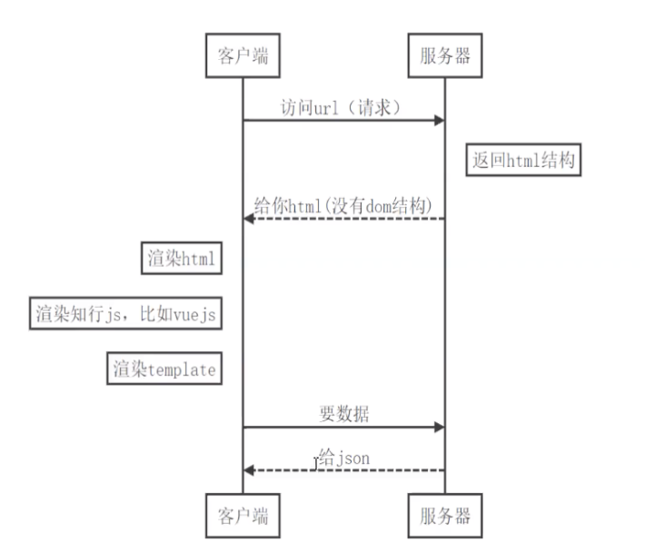
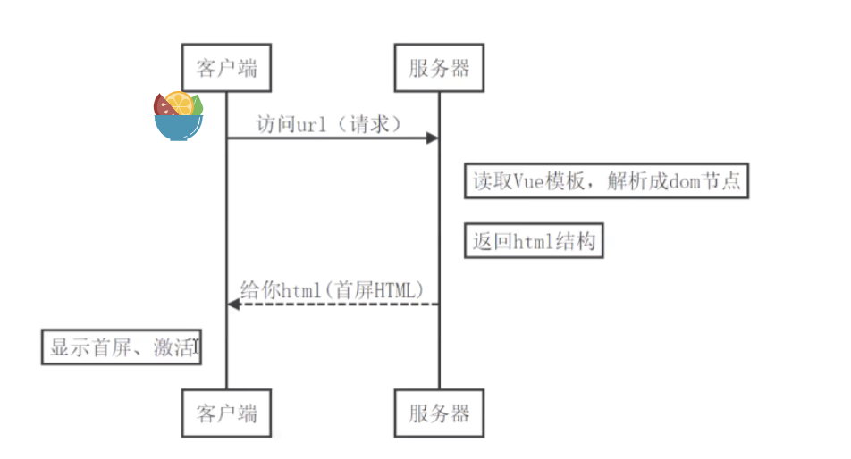
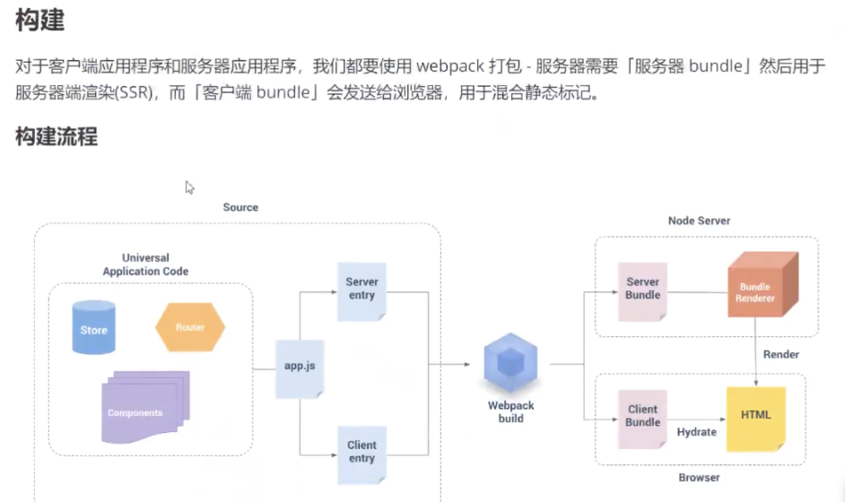
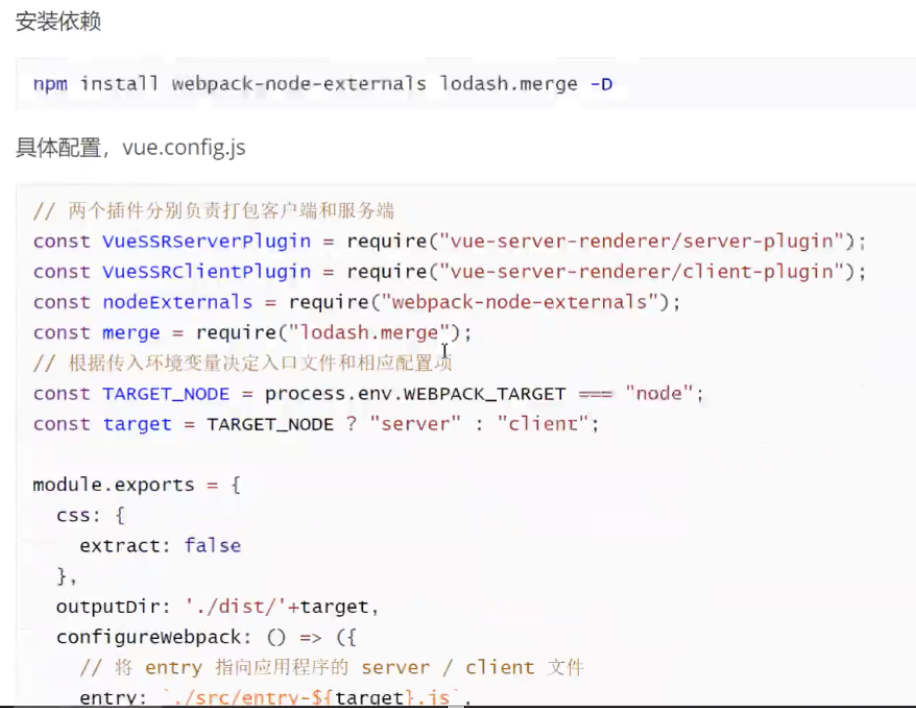
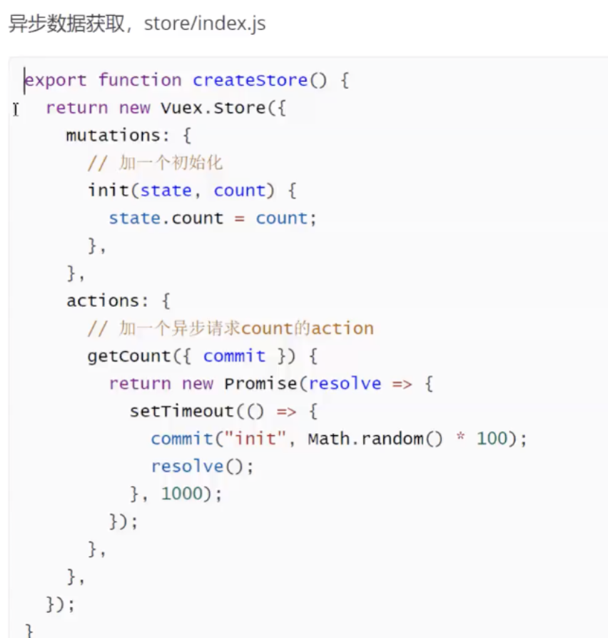

资源：https://ssr.vuejs.org 

nuxtjs 

概念： 

服务端渲染：将vue实例渲染为HTML字符串直接返回，在前端激活为交互程序 

优点：seo、首屏内容到达时间 

服务端知识： 

express(nodejs服务器) 

安装：npm i express -s 

```javascript
const express=require（'express'）  
const server=express()  
//编写路由处理请求 
server.get('/',(req,res)=>{  
    res.send('hello world') 
}) 

//监听端口号 
server.listen(80,()=>{ 
    //server running 
}) 
```

nodemong:自动重启服务器 

基础实现 

使用渲染器将vue实例成HTML字符串并返回 

安装：vue-server-renderer vue服务器端渲染器 
 
npm i vue-server-renderer -s. 


激活交互：服务器渲染  
目标： 
1.ssr概念 
2.vue ssr原生实现 
3.nuxt.js  


理解ssr 

传统服务端渲染ssr  VS  spa(单页面应用) 

 

传统web开发 

网页在服务端渲染完成，一次性传输到浏览器（jsp） 




缺点：Seo、 首屏到达时间 

ssr取中： 后端渲染出完整的首屏的dom结构吧，前端拿到的内容包括首屏及完整spa结构，应用激活后依然按照spa方式运行，这种页面渲染方式成为服务端渲染。




优点：Seo、 首屏更快 

缺点：模型复杂、服务器压力较大 

实战： 

1. Vue-cli创建工程 

vue creat ssr 

2. 安装依赖 
```javascript
npm install vue-server-renderer express -D 
npm i server-favicon -s 

//处理favicon 
const path=require('path') 
const favicon=require（'server-favicon'） 

server.use（favicon(path.join(_dirname,'../public','favicon.ico'))） 
```

_dirname:当前目录 

3. 启动脚本 

路由仍支持使用vue-router  

安装：npm i vue-router -s 

配置： 

创建@/router/index.js 

```javascript
import Vue from 'vue' 
import Router from 'vue-router' 
import Home from '@/view/Home' 
import About from '@/view/About'

Vue.use(Router)   
const routes=[{ 
    path:'/about', 
    name:'about', 
    component:()=>import('../views/About.vue') 
}] 

//修改1. 

const router=new VueRouter({
    mode:'history', 
    base:Process.env.Base_URL, 
    routes 
}) 

//====> 
//路由用工厂函数：因多个客户端 

export  function createRouter(){ 
    return new VueRouter({ 
        routes:[{ path:'/',compontent:Home },{path:'/about',compontent:About}]
    }) 
} 

```
```javascript
// main.js 

new Vue({ 
    router, 
    render:h=>h(App) 
}).$mount('#app') 

//==> 

creatApp(){ 
    const  router=createRouter() 
    const app=new Vue({ 
        router, 
        context,  
        //上下文用于给渲染器传递参数 
        render:h=>h(App)       
    }) 
    return {app,router} 
} 
```
# 构建： 



# webpack


 

# 脚本配置： 

安装依赖： 

npm i cross-env -D 

 

package.json
```json
"script":{
    "build:client":"vue-cli-server build",
    "build:server":"cross-env WEBPACK_TARGET=node vue-cli-server build",
    "build":"npm run build:server && npm run build:client"
}
``` 

宿主文件 


整合vuex 

 

数据预取  
服务端渲染的是应用程序的“快照”，如果应用依赖于一些异步数据，那么在开始渲染之前，需要先预取和解析好这些数据。   


总结： 

优点： 

Seo 

首屏显示时间 

缺点： 

开发逻辑复杂 

开发条件限制： 

比如一些生命周期不能用（首屏渲染时mounted之前的周期）【beforecreat,creat能用】，一些第三方库会不能用 

服务器负载大 

（需做很多优化工作：1.缓存处理；2.负载均衡；nginx：提前做一些缓存处理） 


已经存在spa 

1. 需要seo是否只是少数几个营销页面（预渲染<不需要ssr>是否可以考虑） 

https://github.com/chrisvfritz/prerender-spa-plugin 

2. 确实需要做ssr改造，利用服务器爬虫技术puppeteer（渲染慢，需提前缓存）


最后选择：重构 

1.vue-ssr 

2.nuxt.js（全新项目才建议使用） 