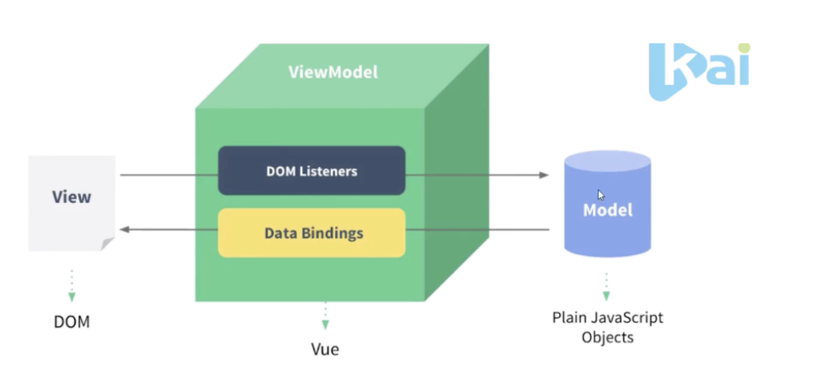

设计思想与理念：数据驱动应用，MVVM框架【mvvm模式的践行者】（三要素：响应式、模版引擎及其渲染） 

Vue:数据监听、数据绑定 


# 核心知识： 
* 模版语法： 

    {{插值文本}} 
    v-bind:title='title' ===>:title='title' 

* 列表渲染 

    `<div v-for=“it in its”>{{it}}</div>`  
* 输入绑定(表单) : v-model 
* 事件处理：按键修饰符、时间修饰符、系统修饰符 

    v-on:时间监听==@  
    修饰符：enter（回车键） 

* class与style 

    :class="[] or {}"   
    :class="{active :selected==c}" 

    :style='{background-color:selected==c?"#66666":"transprant"}' 

    //可读性差 

* 条件渲染 

    v-if   
    v-show  ：css  
    eg: v-if=“c==1” 

* 模版和渲染函数 

    vue编译成虚拟Dom渲染函数,结合响应系统，vue能够智能的计算出最少需要重新渲染多少组件，并把DOM操作次数减到最少。

* 计算属性和侦听器 

1. 计算属性有缓存性：如果值没有发生变化，则页面不会重新渲染 
```javascript
computed :{ 

total(){ 

return this.courses.length+'门' 

} 

} 
```
2. 监听器:数据发生变化之间：变化之后才会执行(默认情况下watch初始化时不执行) 
```javascript
watch：{ 

courses(new,old){ 

this.totlal=new.length+'门' 

} 

} 
```
3. 实现立刻执行：带选项的watch 
```javascript
watch：{ 

data:{ 

Immediate:true, //立即执行 

deep:true,         //监控更里面 

handler(new,old){ 

this.totlal=new.length+'门' 

} 

} 

} 

```

* computed VS watch 

简介性：computed  

语境上： 
    watch：一个值变化了，我要做些事情，适合一个值影响多个值的情形 【适合执行异步操作或较大开销操作】   
    computed ：一个值有其他值得来，这些值变了我也要变。适合多个值影响一个值的情形 
# 核心知识：生命周期 
