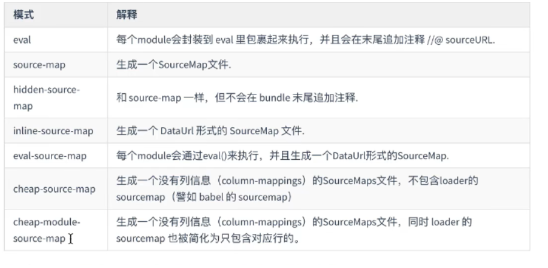
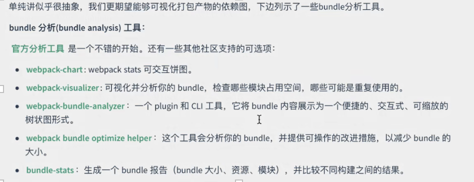

# 第一节 
```javascript
const path=require('path') 
module.exports={ 
    entry:'./src/index.js', 
    output:{ 
        filename:'bundle.js', 
        path:path.resolve(_dirname,'./dist'), 
    }, 
    mode:'none', 
    plugins:[] 
} 
```
## 插件(plugins): 
community:社区插件（HtmlWebpackPlugin）；  
webpack:webpack内置的官方插件；  
webpack contrib:webpack第三方插件  


HtmlWebpackPlugin : index.html的自动化生成 

npm install html-webpack-plugin -D(开发环境) 
const HtmlWebpackPlugin =require('html-webpack-plugin') 

 
==》基于自己html文件生成index.html 

```javascript
plugins:[ 
    new  HtmlWebpackPlugin ({ 
        template:'./test.html', 
        filename："index.html", 
        //定义自动生成的<script>标签在什么位置（head/body）, 
        inject：“body” 
    }) 
] 

运行： npx webpack 
```

清理dist 
```javascript
output:{ 
    … 
    clean:true 
} 
```

# 第二节搭建开发环境 

mode选项:   
1. source map 
2. watch mode 

//查看出错的真实源代码位置 
```javascript
{
    mode:'none|development', 
    devtool:inline-source-map
}
``` 
npx webpack --watch :实时监测代码变化【不人工刷新就能监测代码变化】

**webpack-dev-server（实时重新加载）:** 

真正的没有输出任何物理文件，他把输出的打包以后的bundle文件放到了内存里(如果删掉dist，更改代码依旧实时更新) 

npm install --save-dev webpack-dev-server

```javascript
devServer:[ 
    //指向的物理路径 
    static:'./dist' 
] 
```
webpack-dev-server --open 

===》http://loaclhost:8080/index.html 

# 第三节内置资源模块（混合其他资源，不仅仅只有js） 


## 资源模块介绍(asset module) 

**资源模块类型（asset module type)[四种]**

* asset/resource : 会发送单独的文件并导出URL 
* asset/inline : 导出资源的Data URI 
* asset/source:导出资源的源代码 
* asset：会在导出一个Data URI和发送单独的文件之间自动选择 

**一、asset/resource** 
```javascript
module:{ 
    //规则后是数组；通过配置很多对象加载不同类型文件 
    rules:[{ 
        test:/\.png$/, 
        type:'asset/resource' 
    }] 
} 
```
 

asset文件下 
```javascript
import imgsrc from './asset/.png'    (imgsrc是url) 
==>打包到了dist文件夹下===>自己定义文件名(两个方法) 
a:
output:{ 
    …  
    assetModuleFileName:'images/[contenthash][ext]' 
    //系统自带的默认生成文件名的方法 
    //contenthash根据文件的内容，生成哈希的字符串 
    //ext原扩展名 
} 

b:
module:{ 
    //规则后是数组；通过配置很多对象加载不同类型文件 
    rules:[{ 
        test:/\.png$/, 
        type:'asset/resource'， 
        generator：{ 
            filename:'images/[contenthash][ext]' 
        } 
    }] 
} 
//b优先级高于a 
```

**二、asset/inline**
```javascript
module:{ 
//规则后是数组；通过配置很多对象加载不同类型文件 
    rules:[{ 
        test:/\.svg$/, 
        type:'asset/inline'， 
    }] 
} 
```
 
**三、asset/source** 
```javascript
module:{ 
    //规则后是数组；通过配置很多对象加载不同类型文件 
    rules:[{ 
        test:/\.txt$/, 
        type:'asset/source'， 
    }] 
} 
```
**四、asset通用数据类型** 

如何选择：资源大于8K选1 

```javascript
module:{ 
    //规则后是数组；通过配置很多对象加载不同类型文件 
    rules:[{ 
        test:/\.jpg$/, 
        type:'asset'， 
        //解析器 
        parsar:{ 
            dataUrlCondition:{ 
                //自己调整临界值 
                maxSize:4*1024*1024   //4M 
            } 
        }
    }]
} 
```
 
# 第四节管理资源除了第三节四种资源模块引入外部资源模块外，还可以通过loader去引入其他类型的文件 

**loader**  
重要属性：test(识别转换的文件)、use（转换时使用哪个loader来进行转化） 

**加载css**

```javascript
npm install css-loader 
npm install style-loader //把css放到页面上 
module:{ 
    //规则后是数组；通过配置很多对象加载不同类型文件 
    rules:[ 
        …, 
        { 
            test:/\.css$/, 
            use:['style-loader','css-loader'] 
            //顺序从后往前执行的，位置不能颠倒 
        }
    ] 
} 
```
 

Sass、less、stylus 

```javascript
npm install less-loader 

module:{ 
//规则后是数组；通过配置很多对象加载不同类型文件 
    rules:[ 
        …, 
        { 
            test:/\.(css|less)$/, 
            use:['style-loader','css-loader','less-loader'] 
            //顺序从后往前执行的，位置不能颠倒 
        } 
    ] 
} 
```
**抽离和压缩css** 

style中的样式===>放置到文件里通过link标签加载 
```javascript
npm install mini-css-extract-plugin -D 【webpack5环境中才可以】 

const MiniCssExtractPlugin=require('mini-css-extract-plugin') 

plugins:[ 
    new  MiniCssExtractPlugin({ 
        //指定文件名 
        filename："styles/[contenthash].css", 
    }) 
] 
module:{ 
    //规则后是数组；通过配置很多对象加载不同类型文件 
    rules:[
        …,
        { 
            test:/\.(css|less)$/, 
            use:[MiniCssExtractPlugin.loader,'css-loader','less-loader'] 
            //顺序从后往前执行的，位置不能颠倒 
        } 
    ] 
} 
```
优化配置: 
```javascript
npm install css-minimizer-webpack-plugin -D 

const CssMinimizerWebpackPlugin=require('css-minimizer-webpack-plugi') 

mode:'production', 
optimization:{ 
    minimizer:[ 
        new CssMinimizerWebpackPlugin() 
    ] 
} 
```
**加载images图像** 

```javascript
mode:'development', 

.bg{ 
    background-image:url('./assets/webpack-logo.svg') 
} 
```

**加载fonts字体** 

在css加载font字体 
```javascript
module:{ 
    //规则后是数组；通过配置很多对象加载不同类型文件 
    rules:[ 
        …, 
        { 
            test:/\.(woff|woff2|eot|ttf|otf)$/i, 
            type:asset/resource   
            //可载入任何资源类型 
        } 
    ]    
} 

@font-face{ 
    font-family：'ico', 
    src:url('./') 
} 
.icon{ 
    font-family:'ico' 
    font-size:30px 
} 

<div class="icon"> 
'字体代码--下载字体时提供给我们' 
</div> 
``` 

**加载数据(除图片、图标、字体库还有json、tsv、csv、xml等) **

```javascript
npm install css-loader xml-loader -D 

module:{ 
    //规则后是数组；通过配置很多对象加载不同类型文件 
    rules:[ 
        …, 
        { 
            test:/\.(csv|tsv)$/, 
            use:'csv-loader' 
        },{ 
            test:/\.xml$/, 
            use:'xml-loader' 
        } 
    ] 
} 

index.js
import Data from './asset/data.xml' ===>转换为js对象 
import csv from './asset/data.csv' ===>转换为数组 

console.log(Data ) 
```
 

**自定义JSON模块parser** 


.yaml k:val   
.taml k=val   
.json5 //可加注释，值可用单引号 /n /r 

```javascript
npm install toml yaml json5 -D 

const toml =require('toml') 
const yaml=require('yaml') 
const json5 =require('json5') 

module:{ 
    //规则后是数组；通过配置很多对象加载不同类型文件 
    rules:[ 
        …, 
        { 
            test:/\.toml$/, 
            type:'json', 
            parser:{ 
                parse:toml.parse 
            }
        },{ 
            test:/\.yaml$/,
            type:'json', 
            parser:{ 
                parse:yaml.parse 
            } 
        },{            
            test:/\.json5 $/, 
            type:'json', 
            parser:{ 
                parse:json5.parse 

            } 
        } 
    ]
} 

//使用 
import toml from './asset/ee.toml ' 
import yaml from './asset/ee.yaml ' 
```


# 第四章使用babel-loader 

babel-loader:在webpack里应用babel解析es6的桥梁 
@babel/core：babel核心模块 
@babel/preset-env：babel预设，一组babel插件的集合 

```javascript
npm install -D babel-loader @babel/core @babel/preset-env 

module:{
    //规则后是数组；通过配置很多对象加载不同类型文件 
    rules:[ 
        …, 
        { 
            test:/\.js$/, 
            exclude:/node_module/ 
            use:{        
              loader:'babel-loader' 
              options:{ 
                presets:['@babel/preset-env'], 
                plugins:[ 
                    ['@babel/plugin-transform-runtime'] 
                ] 
               } 
            } 
    } 
    ] 
} 
```

regeneratorRuntime是webpack打包生成的全局辅助函数，由babel生成兼容async/await的语法 

async await 

⚠️regeneratorRuntime is not defined 这个错误是未能正确配置babel 

解决：
```javascript
npm install @babel/runtime -D 

安装插件：
    npm install @babel/plugin-transform-runtime 
作用：
    会在需要regeneratorRuntime的地方，自动require导包，编译的时候会需要它 
```


# 第五章代码分离 


webpack特性：把代码分离到不同的bundle中,然后这些文件按需加载/并行加载 

代码分离：获取更小bundle；控制资源加载的优先级（影响加载时间） 
## 三种代码分离方法： 
1. 配置入口节点（使用entry,配置手动的分离代码---问题：如果是多入口，每个入口引用的文件会重复打包） 
2. 在入口的地方通过entry dependdencies或者是通过splitChunksPlugin 
3. 动态导入：通过模块的内连函数import来调用函数分离代码 
### 一、入口起点 
```javascript
entry:'./src/index.js', 
===> 
entry:{ 
    index:'./src/index.js', 
    another:'./src/another.js' 
} 
output:{ 
    filename:'bundle.js',
    path:path.resolve(_dirname,'./dist'), 
}, 

===> 
output:{ 
    //name可以拿到入口的名字
    filename:'[name].buldle.js',
    path:path.resolve(_dirname,'./dist'), 
}, 
```
### 二、防止重复 
```javascript
entry:{ 
    index:{    
        import :'./src/index.js', 
        dependOn:'shared'   
    }, 
    another:{ 
        import :'./src/another.js', 
        dependOn:'shared'   
    } 
    shared:'loadsh' 
    //当他们两个里面都有lodash，就会抽离出来，并取名为shared这样的chunk 
} 

//也可使用：webpack内置插件splitChunksPlugin(自动进行公共代码的抽离) 
entry:{ 
    index:'./src/index.js', 
    another:'./src/another.js' 
} 
optimization:{ 
    splitChunks:{ 
        chunks:'all' 
    } 
} 
```


### 三、动态导入 


应用： 
1. 懒加载（又叫：按需加载），优化网页或应用的方式。实质：把代码在逻辑断点处分开，在完成某些操作立即引用新的代码块。加快初始加载速度，减轻总体积。
 
魔法注释:
```javascript
import (/*webpackChunkName:math*/'./math.js').then(()=>{}) 
===>math.buldle.js 
```
2. 预获取/预加载模块 
webpack v4.6.6+ 

prefetch（预获取）:将来某些导航下可能需要的资源 
preload(预加载):当前导航下可能需要的资源 (与懒加载有些类似) 

```javascript
import (/*webpackChunkName:math，webpackPrefetch：true */'./math.js').then(()=>{}) 
```


# 第六章 缓存（因：获取资源比较消耗时间） 
js更改时能知道(修改输出文件名) 
```javascript
entry:{ 
    index:'./src/index.js', 
    another:'./src/another.js' 
} 
output:{ 
    filename:'[name].[contenthash].js',  //name可以拿到入口的名字 
    path:path.resolve(_dirname,'./dist'), 
}, 

//缓存第三方库 
//第三方库提取到单独的vendor chunk文件中，因为不想本地资源频繁更改。 
splitChunks:{ 
    chunks:'all', 
    cacheGroups:{ 
        vendor :{ 
            test:/[\\/]node_modules[\\/]/, 
            name:'vendors' 
            chunks:'all'        
        } 
    } 
} 
```
第三方库打包到====>vendors.buldle.js 

 

将js文件放到一个文件夹中 
```javascript
output:{ 
    filename:'scripts/[name].[contenthash].js',
    //name可以拿到入口的名字 
    path:path.resolve(_dirname,'./dist'), 
}, 
```

# 第七章拆分开发环境和生产环境配置 

## 开发环境没有必有缓存 

## 生产环境：  
* 生产环境还需要设置公共路径 
* 相对路径===》绝对路径 

```javascript
const ASSET_PATH=process.env.ASSET_PATH||'/' 

output:{ 
    filename:'scripts/[name].[contenthash].js',  
    //name可以拿到入口的名字 
    path:path.resolve(_dirname,'./dist'), 
    publicPath:ASSET_PATH 'http://localhost:8080' 
}, 
plugins:[ 
    new webpack.DefinePlugin({
        'process.env.ASSET_PATH':JSON.stringify(ASSET_PATH) 
    }) 
] 
```
 
**环境变量** 

消除开发环境与生产环境的差异 
```javascript
npx webpack --env production 
npx webpack --env production   --env goal=local 

module.exports=(env)=>{ 
  return { 
    mode:env.production?'production':'development'   , 
    optimization:{ 
        minimizer:[ 
            new CssMinimizerWebpackPlugin(), 
            new TerserPlugin() 
        ] 
    } 
}} 
```

代码压缩：webpack开箱即用terser 未生效，因minimizer做了css压缩 
```javascript
npm install terser  
const TerserPlugin=require('terser-webpack-plugin ') 
```

拆分配置文件   
config-->webpack.config.dev.js   
npx webpack -c ./config/webpack.config.dev.js 

!!!注意打包后dist位置path 
filename不需要hash缓存， 不需要绝对路径publicPath，不需要压缩 
devtool:环境调试需要 
devServer:需要(启动服务) 


config-->webpack.config.prod.js 

npx webpack -c ./config/webpack.config.prod.js 
```javascript
//性能配置 
performance:{ 
//包太大提示 
    hints:fasle 
} 
npx webpack server -c ….. 
```
 

npm 脚本 

```javascript
package.json 
{ 
    'script':{ 
        start:'webpack server -c ' ./config/webpack.config.dev.js 
    } 
} 
==>npm run start 
```
 

提取公共配置 config-->webpack.config.common.js 

合并配置文件(深合并)：***webpack-merge***   
安装：***npm install webpack-merge -D***


config-->webpack.config.js 
```javascript
const merge =require('webpack-merge') 

const dev=require('') 

module.exports=(env)=>{ 
    switch(true){ 
    case env.production: 
        return merge() 
    case env.development： 
        return  … 
    default: 
        return new Error('error') 
    }
} 
```
# 第八章高级应用篇 

## source-map 

devtool:'inline-source-map' 
默认：eval 
1. hidden-source-map 不能锁定代码行数 
2. inline-source-map 不会单独生成 .map.js文件 
3. eval-source-map 不会单独生成 .js.map文件 ，直接放到了eval后面 
4. cheap-source-map  加loader导致代码行数识别问题  
 .js.map 中mappings:源码和打包后代码的映射：行数 （可减少main.js文件大小） 
5. source-map：mappings:源码和打包后代码的映射 行数与(列数)  
6. cheap-module-source-map //加loader不会导致代码行数识别问题【开发环境推荐】  

⚠️：
生产环境不推荐开启sourcemap功能：  
1.通过bundle和sourcemap文件，可以反编译处源码 
2.sourcemap文件体积相对比较巨大，跟生产环境追求不同（生产环境追求更小更轻的bundle）

 

## devServer 

```javascript
const HtmlWebpackPlugin =require('html-webpack-plugin') 

publicPath:'/' 
devServer:{ 
    //指向的物理路径     
    //static:'./dist' 
    static:path.resolve(_dirname,'./dist'), 
    compress:true， 
    //是不是在服务器端进行代码压缩 
    port:3000， //端口号 
    headers：{ 
        //模拟添加相应头 
        'X-Access-Token':'adff123' 
    } 
    proxy:{ 
        '/api':'http://test.sdf.com' 
    } 
    https:true 
     //使用vue或者react做SPA时,使用的路由是history时，刷新页面可能会报错,解决： 
    historyApiFallback：true 
    host :'0.0.0.0'  //开发服务器主机(局域网内的其他伙伴也能访问到这个服务) 
} 
plugins:[ 
    new  HtmlWebpackPlugin ({ 
        template:'./test.html', 
        filename："index.html", 
        //定义自动生成的<script>标签在什么位置（head/body）, 
        inject：“body” 
    }) 
] 
```
// http==>https默认配置使用的是自签名证书，所以浏览器会告诉你是不安全的。可以继续访问，也可以提供自己的证书。本地开发可以不用关注，部署到服务器时，再去搭建一个https的服务器 

 

控制台接口:相应头： Content-Encoding:gzip //压缩了 

## 模块热替换与热加载 
```javascript
devServer:{ 
    hot：true //热替换 
    liveReload:true, //开启热加载 
} 
```

### ESLint 

npm install eslint -D 

npx eslint --init 

==>.eslintrc.json 


npx eslint ./src 
vscode插件：eslint 

===>在webpack里实现提示 
```javascript
devServer:{ 
    client:{ 
        overlay:false //浏览器不报错 
    } 
} 
module:{ 
    rules:{ 
        test:/\.js/, 
        use：['babel-loader','eslint-loader'] 
    } 
    //保存时报错，浏览器报错 
} 
```
 
### Git-hooks与Husky 

以上为写代码时eslint检查。 

本节：git提交代码之前 

git --version 检查git版本 

git init 搭建git环境 

ls la    查看可以看到.git文件 

创建.gitignore文件 不需要提交的文件 


cd .git 

ls la   

cd hooks 

ls la  后有很多.sample的文件【都是git的hook】 

 

touch pre-commit 创建文件 

ls la  0字节的pre-commit  

vim  pre-commit  

npx eslint ./src 

:wq 保存并退出 

chmod +x  ./pre-commit 【给pre-commit添加可执行权限】具备可执行权限 

 

====》自己文件夹.mygithooks/pre-commit 

* 创建文件夹，mygithooks->新建文件pre-commit->npx eslint ./src 

* 想执行此文件，要做git 配置 git config core.hooksPath .mygithooks 

 

提交时没有权限--给权限chmod +x  .mygithooks/pre-commit 

修改.git/config 将hooksPath =.mygithooks删除 

commit 时读取了本地脚本（.mygithooks/pre-commit） 


使用husky与上同理 
```javascript
npm i husky 
npx husky install     创建默认husky文件夹 

{ 
    "scripts":{ 
        "prepare":"husky install" 
    } 
} 
```

# 第九章模块与依赖 

Webpack模块与解析原理 


## 模块解析（resolve） 

enhanced-resolve可解析路径： 

* 绝对路径（相对于项目的根目录，作为绝对路径） 

* 相对路径 

配置别名： 
```javascript
const Path=require('path') 
resolve:{ 
    alias:{ 
        '@':Path.resolve(_dirname,'./src') 
    } 
    extensions:['.json','.js','.vue'] 
} 
```
引入不带 .js 文件，会默认为.js文件。文件名相同，扩展名不同处理extensions 

* 模块路径 

## 外部扩展（externals）: 

有时为了减少bundle体积,会把一些不变的第三方库以cdn的形式引入 
```javascript
<script src="://cdn…..jquery.js"></script> 
externals:{ 
    jquery[包名一致]:"jQuery'' 
    // jQuery暴露给window 
} 
import $ from 'jquery' 
//====>jquery:['://cdn…..jquery.js','jQuery'] 

externalsType:'script' 
//script标签形式引入到页面 
```
## 依赖图 

一个文件依赖另一个文件时，会将文件视为存在依赖关系。使得webpack可以获取非代码资源，比如images或字体等 


```javascript
npm i webpack-bundle-analyzer -D 
const { BundleAnalyzerPlugin }=require('webpack-bundle-analyzer') 
plugins:[ 
    new BundleAnalyzerPlugin() 
] 
```
 

# 第十章扩展功能 

## PostCSS与CSS模块 

PostCss是用js工具和插件转换CSS代码的工具。不如：Autoprefixer插件自动获取浏览器的流行度和能够支持的属性，并根据数据自动为CSS规则添加前缀，将最新的CSS语法转换成大多数浏览器都能理解的语法。 

css模块：不用担心命名太大众化而造成冲突。 

PostCss与webpack结合 
```javascript
npm i postcss-loader -D 
npm i autoprefixer -D （作用：加前缀）

module:{ 
    rules:[{ 
        test:/\.css$/, 
        use:['style-loader','css-loader', 
'postcss-loader'] 
    }] 
} 
```

```javascript
//配置css配置的插件 postcss.config.js 
module.export ={ 
    plugins:[ 
        require('autoprefixer') 
    ] 
} 

```


package.json 
```json
{ 
    //浏览器版本设置 
    "browserslist":[
        ">1%", 
        //全球浏览器的使用率
        "last 2 version" 
        //每个浏览器最新的两个版本 
    ] 
} 
```


// postcss.config.js 

```javascript
npm i postcss-nested -D 
module.export ={ 
    plugins:[ 
        … 
        require('postcss-nested') 
        //css嵌套功能 
    ] 
} 
```
 
===>开启css模块 
```javascript
module:{ 
    rules:[{ 
        test:/\.css$/, 
        use:['style-loader', 
            { 
                loader:'css-loader', 
                options:{ 
                    modules:true 
                } 
            }, 
            'postcss-loader' 
        ] 
    }] 
} 
```
 
import style from './test.css' 

style.box====>***hash** class 

===>部分使用css模块 

## Web Works 

提供了后台处理线程的api,可以将复杂的耗时的单纯的处理js的逻辑放在浏览器的后台线程中处理，让js线程不阻塞 
```javascript
const worker=new Worker(new URL('./work.js',import.meta.url)) 
worker.postMessage({ 
    question:'hi' 
}) 
worker.onmessage=(message)=>{ 
    console.log(message.data.answer) 
} 
```
 
work.js 
```javascript
self.onmessage=()=>{ 
    self.postMessage({ 
        answer:1111 
    }) 
} 
```
 

## TypeScript 

npm i typescript ts-loader -D 

```javascript
devtool :"inline-source-map" 
module:{ 
    rules:[{ 
        test:/\.ts$/, 
        use:'ts-loader', 
        exclude:/node_modules/ 
    }] 
} 
//识别扩展名 
resolve ：{ 
    extensions:['.ts','.js'] 
} 
output:{ 
    filename:'buldle.js', 
    path:path.resolve(_dirname ,'./dist') 
} 
rootDir:'./src', 
outDir:'./dist' 
```
===>创建tsconfig.json:npx tsc --init 


# 第十一章多页面应用 

entry配置 
```javascript
entry:{ 
    index:{     
        import :'./src/index.js', 
        dependOn:'shared'   
    }, 
    another:{ 
        import :'./src/another.js', 
        dependOn:'shared'   
    } 
    shared:'loadsh' 
    //当他们两个里面都有lodash，就会抽离出来，并取名为shared这样的chunk 
} 
```

```javascript
entry:{ 
    main:{
        import :['./src/index.js'.'./src/another.js'], 
        dependOn:'loadsh'   
    }, 
    loadsh:'loadsh' 
    //当他们两个里面都有lodash，就会抽离出来，并取名为shared这样的chunk 
} 
```
====>打包后：dist/main.js  dist/lodash.js  


# index.html模版配置/多页面环境搭建 


index/another 对应不同html文件 


```javascript
entry:{ 
    index:{ 
        import :'./src/index.js', 
        dependOn:'shared'， 
        filename:'dir1/[name].js' 
    }, 
    another:{ 
        import :'./src/another.js', dependOn:'shared' , 
        filename:'dir2/[name].js' 
    } 
    //shared:'loadsh' 
    lodash:{ 
        import:'loadsh', 
        filename:'common/[name].js' 
    } 
    //当他们两个里面都有lodash，就会抽离出来，并取名为shared这样的chunk 
} 
plugins:[ 
    new  HtmlWebpackPlugin ({ 
        title：'多页面应用' 
        template:'./test.html',
        //<% =HtmlWebpackPlugin.options.title%> 
        filename："dir1/index.html", 
        //定义自动生成的<script>标签在什么位置（head/body）, 
        inject：“body”, 
        chunks:['main','lodash'], 
        publicPath:'http://www.a.com/' 
    }), 
    new  HtmlWebpackPlugin ({ 
        title：'多页面应用' 
        template:'./test2.html',
        //<% =HtmlWebpackPlugin.options.title%> 
        filename："dir2/index2.html", 
        //定义自动生成的<script>标签在什么位置（head/body）, 
        inject：“body”, 
        chunks:['main2','lodash'] 
        publicPath:'http://www.b.com/' 
    }) 
    //publicPath设置包的前缀,例如：main2.js==>http://www.b.com/main2.js 
] 
//文件夹清理 
output:{ 
    clean:true 
} 
```

# 第十二章Tree Shaking 

移除上下文中未引用的代码（死代码）==》es2015模块语法的静态结构特性。 

```javascript
optimization:{ 
    usedExports:true 
} 
```
## sideEffects 

webpack不能百分之百进行tree shaking【只要模块被引入，就会产生严重影响：全局样式表，全局配置的js文件】 

package.json文件 
```javascript
{ 
    sideEffects:true/false(所有的包都是没有副作用)/['*.css'](css有副作用，不要删除) 
} 
```
# 第十三章渐进式网络应用程序PWA 

离线环境能继续运行的功能 

到浏览器运行服务：
webpack-dev-server----->replaced 第三方server (npm i http-server -D【基于node.js】) 

package.json文件 
```javascript
{ 
    scripts:{ 
        start:'http-server dist' 
    } 
} 
```

```javascript
//开发环境中间键（新的dist生成最新的） 
devServer:{ 
    devMiddleware:{ 
        //写入硬盘 
        writeToDisk:true 
    } 
} 
```
非离线环境下运行 

## 添加Workbox(创建service-worker) 

通过添加workbox实现PWA 

work-webpack-plugin插件 

```javascript
npm install work-webpack-plugin --save-dev 
const WorkboxPlugin=require('work-webpack-plugin') 

plugins:[ 
    new WorkboxPlugin.GenerateSW({ 
        clientsClaim:true, 
        //帮助我们快速启用service-worker 
        skipWaiting:true 
        //跳出等待，不允许引入旧的service-worker 
    }) 
] 
```

## 注册Service-Worker实现离线浏览功能 

```javascript
if('serviceWorker' in navigator){ 
    window.addEventListener('load',()=>{ 
        Navigator.serviceWorker.register('/service-work.js').then(registration=>{ 
            console.log('注册成功') 
        }).catch(registrationError=>{ 
            console.log('注册失败') 
        })  
    }) 
} 
```
# 第十四章Shimming预置依赖 

Shimming预置全局变量（使用插件ProvidePlugin） 

lodash为例： 
```javascript
const webpack=require('webpack') 
plugins:[ 
    new webpack.ProvidePlugin({ 
        _：'lodash' 
    }) 
] 
```

细颗粒度Shimming 

当模块运行在CommonJS上下文中，this指向的是module.exports你可以使用imports-loader覆盖this 

npm安装 
```javascript
module:{ 
    rules:[{ 
        test:require.resolve('./src/index.js'), 
        use:'imports-loader?wrapper=window', 
    }] 
} 
```

## 全局Exports 

使用模块又不想导入（exports-loader帮助我们导出某些对象/变量） 

golbal.js外部文件，不知道如何导出 
```javascript

module:{ 
    rules:[{ 
        test:require.resolve('./src/golbal.js'), 
        use:'exports-loader?type=commonjs&exports=file,multiple|helpers.parse|parse', 
         //导出对象里的方法{parse:helpers.parse} 
    }] 
} 
```


const {file,parse} =require('./golbal.js') 

 

## 加载Polyfills 

@babel/polyfill 

===>打了浏览器优雅降级的包 

Array.from([],()=>{}) 

## 进一步优化Polyfills(因不建议全局引入：包体积大，污染全局环境) 

babel-preset-env package通过browserslist来转译浏览器不支持的特性 

 

使用babel(第四章) 

npm install -D babel-loader @babel/core @babel/preset-env 

 

babel-loader:在webpack里应用babel解析es6的桥梁 

@babel/core：babel核心模块 

@babel/preset-env：babel预设，一组babel插件的集合 

 
```javascript
module:{ 
    //规则后是数组；通过配置很多对象加载不同类型文件 
    rules:[ 
        …, 
        { 
            test:/\.js$/, 
            exclude:/node_module/ 
            use:{ 
                loader:'babel-loader' 
                options:{ 
                presets:['@babel/preset-env'，{ 
                    targets:['last 1 version', '>1%' ] 
                    useBuiltIns:'usage', 
                    corejs:3 
                }], 
                plugins:[['@babel/plugin-transform-runtime']] 
                } 
            } 
        } 
    ] 
} 
```
useBuiltIns===>需安装core-js 

 

 

# 第十五章创建Library 

```javascript
module.exports={ 
    entry:'./src/mylib.js', 
    output:{ 
        filename:'mylib.js', 
        path:path.resolve(_dirname,'./dist'), 
        
        library:'mylib' 

        //==>commonjs 
        library:{ 
            name:'mylib', 
            type:'window'  
            //commonjs、module 
        } 

        library:{ 
            name:'mylib', 
            type:'window' //commonjs、UMD【除了module】, 
            globalObject:'globalThis' 
        } 

        library:{ 
            type:'module'  
        } 
        //不想打入包里 

        externals:{ 
            lodash:{ 
                commonjs:'lodash', 
                amd:'lodash', 
                root:"_" 
            } 
        } 
    }, 
    experiments:{ 
        outputModule:true 
    }, 
    mode:'none', 
    plugins:[] 
} 
```
发布为npm-package 

npm config get registry 查看本地registry 确保是npm 

npm assuser 

npm publish 

# 第十五章 模块联邦 

多个独立构建组成应用程序，独立构建之间不存在任何人依赖关系 

 webpack--dll和externals做到代码共享时的common chunk,但不同应用和项目之间就变得困难了。 

webpack5的模块联邦，可以让webpack达到线上runtime，让代码之间的项目利用cdn共享。不再需要npm本地安装发布了。 

 

MFE:微前端，模块共享关联方式，解决多个项目并存的问题 

 

 

使用模块联邦 

```javascript

const {ModuleFederationPlugin}=require('webpack').container 

plugins:[ 
    new ModuleFederationPlugin({ 
        name:'nav', //模块联邦名字 
        filename:'remoteEntry.js', 
        //引用其他路径暴漏的组件 
        remotes:{} 
        //暴漏组件 
        exposes:{ 
            //不是当前路径，时别人用时基于这个路径拼接的url:本地项目路径 
            './Header' :'./src/Header.js' 
        } 
        //模块中共享的第三方模块 

        shared:{} 
    }) 
] 

plugins:[ 
    new ModuleFederationPlugin({ 
        name:'home', //模块联邦名字 
        filename:'remoteEntry.js', 
        //引用其他路径暴漏的组件 
        remotes:{
            //[name]@ 
            nav:'nav@http://localhost:3003/remoteEntry.js' 
        } 
        //暴漏组件 
        exposes:{ 
        //不是当前路径，时别人用时基于这个路径拼接的url:本地项目路径 
        } 
        //模块中共享的第三方模块 
        shared:{} 
    }) 
] 

import ('nav/Header').then(Header=>{ 
}).catch(er=>{}) 
```
 

# 第十五章 提升构建性能 

两类： 
1. webpack提升项目性能（网站首屏到达时间）【客户】 
2. 构建编译性能（提高打包速度，降低打包时间）【开发人员】 

webpack每个版本的优化点是不一样的 


webpack5三个环境提升构建性能 

通用环境【开发生产】： 

1. 更新最新版本 webpack 5.61.0 nodejs 16.13.0 

2. 将loader应用于最少数量的必要模块【示例：只src下的文件】

3. 引导bootstrap 

每个额外的loader/plugin都有其启动时间，尽量少地使用工具 

4. 解析 

减少resolve.modules,resolve.extensions[设置webpack查找的扩展名],resolve.mainFiles,reslove.descriptionFiles中条目数量，因为他们会增加文件系统调用的次数 

如果你不使用symlinks(例如：npm link 或yarn link)，可以设置reslove.symlinks:false 

如果你使用自定义resolve plugin规则，并且没有指定context上下文，可以设置reslove.cacheWithContext:false 

5. 小即是快 

减少编译结果的整体大小，以提高构建性能。尽量保持chunk体积小 

使用数量更少/体积更小的library 

在多页面应用程序中使用SplitChunksPlugin 

在多页面应用程序中使用SplitChunksPlugin,并开启async模式 

移除未引用代码 

只编译你当前正在开发的那些代码 

6. 持久化缓存 

在webpack配置中使用cache选项。使用package.json中的“postinstall”清除缓存目录。 

将cache类型设置为内存或者文件系统。memory选项很简单，它告诉webpack在内存中存储缓存，不允许额外的配置 

```javascript

Module.exports={ 
    //… 
    cache:{ 
        type:'memory' 
    } 
} 
```
7. 自定义plugin/loader 

对他们进行概要分析，以免在此处引入性能问题 

8. progress plugin 

将Progress Plugin从webpack中删除，可以缩短构建时间。请注意，Progress Plugin可能不会为快速构建提供太多价值，因此，请权衡利弊再使用。 

9. dll(提高构建速度) 

使用DllPlugin为更改不频繁的代码生成单独的编译结果。这可以提高应用程序的编译速度，尽管它增加了构建过程的复杂度。 

 webpack.dll.config.js 
```javascript
const path=require('path') 
const webpack=require('webpack') 
module.exports={ 
    mode:"", 
    //配置第三方的包 
    entry:{ 
        jquery：["jquery" ]  
    } 
    output:{ 
        filename:'[name].js', 
        path:path.resolve(_diename,'dll'), 
        //为包命名，导出第三方包 
        library:'[name]_[hash]' 
    } 
    plugins:[ 
        new webpack.DllPlugin({ 
            name: '[name]_[hash]', 
            path:path.resolve(_diename,'dll/manifest.json'), 
        }) 
    ] 
} 
``` 

 

package.json 

```javascript
scripts:{ 
    'dll':"webpack --config ./webpack.dll.config.js" 
} 
```
 

webpack.config.js 

```javascript
const webpack=require('webpack') 
const AddAssertHtmlPlugin=require('add-assert-html-webpack-plugin') 

plugins:[ 
    new webpack.DllReferencePlugin({ 
        manifest:path.resolve(_diename,'./dll/manifest.json'), 
    }), 
    new AddAssertHtmlPlugin({ 
        filepath:path.resolve(_diename,'./dll/jquery.js'), 
        publicPath:'./' 
    }) 
] 
```
===>可代替externals 

10. work池（worker-pool） 原理：把它定义在其他loader前面，其他loader定义在另一个worker pool里面运行（另一个cpu） 

 thread-loader可以将非常消耗资源的loader分流给一个worker pool 

 

```javascript

module:{ 
//规则后是数组；通过配置很多对象加载不同类型文件 
    rules:[ 
        …, 
        { 
            test:/\.js$/, 
            exclude:/node_module/ 
            use:[{ 
                loader:'babel-loader' 
                options:{ 
                    presets:['@babel/preset-env'] 
                } 
            },{ 
                //耗时大的工程有益 
                loader:'thread-loader' 
                options:{ 
                    workers:2 
                } 
            }] 
        } 
        //不要使用太多work,因为Nodejs的runtime都有启动开销，最小化work和main process（主进程）之间的模块传输。进程间通讯（IPC,inter process communication）是非常消耗资源的
    ] 
} 
```

//多个loader从下到上 

 

 

开发环境提升构建性能 

1. 增量编译 

使用webpack的watch mode(监听模式)。而不使用其他工具来watch文件和调用webpack。内置的watch mode会记录时间戳并将此信息传递给compilation以使缓存失效。 

在某些配置环境中，watch mode会回退到poll mode(轮询模式)。监听许多文件会导致CPU大量负载。在这些情况下，可以使用watchOptions.poll来增加轮询的间隔时间。 

2. 在内存中方编译 

下面几个工具通过在内存中（而不是写入磁盘）编译和serve资源来提高性能： 
* webpack-dev-server 
* webpack-hot-middleware 
* webpack-dev-middleware 

3. stats.toJson加速 

 webpack4默认使用stats.toJson（）输出大量数据。除非在增量步骤中做必要的统计，否则请避免获取stats对象的部分内容。 

webpack-dev-server早v3.1.3以后的版本，包含一个重要的性能修复，即最小化每个增量构建步骤中，从stats对象获取的数据量。 

4. Devtool 

需要注意的是不同的devtool设置，会导致性能差异 
* eval具有最好的性能，但并不能帮助你转译代码， 
* 如果你能接受稍微差一些的map质量，可以使用cheap-source-map变体配置来提高性能。 
* 使用eval-source-map变体配置进行增量编译。在大多数情况下，最佳选择是eval-cheap-modlue-source-map 

5. 避免在生产环境才用到的工具 

某些utility,plugin和loader都只用于生产环境。例如，在开发环境下使用TerserPlugin来minify(压缩)和mangle(混淆破坏)代码是没有意义的。通常在开发环境下，应该排除以下这些工具： 
* TerserPlugin 
* [fullhash]/[chunkhash]/[contenthash] 
* AggressiveSplittingPlugin 
* ModuleConcatenationPlugin 

6. 最小化entry chunk 

webpack只会在文件系统中输出已经更新的chunk。某些配置选项（HMR,output.chunkFilename的[name]/[chunkhash]/[contenthash]）,[fullhash])来说，除了对已经更新的chunk无效之外，对于entry chunk也不会生效。 

确保在生成entry chunk时，尽量减少其体积以提高性能。下面的配置为运行时代码创建了一个额外的chunk,所以它的生成代价较低： 
```javascript
module.exports={ 
    //… 
    optimization:{ 
        runtimeChunk:true 
    } 
} 
```
 


生产环境优化 


