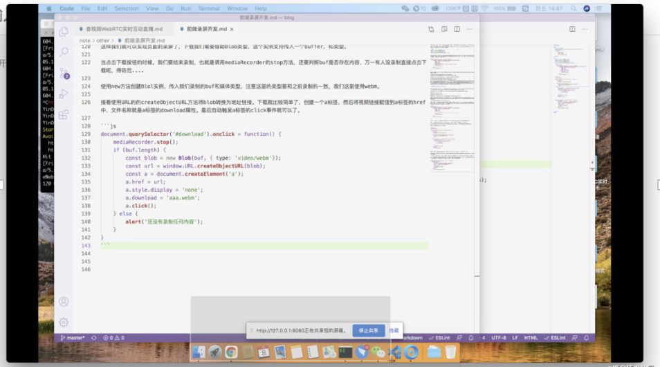
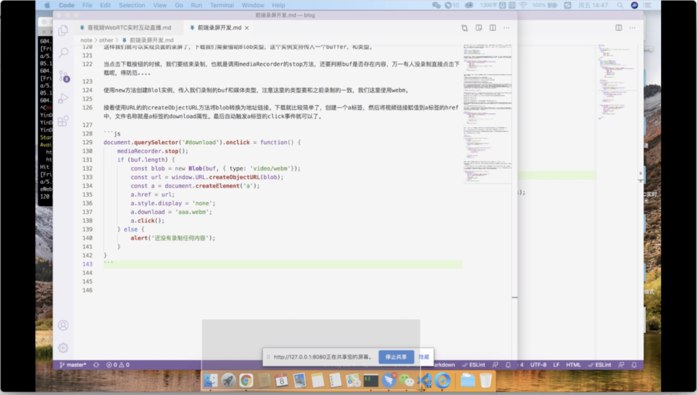
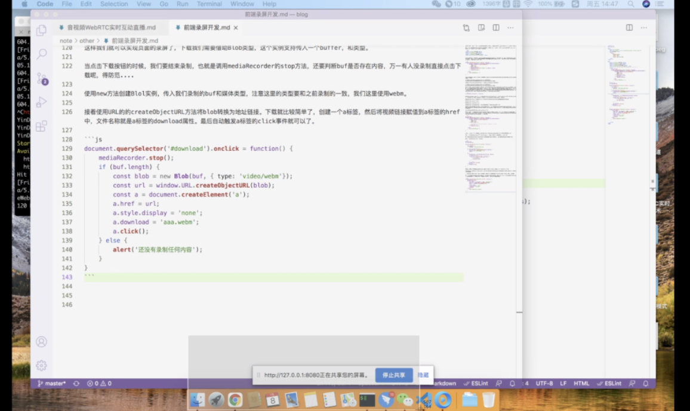
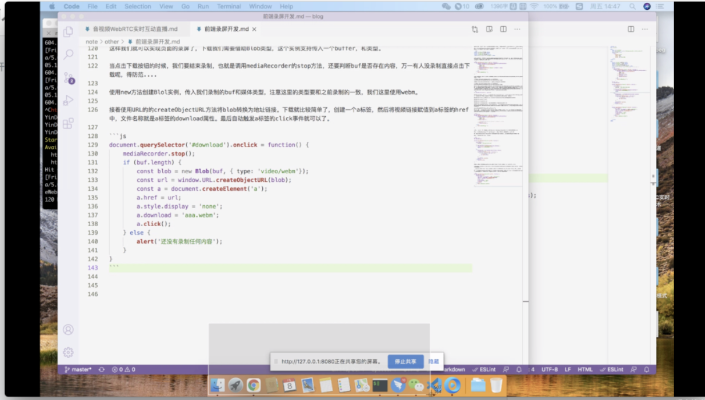
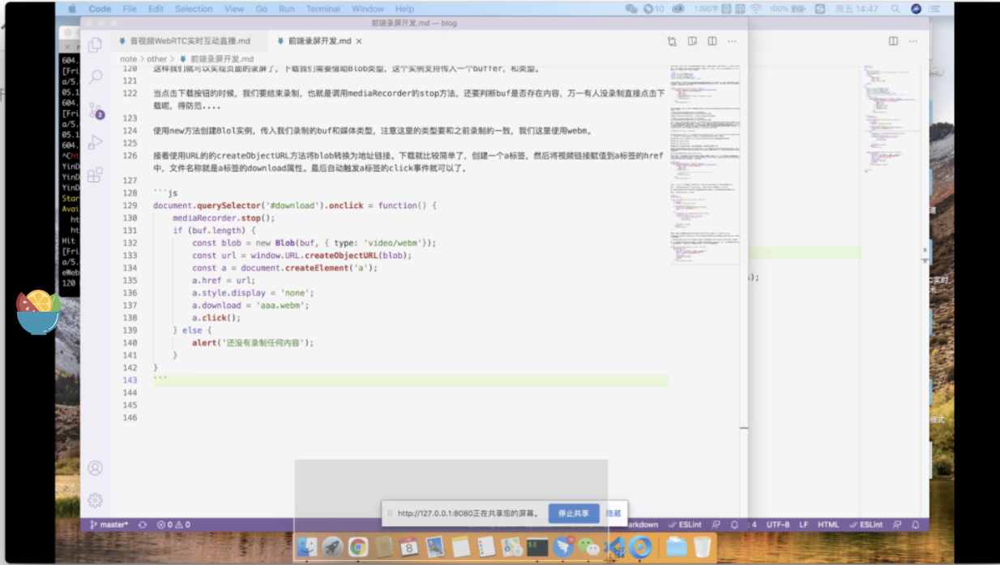
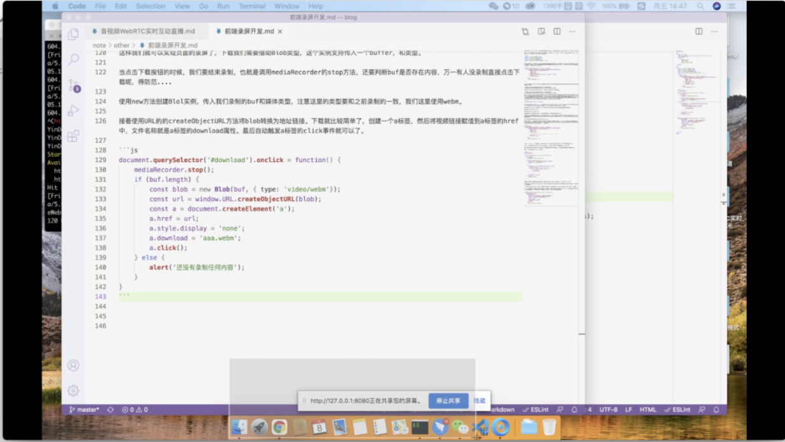

WebRTC是谷歌于2011年开源的一个音视频处理引擎，可以实时的进行视频数据的采集，也就是说可以做直播，也可以做桌面录屏，桌面分享。使用起来还是比较简单的。 

这里我们来开发一个屏幕录制工具。 

首先我们在页面中创建一个video标签，用于展示录屏的内容，再创建四个按钮，一个屏幕分享，一个开始录制，一个停止录制，一个下载视频。

```html
<button id="start">屏幕分享</button> 
<button id="record">开始录制</button> 
<button id="stop">结束录制</button> 
<button id="download">下载视频</button> 
<video autoplay playsinline id="player"></video> 
```

当点击屏幕分享按钮的时候，通过getDisplayMedia方法来获取桌面的媒体流，这里需要传入一个对象作为配置，对象中可以对video和audio进行设置，值可以是布尔类型也可以是对象类型，这里先设置布尔值，采集视频，不采集音频。 

返回值是一个Promise，然后在Promise的then中将流媒体赋值给video标签的srcObject属性就可以了，非常的简单。 
```javascript
document.querySelector('#start').onclick = function() { 
    if (navigator.mediaDevices && navigator.mediaDevices.getDisplayMedia) { 
        navigator.mediaDevices.getDisplayMedia({ 
            video: true, 
            audio: false 
        }).then((stream) => { 
            document.querySelector('#player').srcObject = stream; 
        }).catch((err) => { 
            console.error(err); 
        }) 
    } else { 
        alert('不支持这个特性'); 
    } 
} 
```

当点击屏幕分享按钮时，浏览器会弹出选项询问我们要录制哪部分内容，这里可以选择录制整个屏幕，或者是某个应用的界面，还可以是浏览器的指定标签页。 



比如这里选择录制整个屏幕，此时video标签中就会显示我电脑屏幕中的内容了。 


现在我们知道使用getDisplayMedia是可以将我们的屏幕内容采集到的，如果想要将内容录制下来并且下载到本地需求使用WebRTC提供的另外一个类MediaRecorder。 

他有很多的事件和方法。使用也非常简单。直接实例化就可以了。需要传入两个参数，第一个是stream，也就是我们通过getDisplayMedia拿到的媒体流，第二个是可选参数。主要有mimeType指定录制的是音频还是视频，录制的格式是什么。 

格式有很多比如谷歌的音视频格式video/webm, audio/webm, 还可以设置为mp4， 也可以指定视频的编码video/webm;codecs=vp8, video/webm;codecs=h264, 或者指定音频编码audio/webm;codecs=opus。 

```javascript
new MediaRecorder(stream, [, options]); 
```
MediaRecorder的api也比较多，第一个是MediaRecorder.start(timeslice)意思是开启录制，timeslice是一个可选参数，如果不设置会存储在一个大的buffer中，如果设置了这个参数就会按照时间段存储数据，比如说10s存储一块数据。 

MediaRecorder.start()是关闭录制，当停止录制时会触发dataavailable事件，得到最终的blob数据。 

MediaRecorder.pause()暂停录制 

MediaRecorder.resume()恢复录制 

MediaRecorder.isTypeSupported()检查是否支持要录制的文件格式。比如mp4,webm,mp3等格式。 

除了这些方法，还存在很多的事件，一般常用事件有两个，第一个是ondataavailable当收集到的数据有效就会触发这个事件，所以我们可以监听这个事件，当获取到数据我们可以把这个数据存储在缓存区中，可以在e.data中得到。这个事件的执行实际由timeslice决定，如果没有指定则记录整个数据。如果指定了就会定时触发。 

onerror错误的时候会触发这个事件，录制会自动停止。 

这里我们来改造一下，将getDisplayMedia获取到的流媒体不再直接赋值给video标签，而是通过MediaRecorder存储起来，再转换给video，这样我们不光可以赋值给video，而且stream实现了存储也可以下载下来。我们将getDisplayMedia返回的内容存储到全局的allStream中。

```javascript
let allStream; 

document.querySelector('#start').onclick = function() { 

    if (navigator.mediaDevices && navigator.mediaDevices.getDisplayMedia) { 

        navigator.mediaDevices.getDisplayMedia({ 

            video: true, 

            audio: false 

        }).then((stream) => { 

            allStream = stream; 

            document.querySelector('#player').srcObject = stream; 

        }).catch((err) => { 

            console.error(err); 

        }) 

    } else { 

        alert('不支持这个特性'); 

    } 

} 
```

当点击开始录制按钮时, 首先需要使用MediaRecorder.isTypeSupported方法判断浏览器是否支持这种视频格式。 

然后开始创建MediaRecorder对象，传入allStream对象和配置对象，这里只配置了视频格式为webm格式。 

接着要绑定ondataavailable事件方法，这个事件会处理采集到的流媒体。其实也就是将数据存储到外部变量buf中。 

最后执行mediaRecorder.start开始录制。 
```javascript
let buf = []; 

let mediaRecorder; 

 

document.querySelector('#record').onclick = function() { 

    // 约束视频格式 

    const options = { 

        mimeType: 'video/webm;codecs=vp8' 

    } 

    // 判断是否是支持的mimeType格式 

    if (!MediaRecorder.isTypeSupported(options.mimeType)) { 

        console.error('不支持的视频格式'); 

        return; 

    } 

    try { 

        mediaRecorder = new MediaRecorder(allStream, options); 

        // 处理采集到的事件 

        mediaRecorder.ondataavailable = function(e) { 

            if (e && e.data && e.data.size > 0) { 

                // 存储到数组中 

                buf.push(e.data); 

            } 

        }; 

        // 开始录制 

        mediaRecorder.start(10); 

    } catch (e) { 

        console.error(e); 

    } 

} 
```
这样我们就可以实现页面的录屏了。下载功能我们需要借助Blob类型来实现，创建Blob类型支持传入一个buffer参数和指定buffer内容的类型，。 

当点击下载按钮的时候，我们要结束录制，也就是调用mediaRecorder的stop方法，还要判断buf是否存在内容，万一有人没录制直接点击下载呢，得防范.... 

使用new方法创建Blol实例，传入我们录制的buf和媒体类型，注意这里的类型要和之前录制的一致，我们这里使用webm。 

接着使用URL的的createObjectURL方法将blob转换为地址链接。下载就比较简单了，创建一个a标签，然后将视频链接赋值到a标签的href中，文件名称就是a标签的download属性。最后自动触发a标签的click事件就可以了。 

```javascript
document.querySelector('#download').onclick = function() { 

    mediaRecorder.stop(); 

    if (buf.length) { 

        const blob = new Blob(buf, { type: 'video/webm'}); 

        const url = window.URL.createObjectURL(blob); 

        const a = document.createElement('a'); 

        a.href = url; 

        a.style.display = 'none'; 

        a.download = 'aaa.webm'; 

        a.click(); 

    } else { 

        alert('还没有录制任何内容'); 

    } 

} 
```
同样点击屏幕分享会弹出选择窗口的页面。 

然后点击开始录制按钮，桌面上就会出现一个正在录屏的标记。 

最后点击下载按钮，录制的视频就被下载下来啦。因为我之前已经下载过了，所以这里浏览器自动给我加了一个(1) 

打开这个视频看一下。 


结束录制就是调用一下mediaRecorder对象的stop方法。
```javascript
document.querySelector('#stop').onclick = function() { 

    if (mediaRecorder) { 

        mediaRecorder.stop(); 

    } 

} 
```
至此屏幕录制我们就说完了。对了，这个功能只能在https环境中运行，本地开发可以支持127.0.0.1或者localhost。如果部署正式别忘记使用https。 

WebRTC也是可以从摄像头中获取视频流的，只需要将getDisplayMedia替换成getUserMedia就可以了。
```javascript
document.querySelector('#start').onclick = function() { 

    if (navigator.mediaDevices && navigator.mediaDevices.getUserMedia) { 

        navigator.mediaDevices.getUserMedia({ 

            video: true, 

            audio: false 

        }).then((stream) => { 

            document.querySelector('#player').srcObject = stream; 

        }).catch((err) => { 

            console.error(err); 

        }) 

    } else { 
        alert('不支持这个特性'); 
    } 
} 
``` 
是不是超级简单。 

WebRTC比较高级的功能是音视频直播，共享远程桌面，即时通信等，谷歌希望将WebRTC用作浏览器之间实现音视频通话这种快速的开发使用的。不过这些功能开发起来比较复杂，我们后面有时间再来介绍。 
