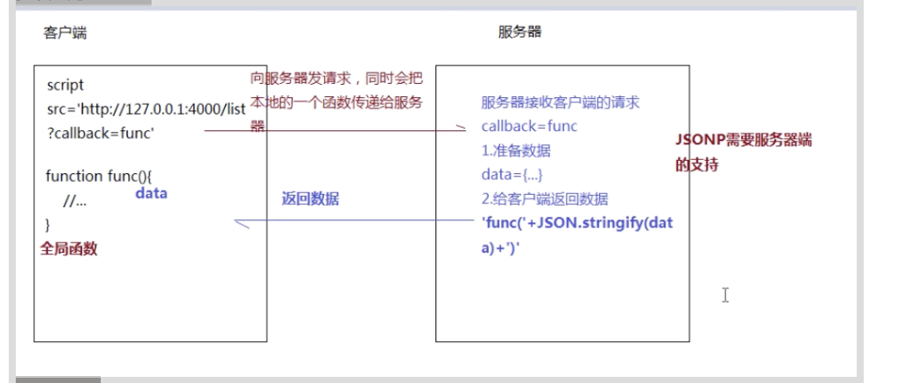

https://www.bilibili.com/video/BV1wT4y1g788?from=search&seid=17352432115883826404 


1.为什么产生跨域？及其价值意义。 

跨域：非同源策略请求 

-同源策略请求  ajax/fetch  ：部署到同一web服务器  
-跨域传输 

区分属于跨域请求还是同源请求： 

    第三方开放接口会跨域（阿里等） 
    三个都一样属于同源，有一个不同属于跨域 (-协议、-域名、-端口号)
 

web服务器地址：http（协议）://127.0.0.1（域名）:3000（端口号）/index.html 

数据接口地址：http ://127.0.0.1  :4000/list   

***跨域产生：*** 

为实现异步无刷新操作：利用ajax 

为了服务器高速运作，进行服务器拆分： 
* web服务器：处理静态资源。kbs.sports.com 
* data服务器:后台开发（业务逻辑、数据分析：包含对数据库的管理）
* api.sports.com 

图片服务器： 

 

常用解决方案 

1. .JSONP跨域解决方案的底层原理 

2. CORS跨域资源共享 

3. 基于http proxy实现跨域请求 

4. 基于post message实现跨域处理 

5. 基于iframe的跨域解决方案： 

window.name/document.domin/location.hash 

6. web socket和nginx反向代理 

 
# 常用 

 

1. JSONP:客户端与服务器的数据传输基于JSON格式 

-script         <script src="https://cdn.bootcss.com/"></script> 

-img 

-link 

-iframe 

… 

=>不存在跨域请求的限制（） 

 

实现原理： 


实现： 


问题： 

src：资源文件请求，所以JSONP只能处理get请求 

响应拦截，安全性差 

post put delete 


2. CORS跨域资源共享 

-客户端:发送请求 

-服务端：设置相关的头信息（需要处理options试探请求） 

缺点： 

    '*' ：多源(不允许携带cookie) 
    具体地址（只能一个） 

 

3. http proxy代理（除非被后台加入黑名单） 

==>webpack webpack-dev-server 

package.json 

安装了webpack webpack-cli webpack-dev-server 

配置规则：webpack.config.js  

4. nginx反向代理(不需要前端，只是服务器部署) 

    1.启liunx服务器  
    2.liunx服务器中安装nginx  
    3.nginx中配置web服务器  
    4.web服务器中做反向代理 


TODO： 

* liunx服务器部署 
* nginx进行web服务器创建 
* 性能优化 
* docker 
 
***不常用*** 


5. posetMessage 

6. socket.io ：可做实时聊天系统（微信） 

WebSocket 客户端与服务器端实时通信协议（协议跨域） 

基于iframe的方案 

7. document.domin+iframe(只能实现同一主域，不同子域) 

www.eeee.com ===> v.eeee.com 

```javascript
// 父页面A www.eeee.com 
<iframe id="iframa" src="http://v.eeee.com/b.html" frameborder='0'></iframe> 

<script> 
    document.domin="eeee.com"; 
    var user='admin' 
</script> 

// 子页面B http://v.eeee.com/b.html" 

<script> 
    document.domin="eeee.com"; 
    alert(window.parent.user)  
    {/* b页面的父页面 'admin'*/} 
</script> 
```
 

8. window.name+iframe （三个页面） 

a.html  
b.html   
proxy.html 

(a,proxy 同域) 

9. location.hash+iframe（三个页面） 

***url限制*** 

a向b发请求 

b拿到通过hash传给c 

c通过回调传给a 

10. node做中间键代理  
<a href="<%=url%>" target="_blank">了解详情...</a> 