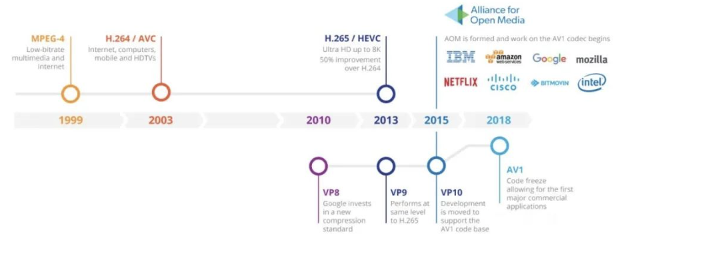
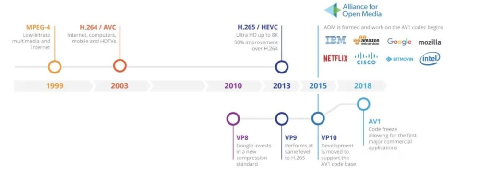

# 音视频术语   
前端音视频的那些术语 

霍语佳 前端大全  2020-08-19 

（给前端大全加星标，提升前端技能） 

作者： 前端食堂 公号 / 霍语佳 

比特率 Bit rate （码率、码流） 

代表每秒传送的比特数。 

比特率又称为“二进制位速率”，俗称“码率”，“码流”，又称为数据信号速率。这大兄弟别名好多。。 

从传输速度的发展看来，摩尔定律不仅应用在晶体管的密度，同样可以用在传输速度：比特率大概每18个月提高一倍。 

单位 

比特/秒(bit/s 或 bps)、千比特/秒(kbit/s 或 kbps)、兆比特/秒 (Mbit/s 或 Mbps) 

(1Mbps = 1000kbit/s) 

比特率越高，代表单位时间传送的数据就越多。 

公式 

码率(kbps) = 文件大小(KB) * 8 / 时间(s) 

举个例子理解：假如视频文件的容量为 2.888G，视频长度100分钟（6000秒），码率约等于 4037kbps (3.446 * 1024 * 1024 * 8 / 6000 = 4037.717)。 

帧率 Frame rate 

图形处理器每秒能够刷新几次，也就是每秒能够播放多少帧。 

人类眼睛的特殊生理结构，如果画面的帧率高于每秒约10-12帧时，都会认为是连贯的，也就是所谓的视觉暂留。 

低帧率会造成视觉卡顿，帧率越高，流畅度越高。 

如果你玩过LOL，那么游戏帧数保证稳定在60帧左右或以上，你的游戏画面就是流畅的。 

单位 

每秒显示的帧数(Frames per Second，FPS）或赫兹（Hz）。 

压缩率 Compression rate 

经过压缩后文件的大小 / 原始文件的大小 * 100% = 压缩率 

压缩率一般是越小越好，但是压得越小，解压时间越长。 

分辨率 Image resolution 

通常表示称PPI，用于度量图像内数据量多少的一个参数。 

像素密度越高，说明像素越密集，5PPI表示每英寸有5个像素，500PPI表示每英寸有500个像素。 

PPI的数值高，图片和视频的清晰度就更高。 

公式 

分辨率 = 单位长度内的像素数量 / 单位长度 

单位 

DPI（点每英寸）、LPI（线每英寸）、PPI（像素每英寸）和 PPD（PPPixels Per Degree 角分辨率，像素每度）。 

是PPD 不是 PDD。 

# 容器格式
MP4 

由国际标准化组织（ISO）和国际电工委员会（IEC）下属的”动态图像专家组“（Moving Picture Experts Group，即MPEG）制定。 

MP4 十分开放，几乎可以用来描述所有的媒体结构。支持流媒体，被广泛用于 H.264/H.265 视频和 ACC 音频，是高清视频的扛把子。 

AVI 

AVI（Audio Video Interleaved），是微软用于对抗苹果 QuickTime 的产物。它可以跨多个平台使用，不过体积过于庞大，压缩标准也不统一。 

FLV 

FLV（Flash Video）是目前最流行的流媒体格式，其文件体积小、封装播放简单，非常适合在网络场景下应用。各大视频网站大多都会使用 FLV 格式。 

TS,M3U8 

HLS 由 TS 和 M3U8 两部分组成： 

* .m3u8 文件：以 UTF-8 编码的 m3u 文件。 

* .ts 视频文件：一个 m3u8 文件对应着若干个 ts文件。 

m3u8 只存放了一些 ts 文件的配置信息和相关路径，而 ts 文件存放了视频的数据。当视频播放时，video 标签会解析 m3u8 并找到对应的 ts 文件进行播放。 

不过 HLS 的延时相对较高，延时包含了 TCP 握手、m3u8 文件下载与解析、ts 文件下载与解析等多个步骤。虽然可以缩短列表的长度和限制单个 ts 文件的大小来降低延迟，但是会造成请求次数增加，服务器压力增大。 

苹果官方推荐的 ts 时长是 10s，大概会有 30s 的延迟。 

WebM 

WebM 由 Google 提出，是一种专为 Web 设计的开放，免版税的媒体文件格式。WebM 文件包含使用 VP8 或 VP9 视频编解码器压缩的视频流和使用 Vorbis 或 Opus 音频编解码器压缩的音频流。 

OGV 

OGV 是 HTML5 中的一个名为 Ogg Theora 的视频格式，起源于 OGG 容器格式(由 Xiph.Org 开源)，它不受软件专利的限制。 

MOV 

MOV 是 QuickTime 中常见的影片格式，拥有着出色的兼容能力，兼容 Macintosh 和 Windows。 

H.264 (AVC) 

H.264 是由国际电信联盟和国际标准化组织/国际电工委员会运动图像专家组联合开发的视频压缩技术或编解码器(如 MPEG-4 Part 10，高级视频编码或 AVC)。它是在 MPEG-4 技术的基础之上建立起来的。广泛应用于网络流媒体数据、网络软件、高清晰度电视、卫星等。 

H.265(HEVC) 

用来替代 H.264/AVC 编码标准。相同视频文件使用 H.265 编码方式编码后的文件体积大约是 MPEG-4 编码后文件的 1/3。 

支持 4k 及更高的分辨率，用户体验好 

高压缩能为用户提供更多内容、降低费用、提升下载速度 

浏览器支持较差，业界解决方案：libe265.js, FFMpeg + WebAssembly 

VP9 

VP9 是 Google 为了替换 VP8 并与 H.265/HEVC 竞争所开发的免费、开源的影像编码格式。超过20亿个端点支持VP9解码，包括Chrome，Opera，Edge，Firefox和Android设备以及数百万台智能电视。 

VP10 视频编码的技术被收录在开放媒体联盟所领导的 AV1 编码中，因此 Google 表示不会在内部部署或正式发布 VP10。 

AV1 

AV1（Alliance for Open Media Video 1）是由 AOM（Alliance for Open Media，开放媒体联盟）制定的一个开源、免版权费的视频编码格式，专门为通过网络进行流传输而设计。IETF 也将这项工作标准化为互联网视频编解码器(NetVC)。 

AV1 的目标是解决 H.265 昂贵的专利费用和复杂的专利授权问题并成为新一代领先的免版权费的编码标准。它是 Google 制定的 VP9 标准的继任者，也是 H.265 强有力的竞争者。 

* YouTube 已开始尝试在部分影片使用AV1视频格式。 

* 2020年2月5日，Netflix开始在Android设备上有限度使用AV1视频格式播放影片，其压缩效率较原本的VP9提升20% 

* 2020年4月30日，爱奇艺宣布在个人电脑网页浏览器和Android设备上支持AV1视频格式。 