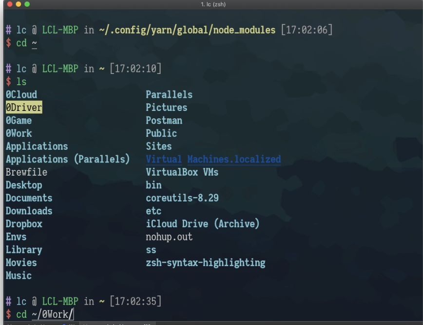
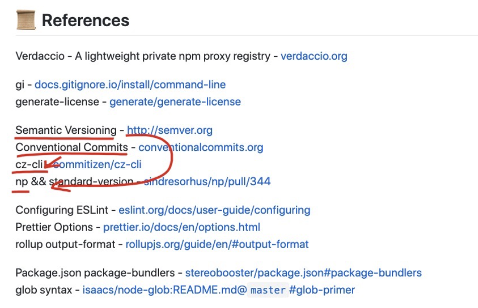

【链接】robbyrussell/oh-my-zsh 

https://github.com/robbyrussell/oh-my-zsh 

 

https://github.com/zsh-users/zsh-syntax-highlighting 

 

 

【链接】关于monorepo的一些尝试 

https://zhuanlan.zhihu.com/p/70782864 

seognil LC  10:15:23 

【链接】npm已落伍，下一代包管理器Tink正在孵化-Info 

https://www.infoq.cn/article/R*5JRVuOOHBRlw411PlZ 

 

规范化工具 

https://github.com/seognil-craft 

 

 

不知 

https://tailwindcss.com/docs/installation/ 

https://stimulusjs.org/ 

 
开发模式  

TDD   
BDD 

# 基础知识
https://github.com/yygmind/blog/blob/master/README.md 
 
渐进式web应用：Creat react app  
https://www.html.cn/create-react-app/docs/making-a-progressive-web-app/ 

https://yq.aliyun.com/articles/609663 

axios:
https://www.cnblogs.com/ShuiNian/p/12307713.html 
https://juejin.im/post/6844903613609803783 

实现Web端自定义截屏  
https://mp.weixin.qq.com/s?__biz=Mzg4MTYwMzY1Mw==&mid=2247496592&idx=1&sn=822fc07383435d98bb5339984e156cd3&source=41#wechat_redirect

Chrome 88 重要更新解读
https://mp.weixin.qq.com/s?__biz=Mzg4MTYwMzY1Mw==&mid=2247496595&idx=1&sn=4f7087f9cc5e12c143571eeadea86733&source=41#wechat_redirect

-----------------------------------

tapd工作台：https://www.tapd.cn/ 

石墨： https://shimo.im/folder/LWHsNn2JhxQd87nv 

npm: https://www.npmjs.com/org/heieo 

=》语雀： https://www.yuque.com/xlhkeg 

 

前端开发技术目录（语雀） https://www.yuque.com/seognil/fe-foundation 

 

人脸融合文档：https://cloud.tencent.com/document/product/670/31061 

webpack文件： 

https://github.com/nobrainr/typescript-webpack-starter （typescript起步开始） 

https://github.com/wbkd/webpack-starter  （传统的 webpack strater   es6） 

 

学习任务： 

https://www.sololearn.com/Course/JavaScript/   

https://www.codecademy.com/learn/introduction-to-javascript   

  

林忱（webpack） 

https://github.com/seognil-lab/webpack-starter 

 

开发使用：coolsite地址 

http://www.coolsite360.com/sites/jq2g43_draft/edit?team=1(编辑) 

http://www.coolsite360.com/sites/jq2g43/html_edit（打包导出） 

 

《Coolsite工作台独立功能的开发和接入》，可复制链接后用石墨文档 App 或小程序打开 

https://shimo.im/docs/uX576Y9O6uI4GnWZ/  

https://www.tapd.cn/20140951/prong/stories/stories_list(pdf需求) 

 

git（语雀） 

https://www.yuque.com/seognil/fe-foundation/git-crash-course 
 

约定式提交规范：https://www.conventionalcommits.org/zh/v1.0.0-beta.2 

代码提交规范 https://github.com/seognil-lab/lib-starter 

http://www.ruanyifeng.com/blog/2016/01/commit_message_change_log.html 

 

 

代码测试 

 

测试代码 https://www.chaijs.com/guide/styles/#assert 

组件测试学习文档：https://www.chaijs.com/api/assert/ 

 

Backbone 

https://zhuanlan.zhihu.com/p/30982369 

 

Vue 

https://ustbhuangyi.github.io/vue-analysis/prepare/directory.html#compiler 

 

重要 

http://www.imooc.com/t/3017249#Article 

 

锻炼代码能力 

https://www.codewars.com/ 

 

Bootstrap 

https://getbootstrap.com/docs/3.3/javascript/ 

 

SwitchHosts（host 管理工具） 

https://github.com/oldj/SwitchHosts/blob/master/README_cn.md 

 

Epub360 开发流程（WWW 上线流程） 

https://shimo.im/doc/5nXmTPUmIsckt2Uc 

 

Epub360本地调试 

http://test.epub360.com/v2/cms/?-build=1 

 
 

http://test.epub360.com/v2/cms/?-build=1&-debug=1（显示console ） 

 

开源库： 

https://www.bootcdn.cn/ 

学习： 

https://github.com/JacksonTian/fks 

注释： 

https://devdocs.io/jsdoc/howto-es2015-modules 

 

https://www.kancloud.cn/csnikey/fepro-guide/645877 

 